#### 3.1.4.2 Mobile Applications Wireflow Diagrams

Un wireflow conecta una vista, una acción y el estado de destino. Los siguientes diagramas expresan recorridos previstos para las metas de usuario; las láminas visuales complementan sus vistas y decisiones. Buyer Mobile se presenta como objetivo de diseño `TARGET`. Si una acción queda sin respuesta concluyente, el recorrido consulta el mismo registro antes de repetirla y mantiene el resultado como no confirmado mientras tanto.

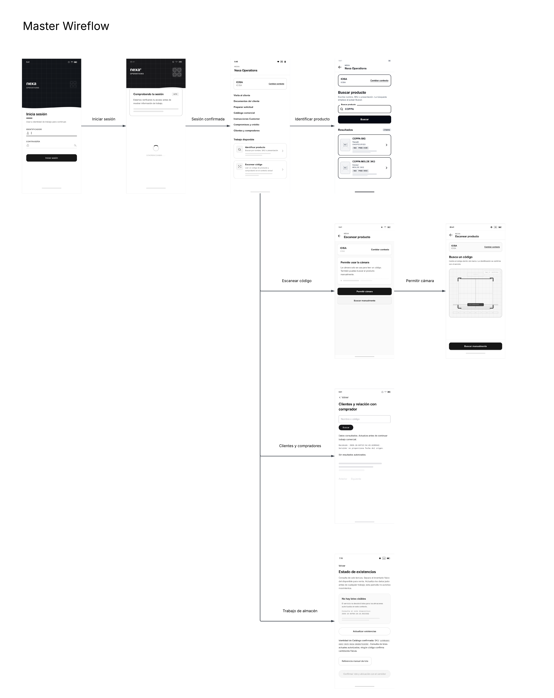

*Vista general de Operations desde el inicio de sesión y la sesión confirmada hasta el contexto de trabajo y la identificación de producto.*

**Acceso y contexto autorizado · MOB-US-001–003**

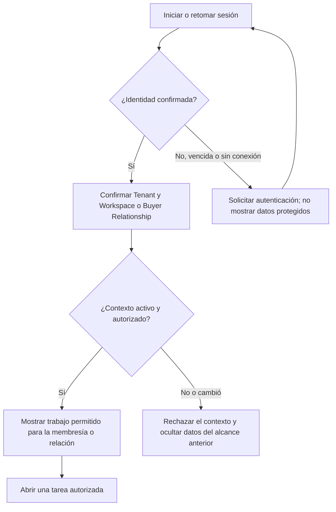

La persona selecciona un contexto cuando hay más de uno; una selección no confirmada no abre información protegida. Si cambia el Tenant, Workspace o Buyer Relationship, la vista anterior deja de ser fuente para la nueva actividad. [La captura existente de sesión](../../../assets/chapter-3/mobile-user-flows/happy-01-session.png) muestra el acceso y el retorno a operaciones.

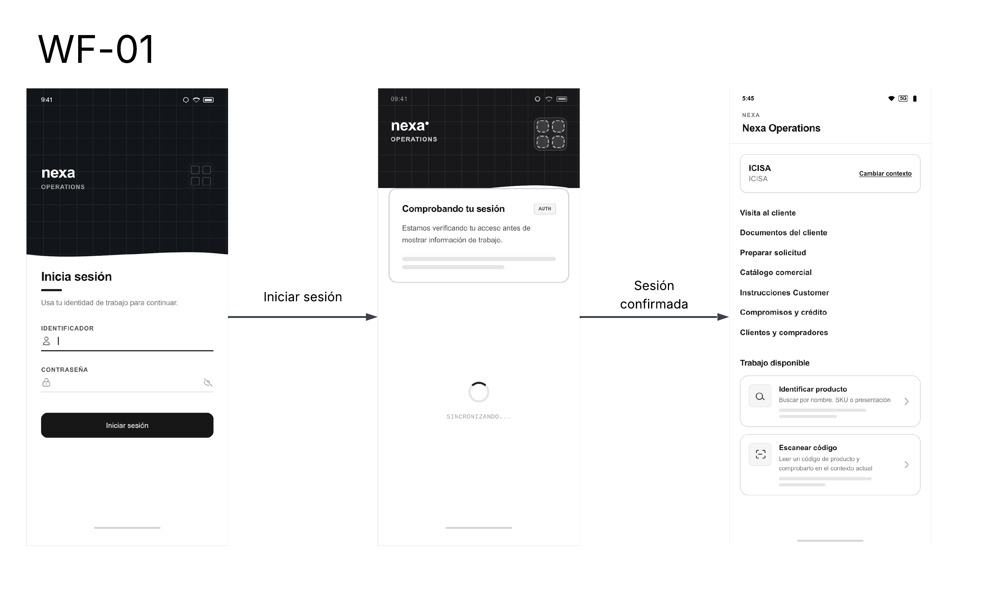

*Secuencia visual de acceso, comprobación de identidad y entrada al trabajo disponible en el contexto Operations (MOB-US-001–003).*

**Identificación de producto · MOB-US-011–012**

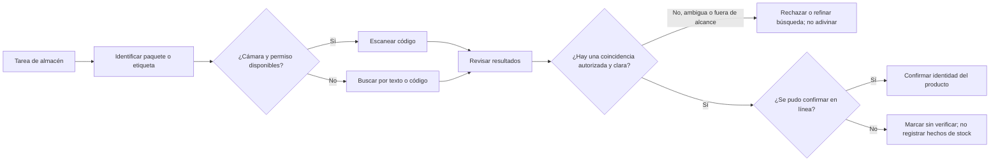

La búsqueda manual permite continuar cuando el escaneo no está disponible. Una coincidencia por sí sola no registra recepción ni picking; los hechos de stock requieren su tarea y confirmación propias. [Las capturas existentes de búsqueda](../../../assets/chapter-3/mobile-user-flows/happy-02-search.png), [cámara](../../../assets/chapter-3/mobile-user-flows/happy-03-camera.png) y [permiso denegado con alternativa manual](../../../assets/chapter-3/mobile-user-flows/unhappy-07-camera-denied.png) ilustran únicamente esos estados.

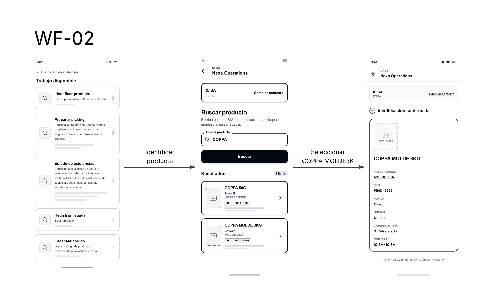

*Búsqueda por texto, revisión de resultados y apertura de la ficha seleccionada (MOB-US-011–012).*

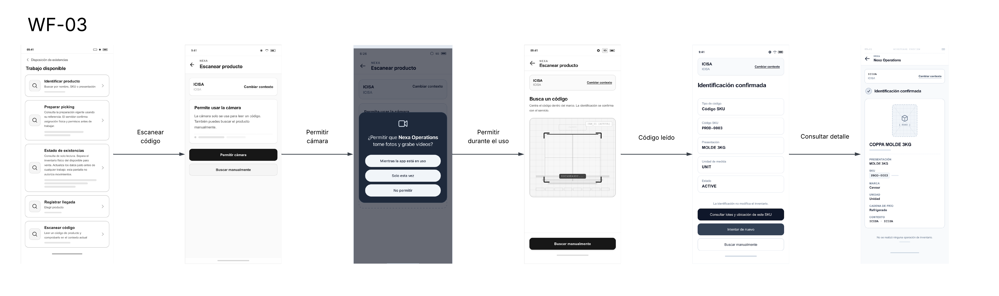

*Solicitud de permiso, búsqueda manual como alternativa y continuación a la identificación por código (MOB-US-011–012).*

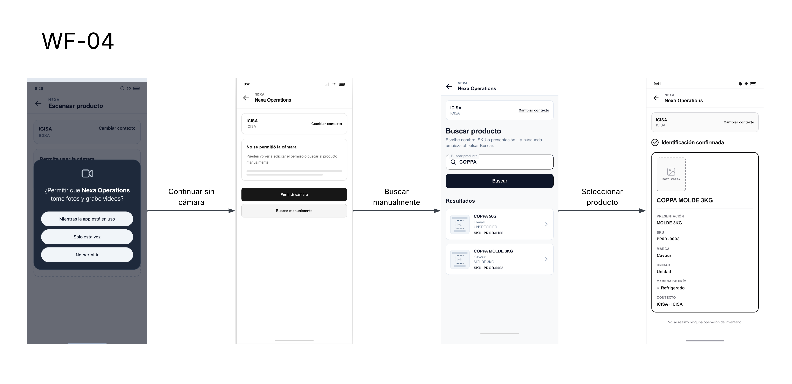

*Ruta de recuperación cuando se deniega la cámara: buscar manualmente y revisar el producto identificado (MOB-US-011–012).*

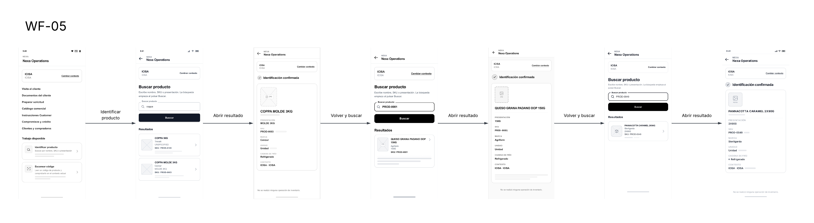

*Consulta por código, lectura de resultados y retorno a una búsqueda nueva cuando corresponde (MOB-US-011–012).*

**Recepción y picking · MOB-US-013–016**

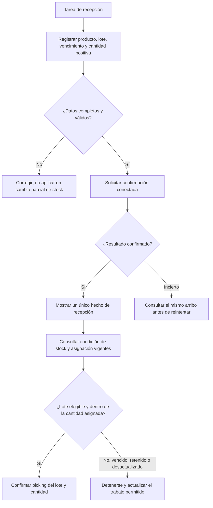

La selección de lote y cantidad se hace contra una Physical Allocation vigente. El picking no usa un lote vencido, retenido, en cuarentena o no asignado, y no supera la cantidad restante. Si una respuesta de recepción o picking es incierta, se consulta el mismo hecho antes de repetir la acción; no se crea un segundo cambio por reintento.

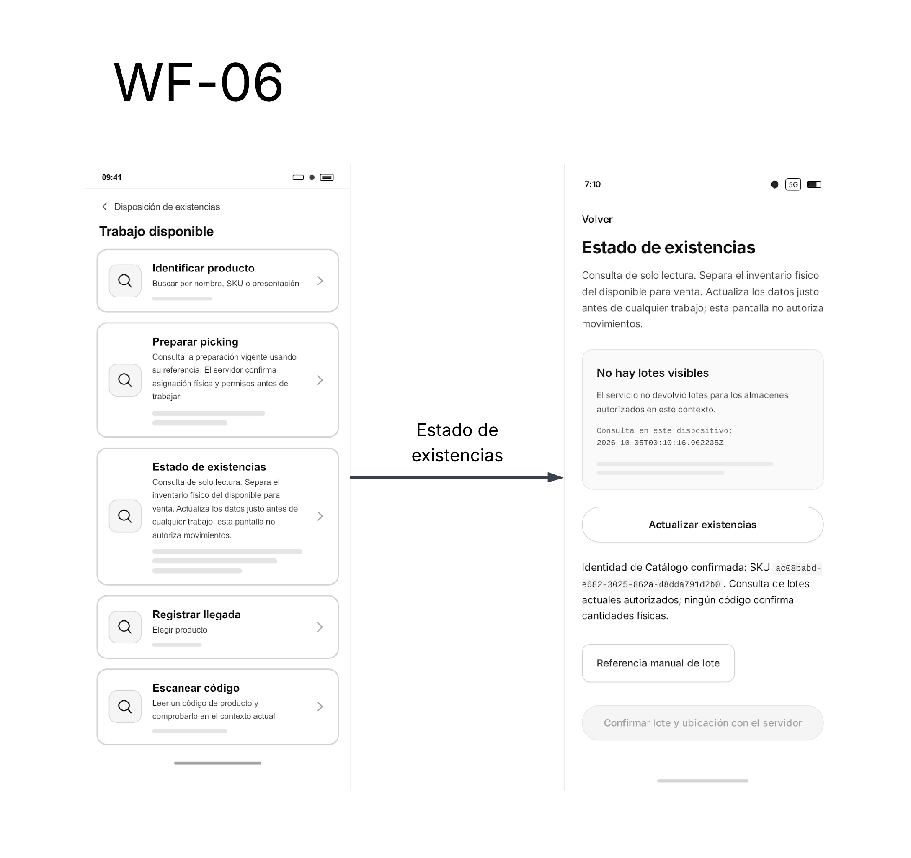

*Vista prevista de existencias sin lotes visibles: permite actualizar la consulta y conserva la lectura separada de cualquier movimiento de inventario.*

**Discrepancia física · MOB-US-017**

El operador abre la tarea relacionada, registra la diferencia observada con su motivo y evidencia requerida y solicita confirmación. El objetivo se alcanza al quedar registrada una discrepancia autorizada, no al resolverla: si falta permiso, motivo o evidencia, no se modifica el stock; si el resultado no se conoce, se consulta el reporte original antes de volver a enviarlo. Una nota local puede conservarse como borrador, pero no decide el estado del inventario.

**Transferencia interna diferida · MOB-US-018**

Esta meta se conserva como diseño futuro `DEFERRED`. **Diseño de evolución:** identificar origen, destino, lote y cantidad; confirmar el movimiento con información vigente; y mantener diferenciados los hechos de origen, tránsito y destino. El resultado esperado es una transferencia confirmada y, por separado, la recepción confirmada en destino. Si faltan datos o la recepción en destino difiere, el movimiento queda sin resolver; un borrador local no confirma movimiento ni recepción.

**Evidencia de temperatura · MOB-US-019**

El operador selecciona el lote o almacén observado y registra valor, unidad, momento y sujeto. La evidencia queda disponible después de la confirmación correspondiente. Cuando una lectura constituye una excursión según el control aplicable, el HOLD de una observación de lote afecta solo la cantidad identificada; para una observación de almacén se seleccionan primero los lotes y cantidades afectados. Un actor autorizado determina la disposición. Si falta unidad o sujeto, no se crea evidencia incompleta. El flujo usa lecturas manuales y mantiene la disposición bajo decisión autorizada.

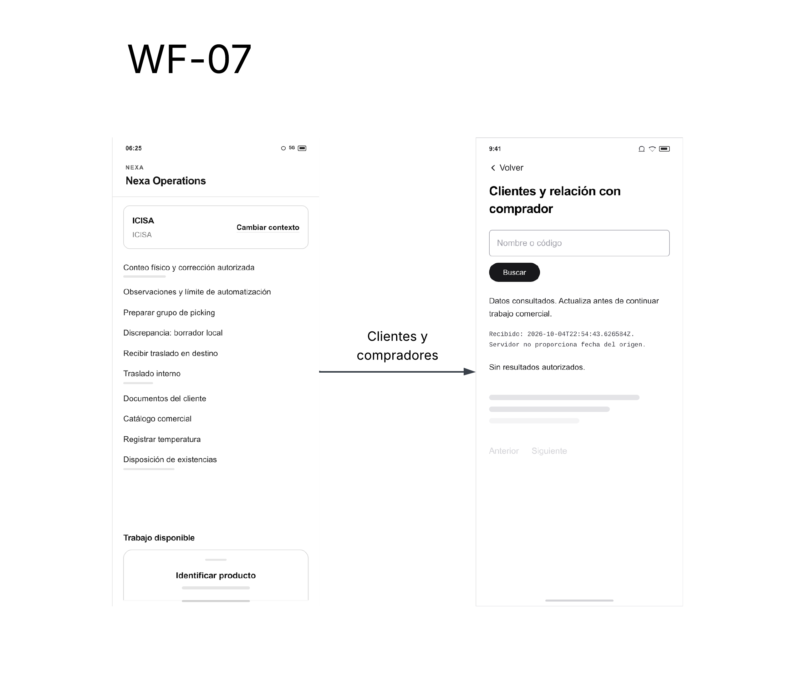

*Menú de trabajo Operations y consulta de relación con comprador. El rótulo «Preparar grupo de picking» queda como elemento de esta propuesta; el flujo de picking descrito arriba sigue la Physical Allocation vigente. El traslado interno y su recepción en destino permanecen `DEFERRED` (MOB-US-018); la consulta comercial se mantiene separada de los recorridos Buyer Mobile `TARGET`.*

**Preparación y despacho de una entrega · MOB-US-020–025**

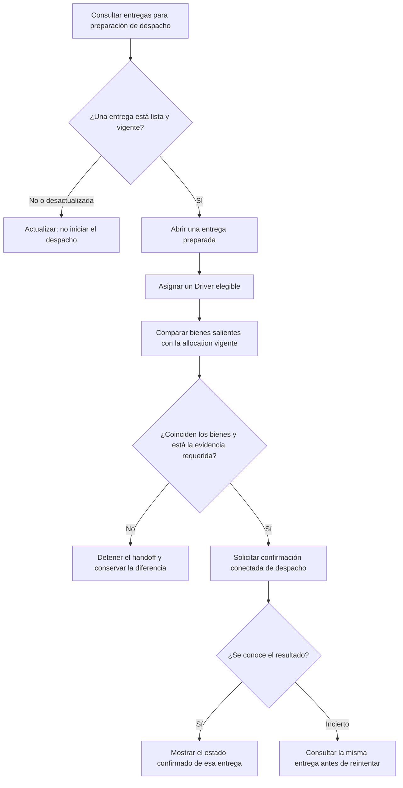

El recorrido trata una entrega preparada a la vez. Una asignación no elegible, allocation distinta, evidencia faltante o estado cambiado detiene la confirmación hasta revisar los datos vigentes. La responsabilidad no se atribuye a una aceptación adicional del Driver: el flujo termina cuando el servidor confirma o rechaza el despacho solicitado.

**Ejecución, intento y prueba de entrega · MOB-US-026–028, 031–033**

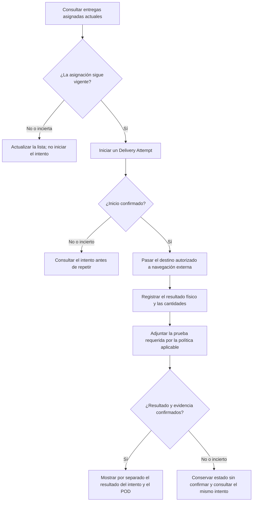

La lista de entregas asignadas debe estar vigente antes de iniciar. Una entrega parcial o rechazada conserva las cantidades recibidas, rechazadas y pendientes como hechos diferenciados; no se presenta como una entrega completa. La navegación externa no registra ubicación del Driver. El POD se conserva separado del resultado del intento y se solicita según la política aplicable, no como requisito universal.

**Ubicación de una entrega · MOB-US-029**

Esta meta permanece `DEFERRED`. **Diseño de evolución:** conserva la intención de compartir la ubicación de una entrega para apoyar el trabajo del Driver; las reglas de esa capacidad quedan sujetas a una definición futura aceptada. En V1, el Driver pasa el destino autorizado a navegación externa, como se describe en el objetivo anterior; esa navegación no registra ubicación de la entrega.

**Código acotado de handoff · MOB-US-034**

Con una entrega e intento activos, el Driver presenta el código breve asociado a esa entrega. Un código equivocado, vencido o ya utilizado se rechaza sin cambiar la entrega. Si el código no puede presentarse, solo una alternativa aprobada mantiene explícito el handoff; no se registra una aceptación falsa. La presentación o verificación del código identifica el handoff, pero no constituye aceptación, POD, Buyer Receipt ni finalización.

**Atención y recepción del Buyer · MOB-US-044, 047–049 · TARGET**

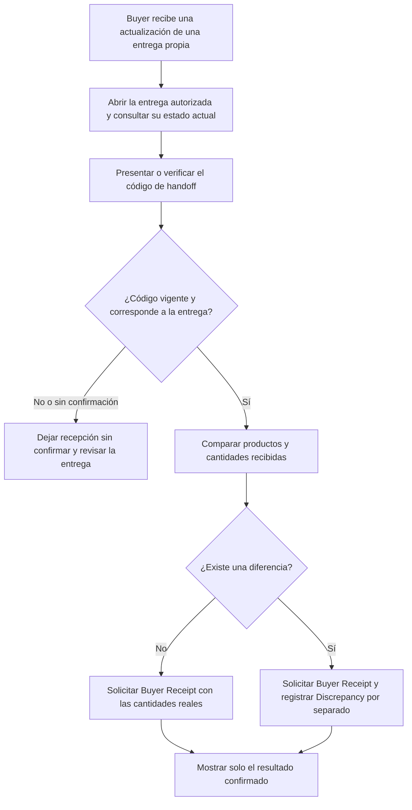

Estos pasos son diseño `TARGET` de Buyer Mobile, no pantallas implementadas ni interacción validada. La actualización solo dirige al Buyer a una entrega de su relación autorizada; si no llega, puede consultar la entrega al abrir la aplicación. Un código no verificable, una relación no autorizada o una respuesta incierta no confirma recepción. La discrepancia conserva sus propios hechos y no reemplaza la evidencia del Driver ni el Buyer Receipt.

El orden de pasos representa decisiones y estados del recorrido. Las capturas del apartado de User Flows ilustran las vistas incluidas en esas secuencias.
