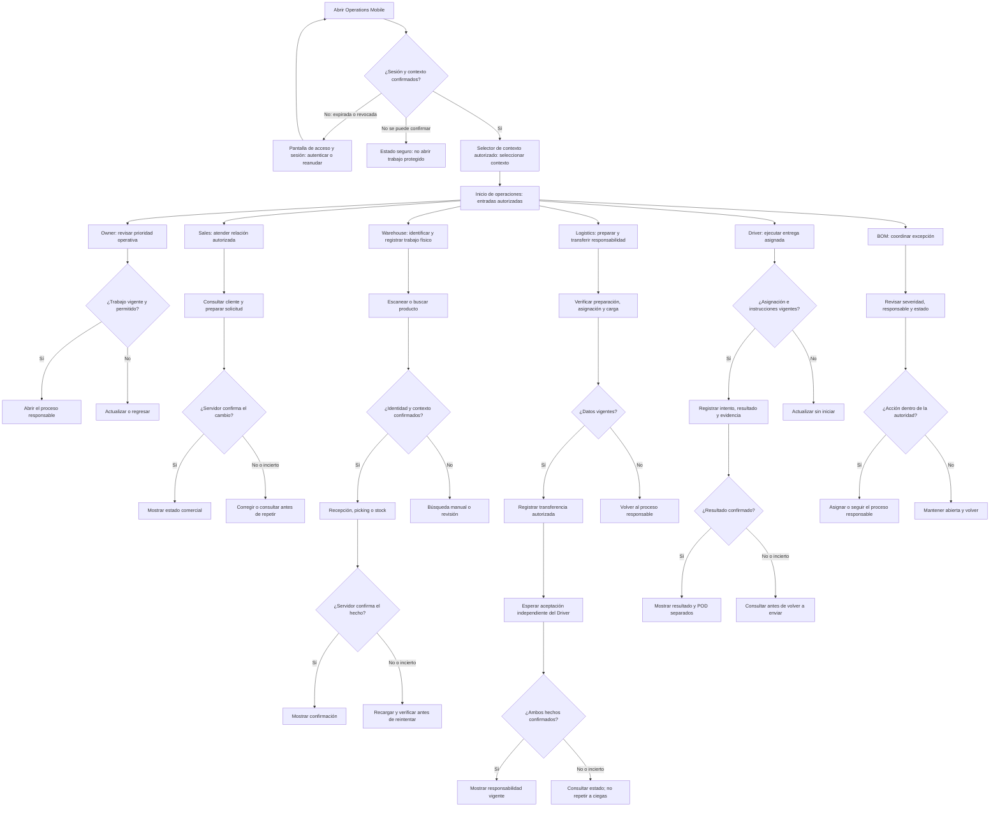
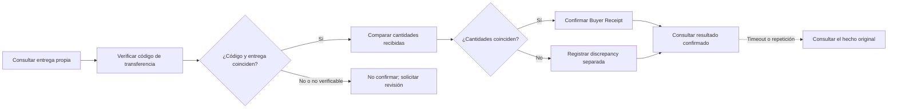

#### 3.1.4.2. Diagramas de wireflow de aplicaciones Mobile

##### Especificación de wireflows

*Wireflows textuales previstos por objetivo de usuario.*

| Objetivo de usuario | Camino principal | Recuperación | Historias |
| :--- | :--- | :--- | :--- |
| Alejandro, Diego y Carlos: retomar trabajo autorizado | Regresar → confirmar sesión → seleccionar contexto → trabajo permitido | Sesión expirada, revocada o no disponible → autenticación o estado seguro | MOB-US-001, MOB-US-002, MOB-US-003 |
| Alejandro: registrar trabajo de almacén | Abrir asignación → identificar ítem → registrar hecho autorizado → resultado confirmado | Ítem desconocido, lote o vencimiento faltante, comando duplicado o red fallida → alternativa manual, reintento o pendiente | MOB-US-011, MOB-US-012, MOB-US-013, MOB-US-014, MOB-US-015, MOB-US-016, MOB-US-017, MOB-US-018, MOB-US-019 |
| Alejandro y Dispatch: transferir una entrega preparada | Revisar trabajo → confirmar preparación → transferir responsabilidad → resultado visible | Preparación incompleta o transferencia duplicada → preservar estado previo y explicar excepción | MOB-US-020, MOB-US-021, MOB-US-022, MOB-US-023, MOB-US-024, MOB-US-025 |
| Diego: registrar evidencia de entrega | Abrir Delivery → navegación externa → intento o resultado → evidencia → código | Resultado parcial o rechazado, permiso denegado o carga fallida → estado no resuelto visible | MOB-US-026, MOB-US-027, MOB-US-028, MOB-US-029, MOB-US-030, MOB-US-031, MOB-US-032, MOB-US-033, MOB-US-034 |
| Carlos: confirmar recepción del comprador | Actualización → verificar código → confirmar cantidades → receipt o discrepancia | Código inválido, cantidades distintas o sin conexión → no confirmar falsamente la recepción | MOB-US-044, MOB-US-047, MOB-US-048, MOB-US-049 |

*Nota.* La secuencia conserva la intención de cada objetivo y sus rutas de
recuperación. El diagrama visual correspondiente aún no forma parte del hito.

##### Mapa de flujos por trabajo

Las etiquetas Owner, Sales, Warehouse, Logistics, Driver y BOM describen
trabajos y personas del informe; no crean roles nuevos en la aplicación. El
servidor confirma sesión, Tenant, Workspace, Membership y permisos. El inicio
operativo presenta únicamente entradas autorizadas y vuelve a comprobar el contexto al
cambiar de trabajo. La pantalla de acceso y sesión gestiona la entrada; el
selector de contexto autorizado permite elegir el alcance; y el inicio de
operaciones muestra el trabajo disponible.

El mapa reúne objetivo, decisión y recuperación. Una ruta modelada o
disponible no demuestra que el resultado comercial u operativo haya sido
validado con usuarios. La autorización del servidor prevalece sobre el menú
mostrado.

##### Wireflows de entrada y recuperación

| Entrada o pantalla | Responsabilidad | Estado de recuperación |
| :--- | :--- | :--- |
| Pantalla de acceso y sesión | Autenticar o reanudar sesión | Sesión expirada, revocada o no confirmable. |
| Selector de contexto autorizado | Elegir o cambiar Tenant/Workspace autorizado | Sin contexto permitido: no abrir datos protegidos. |
| Inicio de operaciones | Mostrar entradas filtradas por permisos | Cambio de contexto: invalidar vistas anteriores. |
| Trabajo operativo | Abrir el proceso responsable y su evidencia | Datos antiguos o permiso insuficiente: actualizar o regresar. |
| Entrega y recepción | Separar transferencia, aceptación, POD, receipt y discrepancy | Resultado incierto: consultar el hecho original antes de repetir. |

##### Buyer Mobile planificado

Buyer Mobile se proyecta como una aplicación Flutter/Dart independiente. Estos
nodos son diseño planificado: no corresponden a pantallas de Operations
Android, no acreditan código implementado y no se consideran recorridos
ejecutados.

La separación entre Operations Mobile y Buyer Mobile conserva los límites de
permisos y de implementación del producto.

No se incluye un wireflow visual de pantallas. El mapa Mermaid es un flowchart
de objetivos, decisiones y recuperación; las tablas conservan trazabilidad
para elaborar el wireflow visual posterior y no demuestran una interacción
Mobile ejecutada.
