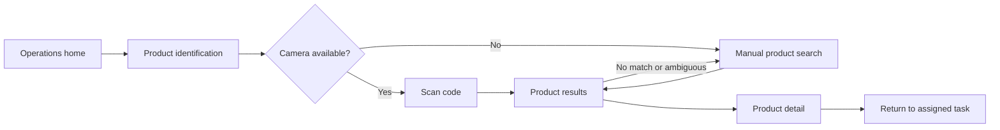

#### 3.1.4.2 Mobile Applications Wireflow Diagrams

Un wireflow conecta la vista, la acción y el estado de destino. El recorrido de producto conserva búsqueda manual como alternativa al permiso de cámara; la confirmación del producto no registra por sí misma un movimiento de inventario.

Para entrega y recepción, la vista debe conservar por separado transferencia, intento del conductor, evidencia y recepción del comprador. Si un estado no puede confirmarse, el recorrido vuelve a consultar el registro original antes de ofrecer otro envío. Estos estados son parte del flujo de interacción; una captura de usuario no sustituye el wireflow de pantallas.
