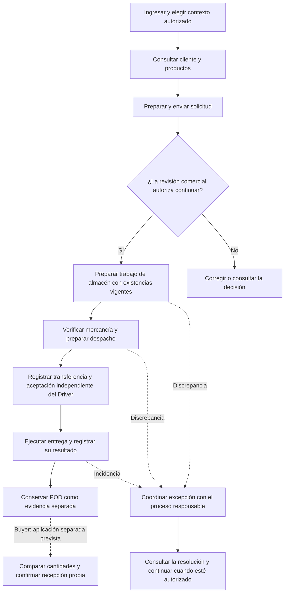
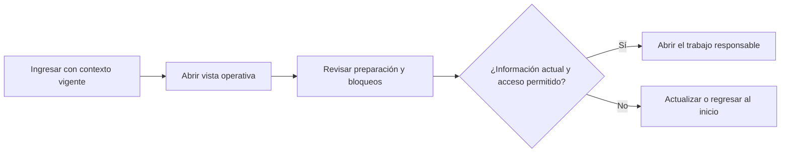
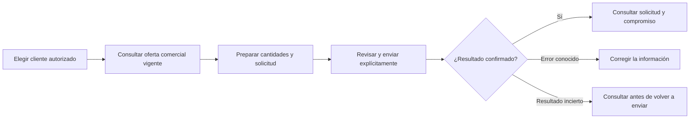
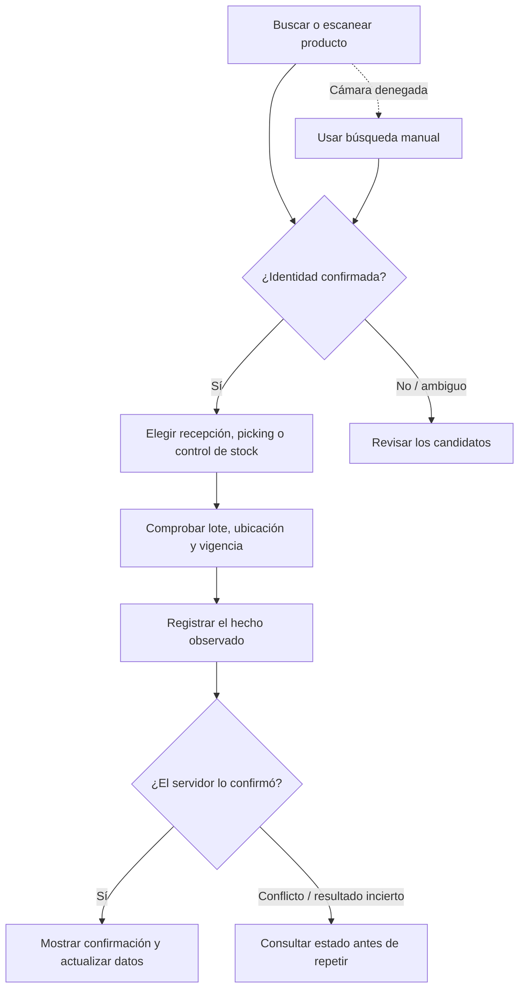
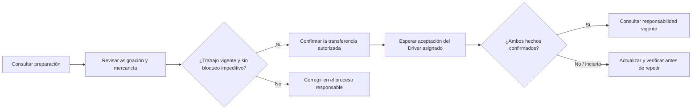
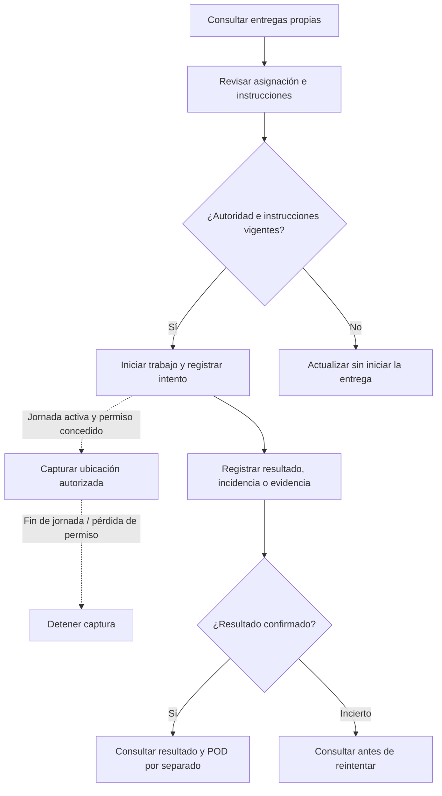
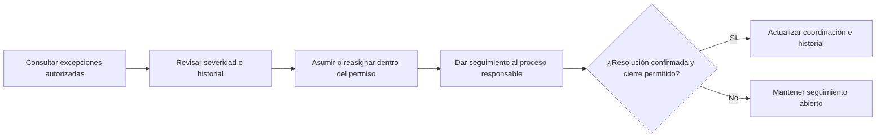
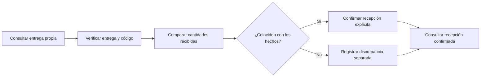

#### 3.1.4.4. Diagramas de flujo de usuario de aplicaciones Mobile

##### Especificación textual de flujos

```text
Mariela — continuidad de preparación y transferencia:
sesión/contexto válido → trabajo asignado → identificación y preparación → transferencia autorizada
  ├─ lote/vencimiento o preparación incompleta → alternativa manual o excepción visible
  └─ transferencia duplicada/no disponible → preservar estado previo → reintento sin comando falso

Diego — cierre de Delivery Attempt:
Delivery asignada → navegación externa → intento/resultado → evidencia permitida
  ├─ parcial/rechazado → conservar cantidades/motivo → continuación autorizada
  └─ evidencia pendiente o red fallida → resultado no resuelto → reintento sin cierre falso

Carlos — recepción y discrepancia:
actualización autorizada → verificar código de transferencia → confirmar cantidades
  ├─ coincide → Buyer Receipt
  ├─ diferencia → Buyer Receipt + Discrepancy
  └─ inválido/no disponible → sin confirmación de recepción → recuperación segura
```

Esta especificación conserva la trazabilidad de los caminos principales y de
recuperación. Los flowcharts posteriores no sustituyen un wireframe visual ni
prueban comportamiento en una aplicación; Driver Outcome, Buyer Receipt, Proof of Delivery, Notification,
Payment y Business Traceability deben seguir tratándose como hechos o estados
distintos.

##### Recorrido general: de la solicitud a la entrega

El flujo conecta la intención comercial con la preparación física y la
entrega. Cada transición conserva su responsabilidad: una solicitud no
reserva existencias por sí sola, una transferencia no confirma recepción y
una evidencia de entrega no sustituye la recepción del comprador.



El diagrama reúne procesos del producto y no afirma que todos hayan sido
ejecutados de extremo a extremo en un dispositivo. El paso Buyer pertenece a
una aplicación separada prevista.

##### Owner: comprender el trabajo operativo



La persona Owner consulta el trabajo preparado o bloqueado dentro del alcance
autorizado; la vista no concede permisos ni decide por otros procesos.

##### Sales: convertir una necesidad en intención comercial



El criterio de comprobación es cliente, contexto, cantidades y conservación de
la intención ante una respuesta incierta; un catálogo no sustituye la oferta.

##### Warehouse: registrar hechos físicos verificables



Identificar un SKU no equivale a modificar inventario; el recorrido conserva
la diferencia y la recuperación explícita.

##### Logistics: preparar y transferir responsabilidad



La salida y la aceptación del Driver permanecen separadas; la comprobación
incluye vigencia, bloqueos y asignación.

##### Driver: ejecutar una entrega asignada



La ubicación queda limitada por jornada y permiso; resultado, incidencia y POD
son hechos diferenciados.

##### BOM: coordinar sin reemplazar la decisión del proceso



La coordinación no concede autoridad para disponer stock ni alterar el
resultado de una entrega.

##### Buyer: recepción propia en la aplicación prevista



Buyer Mobile permanece planificado como aplicación separada; este diagrama no
presenta una pantalla implementada en Operations Android.

##### Recorridos por trabajo y criterio de comprobación

| Trabajo | Recorrido esencial | Resultado reconocible | Recuperación o evidencia que falta |
| :--- | :--- | :--- | :--- |
| Owner | Abrir vista operativa y revisar trabajo preparado o bloqueado | Acceso sólo al alcance autorizado y al proceso responsable | Datos vigentes y recorrido físico de la vista operativa. |
| Sales | Elegir cliente, consultar oferta y preparar solicitud | Solicitud confirmada por el servidor | Sesión real autorizada y consulta posterior desde el dispositivo. |
| Warehouse | Identificar SKU/lote, recibir, preparar o revisar existencias | Hecho físico confirmado y diferencia conservada | Lotes preparados, recuperación de conflictos y recorrido completo. |
| Logistics | Verificar preparación, asignación y mercancía; transferir responsabilidad | Transferencia y aceptación del Driver como hechos separados | Sesiones autorizadas y comprobación de salida/aceptación completa. |
| Driver | Revisar entrega e instrucciones; registrar intento, resultado y evidencia | Resultado y POD separados; ubicación sólo con jornada y permiso | Entrega asignada, permiso físico y recuperación de resultado incierto. |
| BOM | Revisar severidad, responsable e historial; coordinar excepción | Seguimiento o cierre sólo dentro de la autoridad vigente | Excepción preparada y comprobación de coordinación completa. |
| Buyer | Verificar entrega y código; comparar cantidades | Recepción explícita o discrepancia separada | Implementación de la aplicación independiente y validación con compradores. |

Las etiquetas Owner, Sales, Warehouse, Logistics, Driver y BOM describen
trabajos y personas del informe. La sesión, Tenant, Workspace, Membership y
los permisos del servidor determinan qué trabajo puede abrirse. La presencia
de Owner en este informe no define un rol nuevo en la aplicación.

##### Criterios de continuidad y permisos

- Una vista debe descartar datos del contexto anterior cuando cambia Tenant,
  Workspace o autoridad.
- La búsqueda manual permite continuar cuando la cámara no está disponible;
  identificar un SKU no equivale a modificar inventario.
- El cambio de responsabilidad exige conservar el estado previo y distinguir
  preparación, salida y aceptación independiente.
- El resultado incierto se consulta antes de repetir un comando; no se crea
  un receipt, POD o discrepancy duplicado.
- La ubicación se captura sólo dentro de la jornada autorizada y con el
  permiso necesario.

##### Correspondencia con el aprendizaje Lean UX

Warehouse y Logistics preparan la observación de H1, sobre continuidad entre
preparación, readiness y transferencia. Driver corresponde a H2, sobre
resultado y evidencia atribuibles a la entrega. Buyer corresponde a H3, sobre
recepción y discrepancia, y permanece previsto en una aplicación separada.
Owner, Sales, BOM y el recorrido general aportan contexto y coordinación; no
incorporan nuevas hipótesis.

La evaluación deberá observar los indicadores y comparar la línea base
establecidos en el proceso Lean UX. Estos diagramas preparan esa evaluación,
pero no acreditan reducción de esfuerzo, utilidad para usuarios o aceptación
del producto.

##### Estado de la comprobación

Los flujos de esta sección son diseño textual y criterios de comprobación.
Existe evidencia técnica para partes de acceso, navegación, contratos,
permisos y estados; queda pendiente demostrar cada recorrido autenticado de
extremo a extremo, con datos preparados y dispositivos autorizados. Las
pruebas técnicas no sustituyen la comprobación con usuarios ni la aceptación
del producto.
