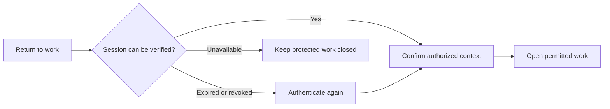
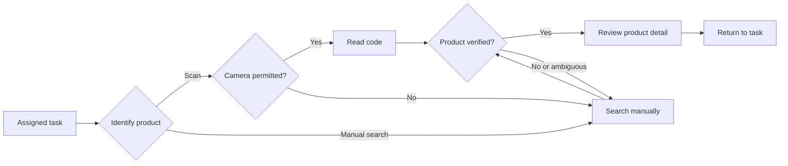
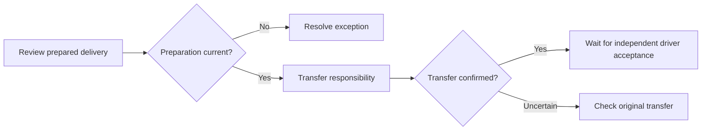
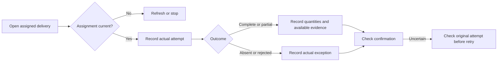
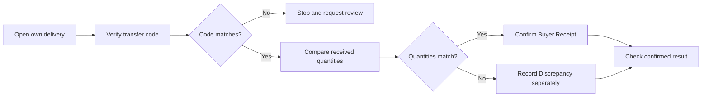

#### 3.1.4.4 Mobile Applications User Flow Diagrams

Los flujos distinguen el camino principal y las alternativas que impiden una confirmación incorrecta. Los diagramas expresan comportamiento esperado; las capturas ilustran solo las pantallas visibles en cada secuencia.

**Retomar trabajo autorizado**

*La secuencia muestra acceso, verificación visible de sesión y menú de operaciones.*

**Registrar trabajo de almacén**

*La secuencia muestra consultas de texto, resultados con productos similares, apertura de fichas y una nueva consulta.*

*La secuencia muestra una explicación de permiso, el diálogo de Android, la cámara abierta y el resultado «Identificación confirmada» para PROD-0003, presentación MOLDE 3KG.*

*La secuencia muestra denegación del permiso, búsqueda manual y apertura de una ficha de producto.*

*La captura etiquetada UP-10 muestra una consulta por código, su ficha, una búsqueda posterior por nombre y otra ficha.*

**Transferir una entrega preparada**

**Registrar evidencia de entrega**

**Confirmar recepción del comprador**

Las secuencias visuales aportadas cubren acceso, identificación de productos y permiso de cámara. Los diagramas de transferencia, entrega y recepción describen los recorridos diseñados para esos objetivos.
