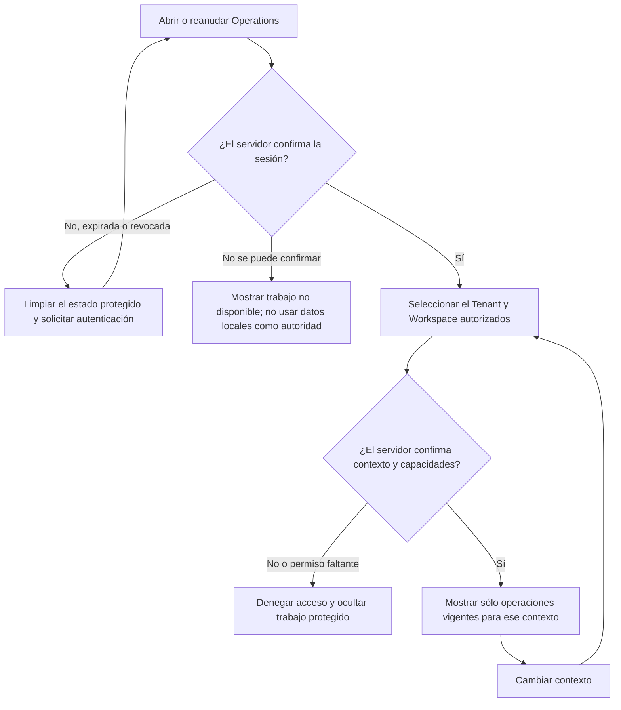
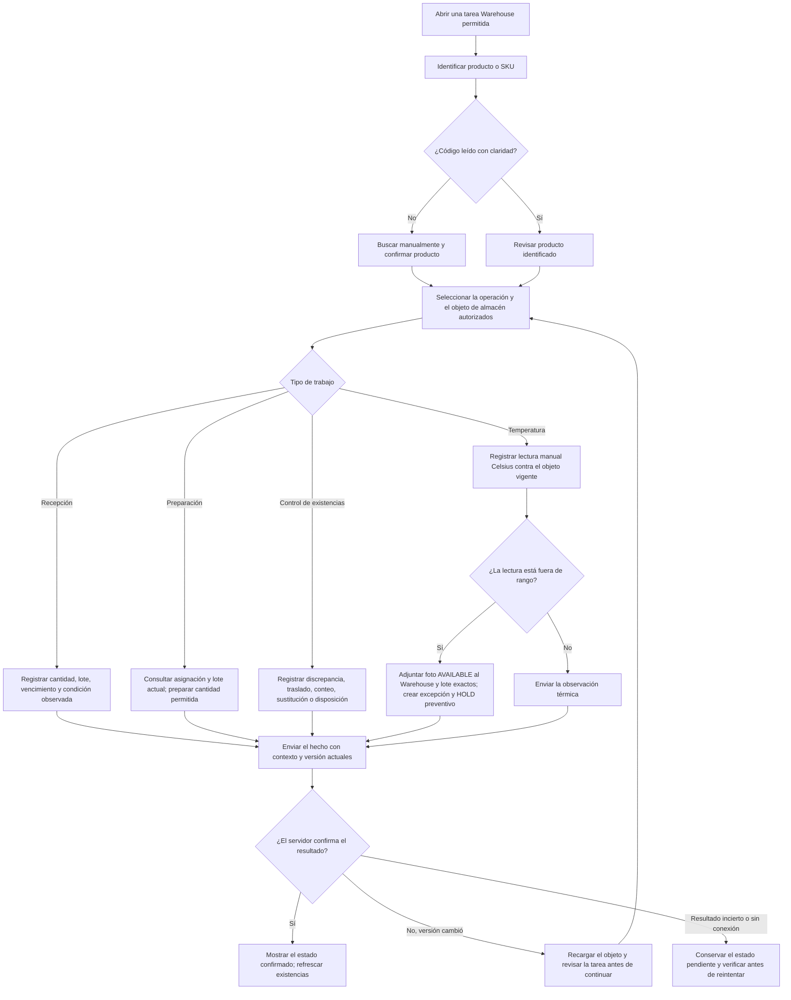
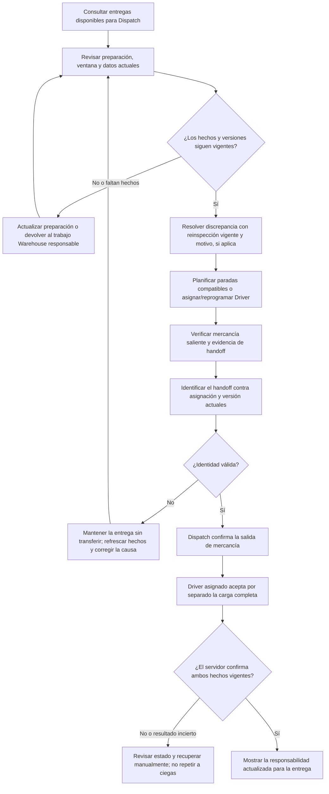
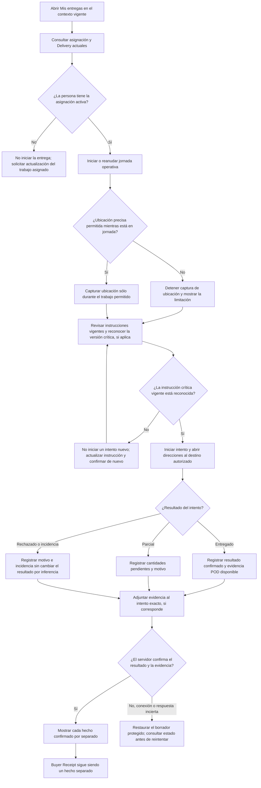
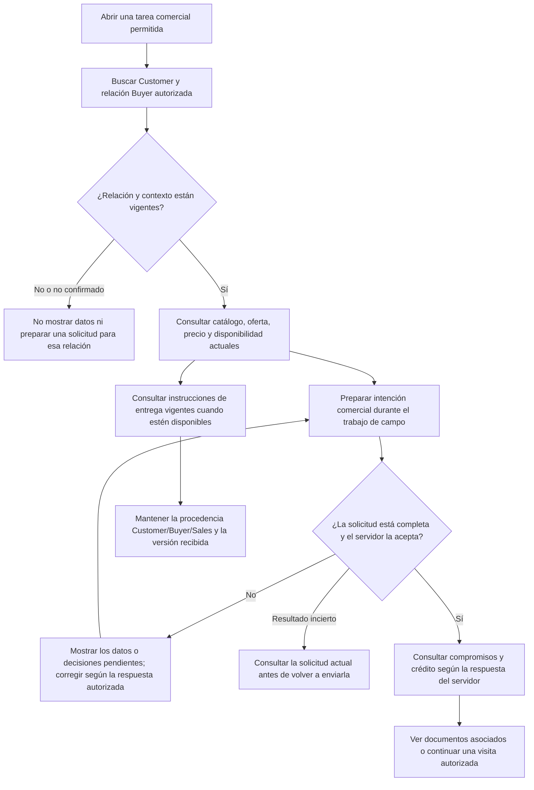
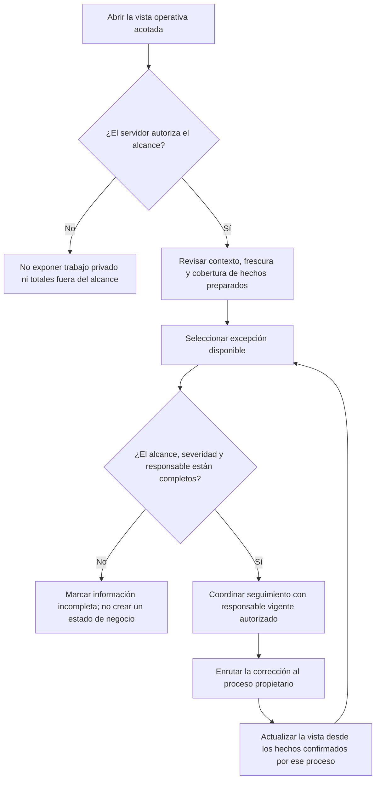
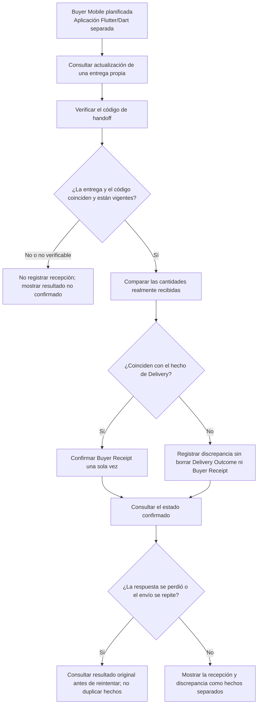

#### 3.1.4.4. Diagramas de flujo de usuario de aplicaciones Mobile

El [mapa de navegación y flujos por trabajo](./3.1.4.6-mobile-navigation-and-flow-guide.md)
agrupa user flows y wireflows por Owner, Sales, Warehouse, Logistics, Driver y
BOM, con Buyer en una aplicación planificada separada.

##### Alcance y lectura

Los diagramas modelan recorridos de Operations Mobile (Android/Kotlin/Compose)
a partir de `CONNECTED_OPERATIONS` en `MainActivity` y del catálogo vigente de
54 historias Operations. Las historias indicadas aportan trazabilidad
funcional; no prueban por sí mismas que el recorrido se haya ejecutado,
aceptado o desplegado. La evidencia de implementación y sus límites se
registra en
[Operations Mobile Wave 4](../../../04-product-implementation-and-validation/4.2-landing-page-and-mobile-application-implementation/4.2.5-operations-mobile-wave-4/4.2.5.1-development-evidence.md).

Las agrupaciones Warehouse, Dispatch, Driver, Sales y Business Operations
Manager describen tareas, no perfiles que la aplicación pueda asignar. El
servidor confirma la sesión, Tenant, Workspace, Membership, grants y
capacidades vigentes; la interfaz sólo presenta trabajo permitido. Los caminos
de recuperación preservan el estado confirmado y muestran como incierto todo
resultado que el servidor aún no haya confirmado.

La prueba Compose de humo reportada para `MainActivity` comprueba que el grafo
de la aplicación resuelve y que se muestra la pantalla de acceso; no recorre
estos escenarios de negocio. Buyer Mobile permanece como otra aplicación
planificada en Flutter/Dart, sin afirmaciones de implementación en este
documento.

##### Acceso y contexto de trabajo

*Retorno a Operations con validación de contexto; historias MOB-US-001–003.*

Este flujo no representa administración de usuarios, Memberships o grants, ni
un rol superusuario. La aplicación consume el alcance que confirma el servidor.

##### Warehouse — recepción, preparación y control de existencias

*Trabajo de almacén con autorización vigente; historias MOB-US-011–019,
MOB-US-050–056 y MOB-US-073.*

Una observación de discrepancia puede quedar lista para revisión sin aprobarse
ni corregir existencias. Un HOLD preventivo tampoco representa una disposición
final. Una lectura WAREHOUSE registra evidencia y excepción; no aplica HOLD
a todos sus lotes. El impacto preventivo requiere seleccionar explícitamente
los lotes y cantidades afectados. Cada cambio de inventario requiere la
autoridad y confirmación de su contexto propietario.

##### Dispatch — preparación y transferencia de responsabilidad

*Preparación y handoff de entregas; historias MOB-US-020–025 y MOB-US-057–061.*

Identificar el handoff no lo acepta. La transferencia exige confirmación de
Dispatch y aceptación del Driver asignado; no produce Buyer Receipt. La
planificación no implica optimización automática de rutas ni acceso Mobile a
un transportista externo.

##### Driver — jornada, entrega y evidencia

*Ejecución de entregas asignadas; historias MOB-US-026–029, MOB-US-031–035,
MOB-US-061–063 y MOB-US-065–066.*

Una lectura térmica manual puede registrarse sólo dentro de su contexto
autorizado; una excursión en tránsito sigue el HOLD de ejecución de BC-06 y no
recrea inventario. `MOB-US-030` (contacto Driver–Buyer) está excluida por
decisión directa de Product Owner y no aparece como acción. Resultado de Driver,
POD y Buyer Receipt permanecen separados.

##### Sales — trabajo comercial de campo

*Consulta comercial y solicitud desde trabajo de campo; historias
MOB-US-006–010, MOB-US-063, MOB-US-070 y MOB-US-072.*

La persona Sales registra intención comercial bajo su identidad autorizada; no
suplanta la confirmación Buyer. Catálogo, precio, crédito, relación comercial e
instrucciones conservan la autoridad de sus contextos propietarios. Este flujo
no incorpora chat Driver–Buyer.

##### Business Operations Manager — vista y coordinación

*Priorización de trabajo y seguimiento de excepciones; historias MOB-US-004–005.*

La coordinación no concede autoridad para resolver inventario, Delivery u otro
proceso dueño, ni para cerrar una excepción sólo desde la vista agregada.

El recorrido BOM observado abrió «Coordinar excepciones operativas», mostró
la lista actual vacía y regresó al trabajo autorizado mediante «Back». Sus
[pantallas y guía](./3.1.4.2-mobile-application-wireflows.md) registran únicamente
esa navegación; asumir, reasignar y cerrar siguen siendo caminos del modelo que
no fueron ejecutados en esta captura.

##### Buyer — flujo planificado en una aplicación separada

*Recorrido de diseño de Buyer Mobile, otra aplicación prevista; historias
MOB-US-044, MOB-US-047–049. No representa implementación ejecutada.*

Buyer Mobile es el plano previsto para atención, recepción y discrepancias del
comprador. No forma parte de `CONNECTED_OPERATIONS` y este modelo no afirma que
esa aplicación, sus pantallas ni sus recorridos estén implementados o validados.
