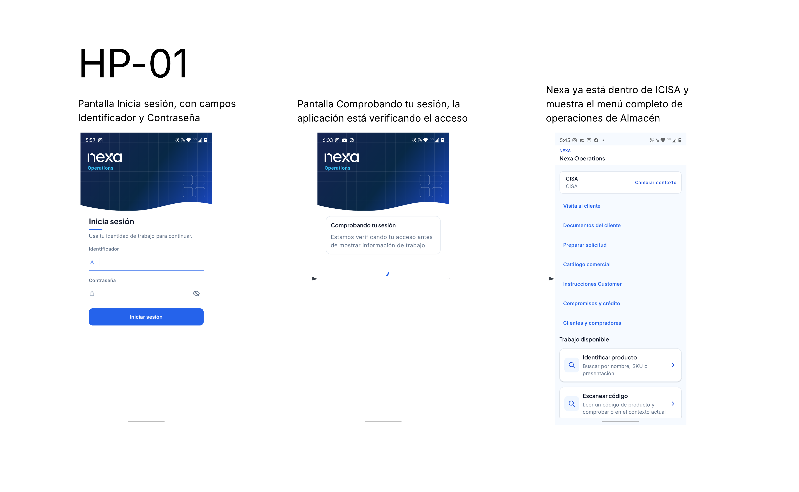
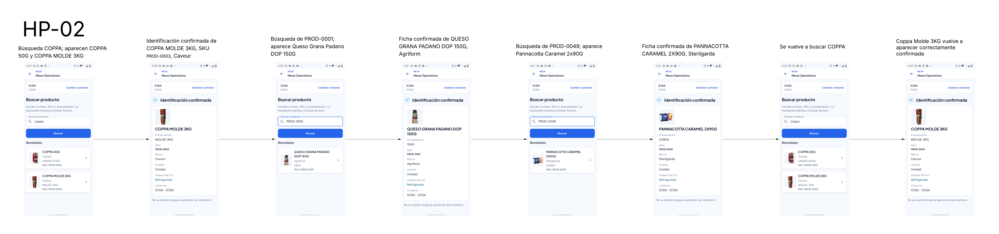
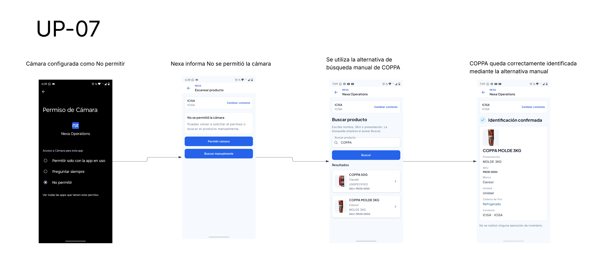
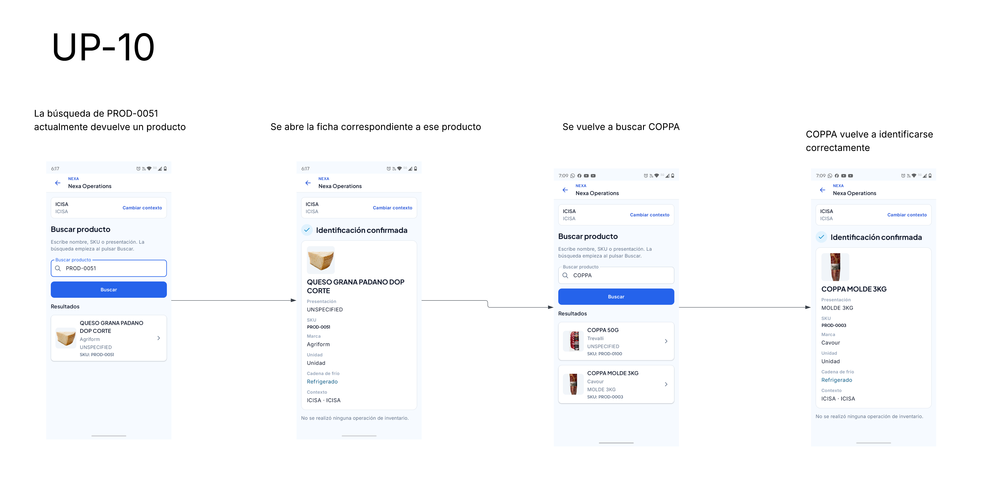

#### 3.1.4.4 Mobile Applications User Flow Diagrams

Los recorridos describen el comportamiento esperado para cada actor. En cada cambio de negocio, la app presenta el contexto vigente y solicita la acción al servidor, que confirma el resultado; la información local por sí sola no establece un hecho de negocio. Cada alternativa conserva la claridad cuando la identidad, asignación o dato requiere revisión. El recorrido Buyer pertenece al diseño de Buyer Mobile en Flutter; el operativo, al de Operations Mobile nativa Android en Kotlin. Las capturas ilustran las pantallas incluidas en estas secuencias y las tablas organizan cada meta, recorrido y alternativa. Buyer Mobile se presenta como objetivo de diseño `TARGET`.

**Retomar trabajo autorizado**

| Historias | Objetivo | Camino principal | Alternativa |
| --- | --- | --- | --- |
| MOB-US-001–003 | **1. Reanudar el contexto de trabajo** | La persona inicia sesión, selecciona Tenant/Workspace y abre una tarea que el servidor confirma para su membresía y capacidades. **Cierre:** identidad, contexto y tarea permitida quedan confirmados. | Si la sesión vence, el acceso se revoca o el contexto no está disponible, vuelve a autenticarse o actualizarlo; sin confirmación no se muestra trabajo protegido. |

*La captura recorre el inicio de sesión, el estado visible de la sesión y el menú de operaciones.*

**Registrar trabajo de almacén**

| Historias | Objetivo | Camino principal | Alternativa |
| --- | --- | --- | --- |
| MOB-US-011–012 | **2. Identificar un producto** | Desde una tarea de almacén, el operador escanea el código y revisa el producto coincidente antes de continuar. **Cierre:** queda confirmada una coincidencia clara y autorizada; la identificación no registra hechos de stock. | Sin cámara o permiso, busca por texto o código; si la consulta devuelve coincidencias ambiguas o ninguna, refina la búsqueda y no adivina. |
| MOB-US-013–014 | **3. Registrar la recepción física** | El operador registra SKU, cantidad, lote y vencimiento observados y solicita confirmar la recepción con esos datos. **Cierre:** el servidor confirma un arribo completo con cantidad positiva. | Si los datos físicos difieren de lo esperado, registra los hechos observados y la diferencia. Si falta un dato requerido, detiene el envío hasta corregirlo; una recepción no confirmada no aumenta el stock disponible. |
| MOB-US-015–016 | **4. Preparar el lote y la cantidad asignados** | El operador revisa la condición del stock y la Physical Allocation vigentes, selecciona el lote elegible según FEFO y solicita confirmar la cantidad asignada. **Cierre:** queda confirmado el picking contra lote elegible y cantidad restante. | Si el estado está desactualizado, el lote vencido, retenido, en cuarentena o no asignado, o la cantidad excede lo restante, detiene la acción y revisa el trabajo vigente. |
| MOB-US-017 | **5. Reportar una discrepancia de stock** | El operador registra la diferencia física, los artículos afectados, el motivo y la evidencia pertinente para que la revise el actor autorizado. **Cierre:** queda registrado el reporte autorizado; la disposición del stock se decide por separado. | Si falta permiso, motivo o evidencia requerida, conserva la diferencia para completar el reporte; sin autoridad de resolución no cambia la disposición. |
| MOB-US-018 | **6. Transferir stock entre ubicaciones (DEFERRED)** | **Diseño de evolución:** el operador identifica origen, destino, lote y cantidad; confirma el movimiento con datos vigentes y, en destino, confirma por separado lo recibido. El resultado esperado conserva distintos los hechos de origen, tránsito y recepción. | Si faltan datos o la recepción en destino difiere, el movimiento queda sin resolver; un borrador local no confirma el movimiento ni la recepción. |
| MOB-US-019 | **7. Registrar temperatura manual** | El operador selecciona el lote o almacén observado y registra el valor, unidad, momento y sujeto de la lectura. **Cierre:** queda confirmada una lectura atribuible al sujeto y alcance registrados. | Si falta sujeto o unidad, no crea evidencia incompleta. Cuando una lectura constituye una excursión según el control aplicable, el HOLD para un lote afecta solo la cantidad identificada; para un almacén se seleccionan primero los lotes y cantidades afectados. Un actor autorizado determina la disposición. |

*La secuencia muestra consultas de texto, resultados similares, una ficha y una consulta posterior.*

*La secuencia muestra la explicación del permiso, el diálogo de Android, la vista de cámara y la ficha de PROD-0003 con «Identificación confirmada».*

*La captura muestra la denegación del permiso, la búsqueda manual y la apertura de una ficha.*

*La secuencia contiene una consulta por código con su ficha y otra consulta por nombre con su ficha.*

**Preparar y despachar una entrega preparada**

| Historias | Objetivo | Camino principal | Alternativa |
| --- | --- | --- | --- |
| MOB-US-020–025 | **8. Preparar y despachar una entrega asignada** | El coordinador revisa una entrega preparada con datos vigentes, asigna un Driver elegible, contrasta los bienes salientes con la Physical Allocation, conserva la evidencia requerida y solicita confirmar el despacho. **Cierre:** el servidor confirma el despacho de esa entrega. | Si la entrega no está lista, la asignación no es elegible, los bienes no coinciden, falta evidencia o el estado cambió, detiene la confirmación y actualiza la información. Si la respuesta es incierta, consulta la misma entrega antes de reintentar. |

**Ejecutar trabajo como Driver**

| Historias | Objetivo | Camino principal | Alternativa |
| --- | --- | --- | --- |
| MOB-US-026–028, 031–033 | **9. Ejecutar una entrega asignada** | El Driver revisa una asignación vigente, inicia el Delivery Attempt, puede pasar el destino autorizado a navegación externa y registra el resultado físico, las cantidades y la evidencia requerida. **Cierre:** queda confirmado el resultado del intento y, cuando la política lo requiere, su POD. | Si la asignación está desactualizada, falta evidencia o el resultado no está confirmado, detiene la acción y consulta el mismo intento antes de repetirla. El resultado del Driver y el POD permanecen separados; las cantidades parciales o rechazadas no se muestran como una entrega completa. |
| MOB-US-029 | **10. Considerar la ubicación de una entrega (DEFERRED)** | **Diseño de evolución:** se conserva la intención de compartir la ubicación de una entrega para apoyar el trabajo del Driver; las reglas de esa capacidad quedan sujetas a una definición futura aceptada. | En V1, el Driver pasa el destino autorizado a navegación externa según el objetivo 9. Esa acción no registra ubicación de la entrega; la meta MOB-US-029 permanece diferida. |
| MOB-US-034 | **11. Presentar un código acotado de entrega** | Con una entrega y un intento activos, el Driver presenta el código breve asociado a esa Delivery para identificar el handoff. **Cierre:** el código verificado identifica el handoff, pero no registra Buyer Receipt, POD ni finalización. | Si el código es incorrecto, venció o ya se utilizó, no cambia la entrega. Si no está disponible, solo una alternativa aprobada mantiene explícito el handoff; no se registra una aceptación falsa. |

**Revisar una entrega como Buyer**

| Historias | Objetivo | Camino principal | Alternativa |
| --- | --- | --- | --- |
| MOB-US-044 | **12. Identificar una entrega propia que requiere atención (TARGET)** | Buyer Mobile presenta una actualización relevante de una Delivery propia; el Buyer abre la relación autorizada y consulta el estado vigente. **Cierre de diseño:** muestra el estado actual de una entrega propia; la actualización no cambia la Delivery. | Si la notificación no llega, el Buyer puede consultar la Delivery al abrir la app. Una relación ajena no revela información de la entrega. |
| MOB-US-047–049 | **13. Confirmar lo recibido o reportar una diferencia (TARGET)** | El Buyer verifica que el código corresponda a la Delivery y al intento, compara las cantidades y solicita registrar el Buyer Receipt. **Cierre de diseño:** el recibo queda confirmado y cualquier Discrepancy se conserva como hecho separado. | Si el código es inválido, venció o no puede verificarse, la recepción queda sin confirmar. Una diferencia preserva los hechos del Driver y del Buyer sin reemplazarlos. |
