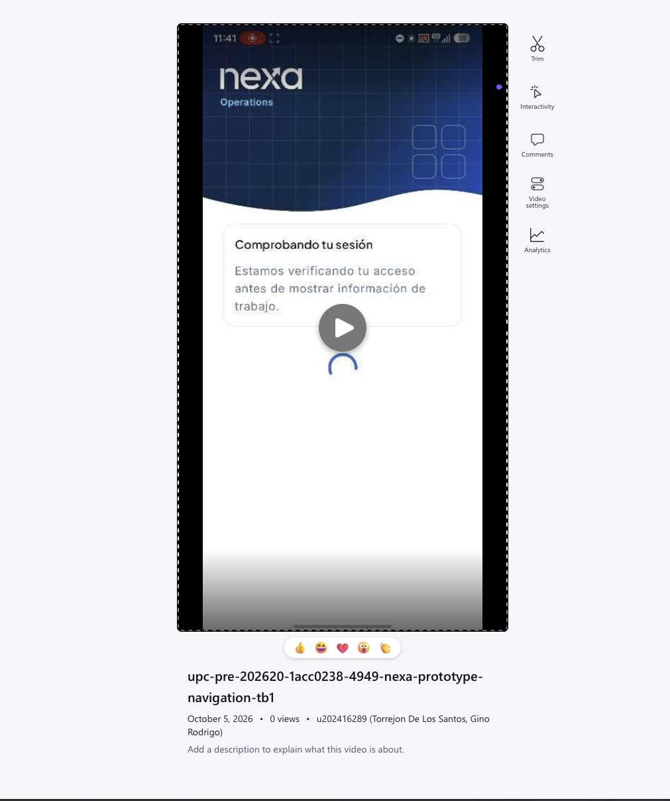

#### 3.1.4.5 Mobile Applications Prototyping

La evidencia audiovisual del prototipo móvil se presenta en la [grabación del prototipo de Nexa](https://upcedupe-my.sharepoint.com/:v:/g/personal/u202323040_upc_edu_pe/IQDZehdOpGE0TahaQPj0HA3WARS1Q_dJsDD9oO3iDeH-ygA?e=vO7Upw). La grabación tiene una duración de 1 minuto y 41 segundos. Su consulta complementa los wireflows y User Flows del capítulo, diferenciando la propuesta de interacción de las comprobaciones técnicas de implementación.

*Vista previa de la grabación del prototipo de navegación móvil.*

El prototipado permite revisar secuencia, contenido y recuperación. La grabación no sustituye resultados de autorización, persistencia, reglas de negocio o aceptación con usuarios; la instalación y prueba de la aplicación en un dispositivo físico constituyen una evidencia distinta.
