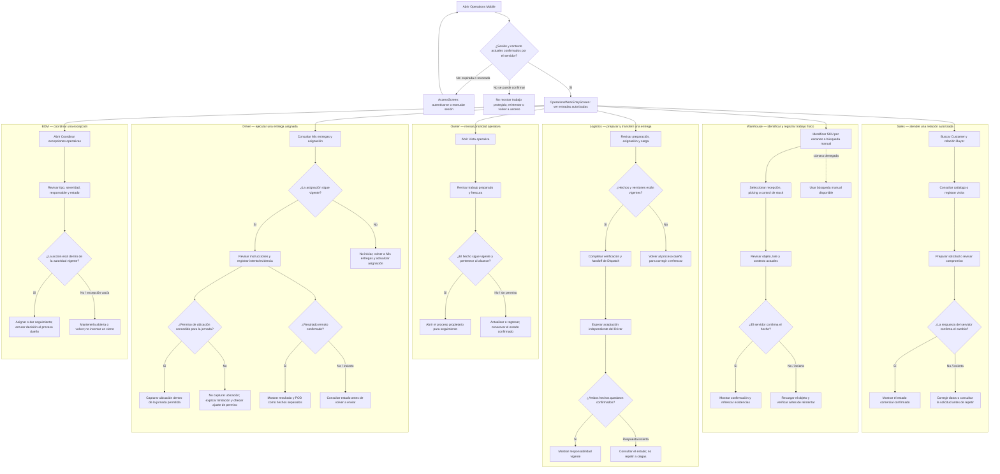
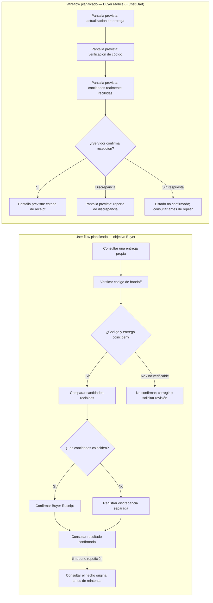

#### 3.1.4.6. Mapa de navegación y flujos por trabajo Mobile

Esta guía agrupa los user flows por objetivo y los wireflows por pantalla de
entrada, ruta y recuperación. Complementa los diagramas detallados de
[wireflows](./3.1.4.2-mobile-application-wireflows.md) y
[user flows](./3.1.4.4-mobile-application-user-flows.md); no sustituye sus
decisiones funcionales ni la evidencia de implementación del
[capítulo 4](../../../04-product-implementation-and-validation/4.2-landing-page-and-mobile-application-implementation/4.2.5-operations-mobile-wave-4-evidence.md).

Las etiquetas Owner, Sales, Warehouse, Logistics, Driver y BOM describen
trabajos y personas del informe. Operations Mobile no asigna esos perfiles: el
servidor confirma la sesión, Tenant, Workspace, Membership y permisos. El hub
presenta únicamente las entradas autorizadas. En particular, el código no
declara un rol de aplicación llamado `Owner`; este mapa relaciona esa persona
con la vista operativa si el servidor concede `dispatch.read`.

Los nombres entre comillas son etiquetas del hub actual; los identificadores
entre paréntesis son claves de ruta de `CONNECTED_OPERATIONS`. `OperationsWorkEntryScreen`
es el hub común, `AccessScreen` gestiona acceso y sesión, y
`ContextChooserScreen` selecciona o cambia el contexto. Una ruta modelada o
implementada no demuestra que su resultado comercial u operativo haya sido
validado. La evidencia efectivamente observada se informa por separado en el
capítulo 4.

##### User flows — objetivo, decisión y recuperación

Cada subgrafo representa el objetivo principal, un resultado esperado y una
salida segura para permisos faltantes, información desactualizada o respuesta
incierta. Los caminos operativos detallados y su trazabilidad a historias están
en los diagramas de [user flows](./3.1.4.4-mobile-application-user-flows.md).

##### Wireflows — entradas y pantallas Operations implementadas

El diagrama ubica las entradas y rutas actuales. Las opciones que una pantalla
abre como paso interno se señalan como rutas anidadas; no todas aparecen como
botones del hub. Una ruta que no supera la autorización vigente no se abre y el
estado protegido se invalida al cambiar el contexto o la autoridad.

```mermaid
flowchart TB
    A["AccessScreen<br/>acceso o reanudación"] --> C{"Sesión y contexto autorizados?"}
    C -->|No / expirados| A
    C -->|Sin contexto seleccionable| X["ContextChooserScreen<br/>elegir, cambiar o recuperar contexto"]
    X --> C
    C -->|Sí| H["OperationsWorkEntryScreen<br/>hub filtrado por permisos del servidor"]
    C -. "fallo de confirmación" .-> R["No abrir pantalla protegida<br/>reintentar o volver a acceso"]
    R --> A

    H --> O["Owner persona: Vista operativa<br/>operations.overview"]
    H --> OE["Trabajo bloqueado<br/>operations.exceptions"]
    O --> OS["OperationsOverviewScreen"]
    OE --> OS
    OS --> OR["Preparación de despacho<br/>dispatch.readiness"]
    OS -. "sin permiso / datos antiguos" .-> H

    H --> S1["Clientes y compradores<br/>commercial.customers"]
    H --> S2["Catálogo comercial<br/>commercial.catalog"]
    H --> S3["Visita al cliente<br/>commercial.visit"]
    H --> S4["Preparar solicitud<br/>commercial.request"]
    H --> S5["Compromisos y crédito<br/>commercial.progress"]
    H --> S6["Documentos del cliente<br/>commercial.documents"]
    H --> S7["Instrucciones Customer<br/>commercial.instructions"]
    S1 --> S8["Detalle/relación y trabajo Sales vigente"]
    S2 --> S8
    S3 --> S8
    S4 --> S9{"¿Solicitud confirmada por API?"}
    S9 -->|Sí| S5
    S9 -->|No / incierta| SR["Corregir o consultar estado antes de repetir"]
    S6 --> S8
    S7 --> S8
    SR --> H

    H --> W0["Warehouse base<br/>OperationsWorkEntryScreen"]
    W0 --> W1["ProductSearch → ConfirmedSku"]
    W1 --> W2["Receiving / Picking / StockCondition"]
    W0 --> W3["Discrepancia: borrador local<br/>warehouse.inbound-discrepancy"]
    W0 --> W4["Preparar grupo de picking<br/>warehouse.batch"]
    W0 --> W5["Registrar temperatura<br/>warehouse.temperature"]
    W0 --> W6["Traslado / recepción destino<br/>warehouse.transfer / warehouse.transfer-receipt"]
    W0 --> W7["Conteo / disposición / observaciones<br/>warehouse.cycle-count / warehouse.disposition / warehouse.automation"]
    W1 -. "cámara denegada" .-> WM["ProductSearch: búsqueda manual"]
    W2 -. "scope/version conflict" .-> WR["Recargar el objeto actual y revisar antes de repetir"]
    WR --> W0

    H --> L1["Preparación de despacho<br/>dispatch.readiness"]
    H --> L2["Cargas y paradas<br/>dispatch.loads"]
    H --> L3["Instrucciones de entrega<br/>dispatch.instructions"]
    L1 --> L4["Rutas internas: asignar/replanificar,<br/>verificar salida, identidad y handoff"]
    L2 --> L4
    L4 --> L5{"¿Dispatch confirma salida y Driver acepta carga?"}
    L5 -->|Sí| L6["Responsabilidad actualizada"]
    L5 -->|No / incierto| LR["Volver a la entrega, refrescar y verificar el estado"]
    LR --> L1

    H --> D1["Mis entregas<br/>driver.deliveries"]
    H --> D2["Jornada y ubicación<br/>driver.workday"]
    H --> D3["Aceptar carga completa<br/>driver.loads"]
    D1 --> D4["Detalle → instrucciones → intento / POD / incidencia"]
    D1 --> D5["Rutas internas: código de entrega y temperatura<br/>driver.handoff-code / driver.execution-temperature"]
    D2 --> D6{"¿Permiso de ubicación concedido?"}
    D6 -->|Sí| D7["Captura sólo durante jornada autorizada"]
    D6 -->|No| D8["Sin captura; conservar jornada y ofrecer recuperación de permiso"]
    D4 -. "resultado incierto" .-> DR["Consultar entrega antes de repetir el comando"]
    DR --> D1

    H --> B1["Coordinar excepciones operativas<br/>bom.exceptions"]
    B1 --> B2["BusinessOperationalExceptionsScreen<br/>lista y detalle"]
    B2 --> B3["Asumir/reasignar/seguir dentro del permiso"]
    B3 --> B4{"¿Resolución del proceso dueño confirmada?"}
    B4 -->|Sí| B5["Actualizar seguimiento y cierre permitido"]
    B4 -->|No / no hay excepciones| B6["Volver a la lista; mantener estado abierto"]

    H --> Back["Volver a trabajo autorizado"]
    OS --> Back
    S8 --> Back
    S5 --> Back
    WM --> Back
    W2 --> Back
    W3 --> Back
    W4 --> Back
    W5 --> Back
    W6 --> Back
    W7 --> Back
    L6 --> Back
    D7 --> Back
    D8 --> Back
    B5 --> Back
    B6 --> Back
```

##### Buyer — user flow y wireflow planificados en una aplicación separada

Buyer Mobile se proyecta como una aplicación Flutter/Dart independiente. Los
nodos de esta sección son diseño planificado; no corresponden a pantallas de
`CONNECTED_OPERATIONS`, no acreditan código implementado y no se consideran
recorridos ejecutados.

##### Trazabilidad a diagramas existentes

| Trabajo | User flow detallado | Wireflow / evidencia de pantalla |
| --- | --- | --- |
| Owner, vista operativa y trabajo bloqueado | [User flows de Operations](./3.1.4.4-mobile-application-user-flows.md#acceso-y-contexto-de-trabajo) | [Wireflows de Operations](./3.1.4.2-mobile-application-wireflows.md) |
| Sales | [Sales](./3.1.4.4-mobile-application-user-flows.md#sales--trabajo-comercial-de-campo) | [Wireflows y capturas observadas](./3.1.4.2-mobile-application-wireflows.md) |
| Warehouse | [Warehouse](./3.1.4.4-mobile-application-user-flows.md#warehouse--recepción-preparación-y-control-de-existencias) | [Wireflows y capturas observadas](./3.1.4.2-mobile-application-wireflows.md) |
| Logistics / Dispatch | [Dispatch](./3.1.4.4-mobile-application-user-flows.md#dispatch--preparación-y-transferencia-de-responsabilidad) | [Wireflows y capturas observadas](./3.1.4.2-mobile-application-wireflows.md) |
| Driver | [Driver](./3.1.4.4-mobile-application-user-flows.md#driver--jornada-entrega-y-evidencia) | [Wireflows de Operations](./3.1.4.2-mobile-application-wireflows.md) |
| BOM | [Business Operations Manager](./3.1.4.4-mobile-application-user-flows.md#business-operations-manager--vista-y-coordinación) | [Wireflows y capturas observadas](./3.1.4.2-mobile-application-wireflows.md) |
| Buyer, aplicación futura | [Buyer — planificado](./3.1.4.4-mobile-application-user-flows.md#buyer--flujo-planificado-en-una-aplicación-separada) | [Wireflow planificado incluido en esta guía](#buyer--user-flow-y-wireflow-planificados-en-una-aplicación-separada) |

Los diagramas anteriores describen pantallas y transiciones Mobile; no son
wireframes visuales ni un prototipo interactivo. La disponibilidad de esos
artefactos se registra por separado en [wireframes](./3.1.4.1-mobile-application-wireframes.md),
[mock-ups](./3.1.4.3-mobile-application-mockups.md) y
[prototipado](./3.1.4.5-mobile-application-prototyping.md).

Los [recorridos individuales y su matriz de verificación](3.1.4.7-role-journeys-and-validation.md) presentan cada perfil y el flujo general de forma separada.
