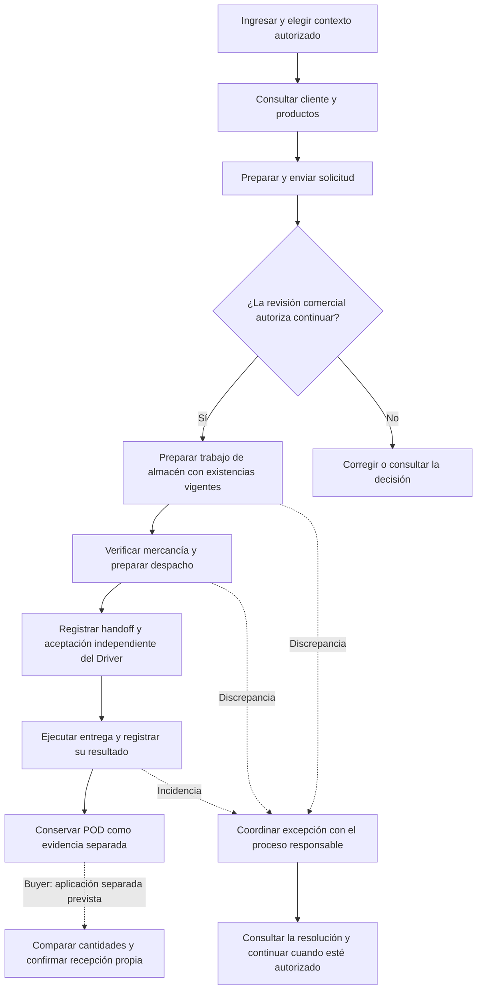
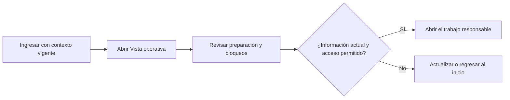
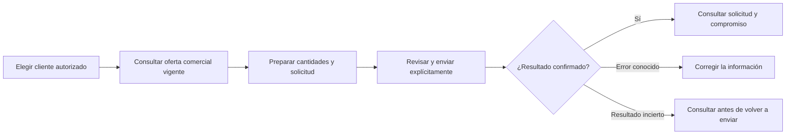
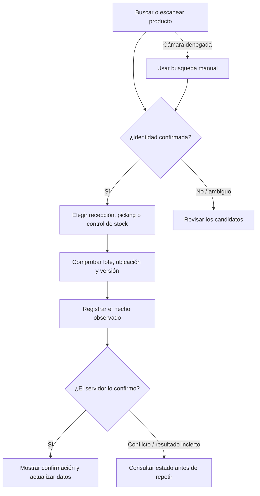
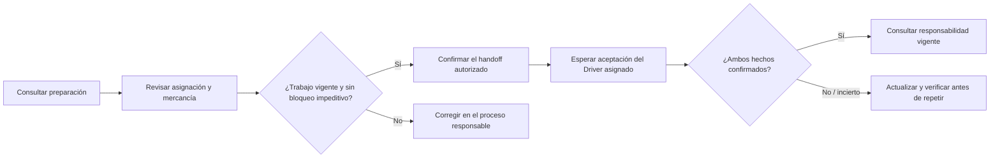
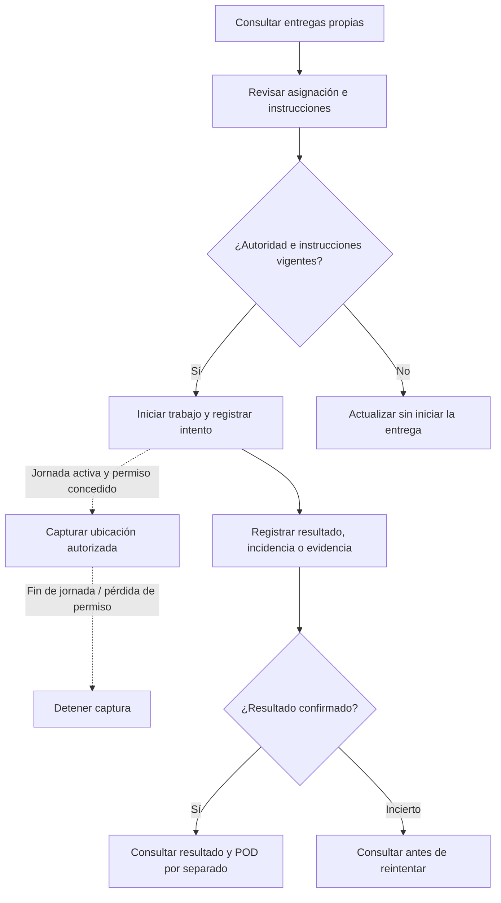
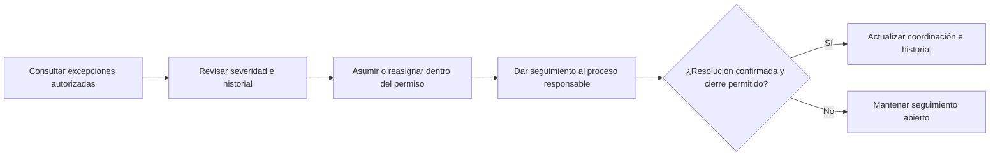
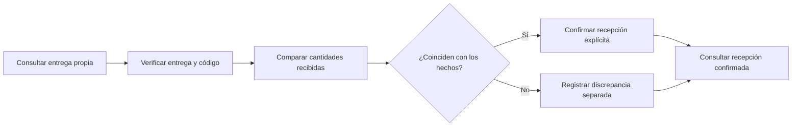

#### 3.1.4.7. Recorridos por usuario y criterios de verificación

Los recorridos presentan el objetivo de cada participante, las decisiones que necesita tomar y el resultado que debe poder reconocer. Son una lectura funcional del [mapa de navegación](3.1.4.6-mobile-navigation-and-flow-guide.md) y de los [user flows detallados](3.1.4.4-mobile-application-user-flows.md). Los perfiles orientan el diseño; la sesión, el contexto y los permisos vigentes determinan qué trabajo puede abrir cada persona.

##### Recorrido general: de la solicitud a la entrega

El flujo general conecta la intención comercial con la preparación física y la entrega. Cada transición conserva su responsabilidad: una solicitud no reserva existencias por sí sola, un handoff no confirma recepción y una evidencia de entrega no sustituye la recepción del comprador.

*Recorrido general de referencia del producto.*

El diagrama reúne procesos del producto y no afirma que todos hayan sido ejecutados de extremo a extremo en un dispositivo. El paso Buyer pertenece a una aplicación separada prevista.

##### Owner: comprender el trabajo operativo

El propietario necesita identificar trabajo preparado o bloqueado y acceder al proceso responsable con información vigente. La vista operativa es una consulta acotada; no reúne permisos que la persona no tenga ni permite decidir en nombre de todos los procesos.

*Recorrido de consulta operativa.*

La verificación debe comprobar que la vista respete el alcance autorizado y descarte datos del contexto anterior. La presencia de la persona Owner en el informe no define un rol nuevo en la aplicación.

##### Sales: convertir una necesidad en intención comercial

El vendedor trabaja con un cliente autorizado, consulta su oferta y prepara una solicitud explícita. El resultado reconocible es la solicitud confirmada por el servidor, sin confundirla con la disponibilidad de existencias o la salida física.

*Recorrido comercial de campo.*

La comprobación debe cubrir el cliente y contexto correctos, las cantidades y la conservación de la intención ante una respuesta incierta. Un listado de productos no sustituye una oferta comercial con condiciones autorizadas.

##### Warehouse: registrar hechos físicos verificables

El operario identifica el producto y el lote antes de recibir, preparar o revisar existencias. La búsqueda manual permite continuar cuando no se concede acceso a la cámara. El registro debe expresar lo observado y conservar las diferencias para revisión.

*Recorrido de identificación y trabajo físico.*

La verificación debe distinguir identificar un SKU de modificar inventario, impedir confirmaciones con datos obsoletos y conservar la recuperación explícita de una discrepancia.

##### Logistics: preparar y transferir responsabilidad

El responsable de despacho verifica preparación, asignación y mercancía. La salida y la aceptación del Driver son hechos separados; el cambio de responsabilidad debe poder explicarse con ambos registros y sus restricciones vigentes.

*Recorrido de preparación y handoff.*

La comprobación debe incluir versiones, bloqueos, asignación y separación entre la confirmación de Dispatch y la aceptación del Driver.

##### Driver: ejecutar una entrega asignada

El transportista revisa su asignación e instrucciones antes de iniciar el trabajo. La ubicación se captura únicamente dentro de la jornada autorizada y con el permiso necesario. El resultado de la entrega, las incidencias y el POD se registran como hechos diferenciados.

*Recorrido de ejecución de entrega.*

La verificación debe cubrir la pérdida de asignación o permiso, la parada de ubicación, las instrucciones críticas y la recuperación de comandos inciertos. Para el recorrido físico se necesita una identidad Driver autorizada y una entrega preparada dentro de su alcance.

##### BOM: coordinar sin reemplazar la decisión del proceso

La coordinación de excepciones permite conocer severidad, responsabilidad e historial y dirigir el trabajo hacia quien puede resolverlo. La coordinación no concede automáticamente autoridad para disponer stock o alterar el resultado de una entrega.

*Recorrido de coordinación de excepción.*

La comprobación debe demostrar que las acciones respeten la severidad y la autoridad vigente y que un cierre no sustituya una resolución inexistente.

##### Buyer: recepción propia en la aplicación prevista

El comprador consulta una entrega asociada a su relación comercial, verifica el handoff y registra las cantidades efectivamente recibidas. Este flujo pertenece al diseño de Buyer Mobile y no se presenta como un recorrido implementado en Operations Android.

*Recorrido Buyer planificado.*

##### Correspondencia con el aprendizaje Lean UX

Los recorridos Warehouse y Logistics permiten preparar la observación de H1, sobre continuidad entre preparación, readiness y handoff. Driver corresponde a H2, sobre resultado y evidencia atribuibles a la entrega. Buyer corresponde a H3, sobre recepción y discrepancia, y permanece previsto en una aplicación separada. Owner, Sales, BOM y el recorrido general aportan contexto y coordinación; no incorporan nuevas hipótesis ni reemplazan esos tres focos de aprendizaje.

La evaluación deberá observar los indicadores y comparar la línea base establecidos en las [Hypothesis Statements](../../../01-presentation/1.2-solution-profile/1.2.2-lean-ux-process/1.2.2.3-hypothesis-statements.md). Los diagramas y las pruebas técnicas preparan esa evaluación, pero no acreditan reducción de esfuerzo, utilidad para usuarios o aceptación del producto.

##### Estado de la verificación de los recorridos

*Evidencia disponible y comprobación integral pendiente.*

| Recorrido | Evidencia técnica disponible | Comprobación integral pendiente |
| --- | --- | --- |
| Acceso y contexto común | Pruebas de sesión, navegación, pérdida de capacidad y contexto; instrumentación Android API 29 y 37. | Sign-in y cambio de contexto con los perfiles reales en el teléfono. |
| Owner | Consultas de preparación, permisos y navegación autorizada. | Recorrido físico de vista operativa con datos del contexto vigente. |
| Sales | Pruebas de búsqueda, catálogo comercial, solicitud y sus contratos API. | Solicitud real autorizada y consulta posterior desde el dispositivo. |
| Warehouse | Identificación, cámara denegada, recepción, picking, condición de stock y discrepancia; pruebas de contrato y estado local. | Hechos físicos, lotes y recuperaciones del recorrido completo con datos preparados. |
| Logistics | Preparación, asignación, verificación de salida, handoff y carga; contratos API verificados. | Handoff completo y aceptación independiente del Driver desde sesiones autorizadas. |
| Driver | Entrega, jornada, instrucciones, ubicación y evidencia: pruebas de política, ViewModel y gateway. | Identidad Driver, entrega asignada y prueba física de ubicación, permisos y resultado. |
| BOM | Pruebas de ciclo de vida, severidad, rutas y cuerpos de coordinación. | Coordinación completa sobre una excepción real preparada para validación. |
| Buyer | Diseño y contratos asociados en el backend. | Implementación de la aplicación separada y validación con compradores. |

Las suites de referencia aprobaron 673 pruebas API, 456 JVM Android y 53 pruebas instrumentadas por cada API 29 y 37. Son totales de suites, no conteos de recorridos completos por usuario. Una ejecución posterior en Android Studio volvió a aprobar las 456 pruebas JVM, junto con arquitectura, lint y compilación. La instalación y el arranque en Samsung constituyen una comprobación inicial del dispositivo. Ningún recorrido autenticado completo se declara aprobado en este corte. La [validación técnica del capítulo 4](../../../04-product-implementation-and-validation/4.2-landing-page-and-mobile-application-implementation/4.2.5-operations-mobile-wave-4/4.2.5.7-validation-update-2026-10-02.md) conserva el resultado y sus límites.
