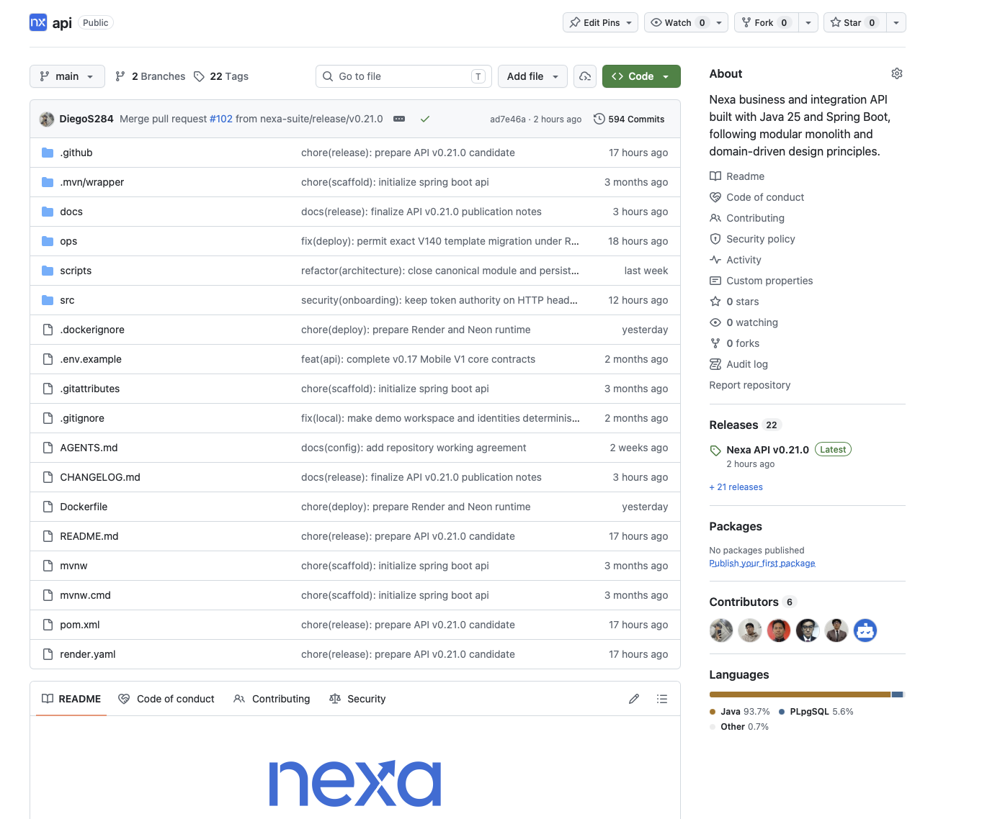
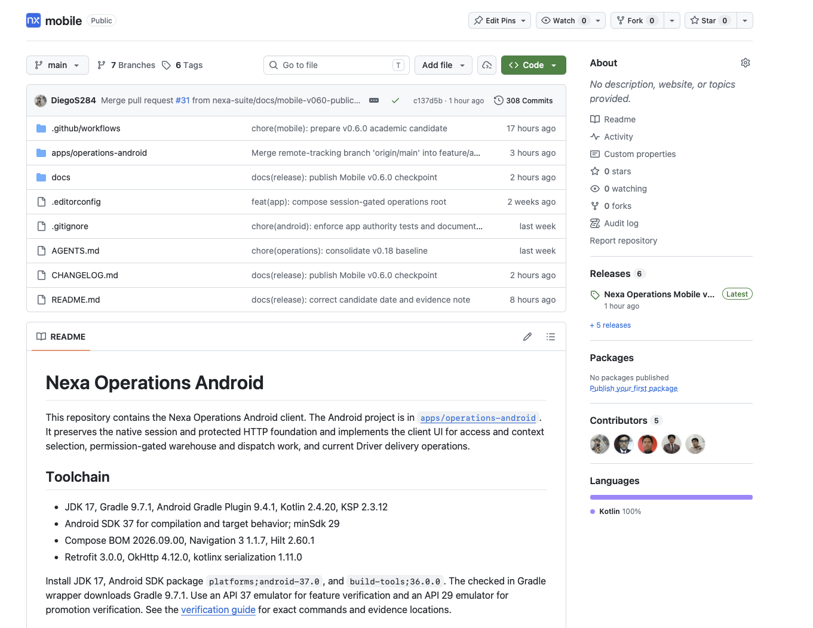
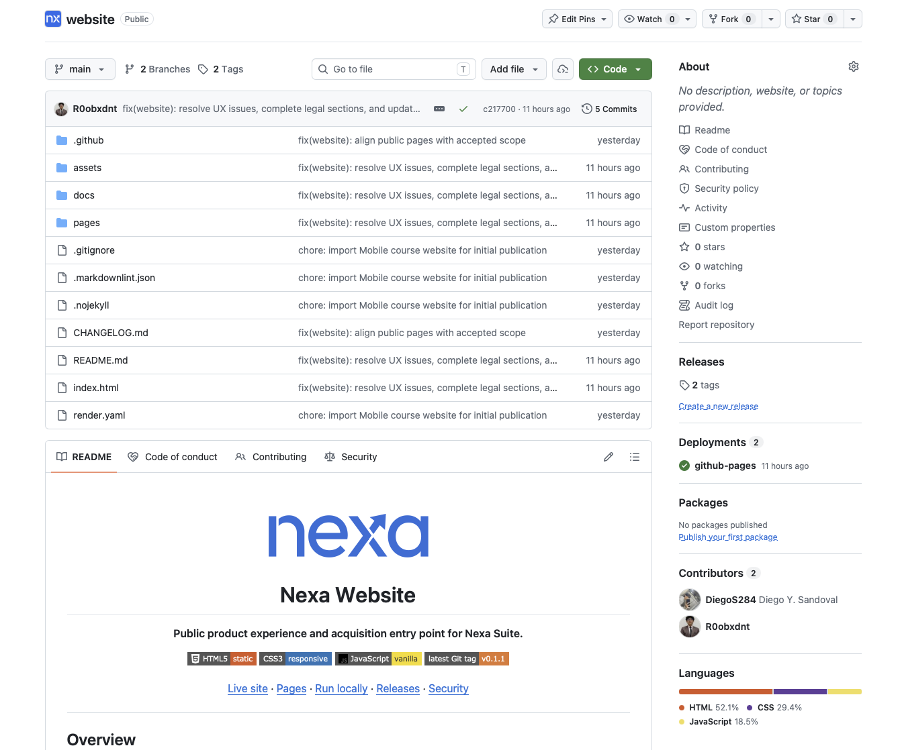
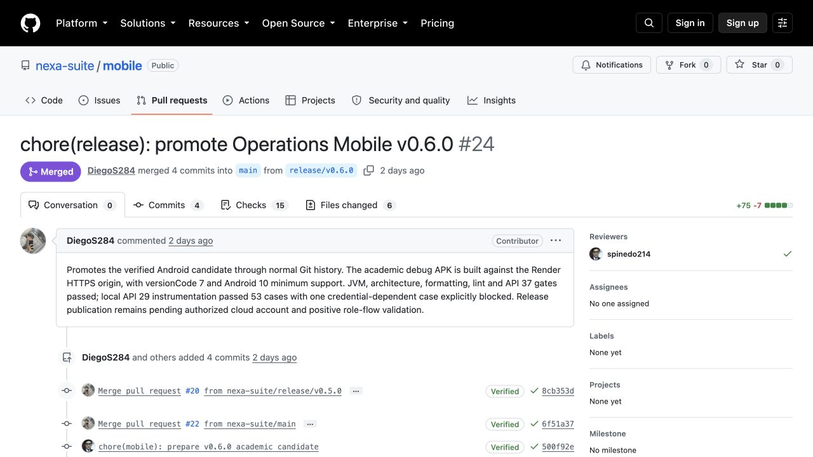

### 4.1.2. Source Code Management

El flujo de ramas de tipo GitFlow observado en Nexa Mobile v0.6.0 muestra la integración del incremento y la publicación del release en GitHub. Cada repositorio mantiene su propio historial, mientras que el informe conserva enlaces a los productos que componen la solución académica. El historial Git documenta cambios técnicos o documentales; ejecución, validación con personas usuarias y aceptación de producto requieren sus propias evidencias y se reportan por separado.

*Repositorios que componen el alcance académico de Nexa.*

| Producto | Repositorio |
| --- | --- |
| Landing Page / Website | [nexa-suite/website](https://github.com/nexa-suite/website) |
| Web Services | [nexa-suite/api](https://github.com/nexa-suite/api) |
| Web applications | [nexa-suite/web-clients](https://github.com/nexa-suite/web-clients) (monorepo Angular) |
| Mobile Applications | [nexa-suite/mobile](https://github.com/nexa-suite/mobile) |
| Academic Report | [nexa-suite/mobile-report](https://github.com/nexa-suite/mobile-report) |

*Nota.* Los enlaces identifican repositorios de trabajo; releases, validaciones y despliegues se informan con sus registros específicos.

Las vistas de los repositorios permiten reconocer la separación del código
fuente de los servicios, la aplicación Android y el sitio público. En los tres
casos se muestra la rama `main`, junto con los directorios del producto y el
acceso a su historial.

*Repositorio de los servicios de negocio.*

*La vista del API muestra su código fuente, documentación y archivos de
construcción y despliegue. Esta organización mantiene los servicios de negocio
en un repositorio independiente de sus clientes.*

*Repositorio de la aplicación móvil.*

*El proyecto Android se encuentra en `apps/operations-android`; la documentación
y los controles de integración se conservan en el mismo repositorio. La vista
permite identificar la fuente de la aplicación que se distribuye como APK.*

*Repositorio del sitio público.*

*El sitio organiza sus páginas y recursos visuales en directorios propios. El
entorno GitHub Pages aparece asociado al repositorio, lo que vincula el código
del Website con su publicación.*

#### Flujo de ramas y revisión

La publicación de Operations Mobile v0.6.0 permite observar el flujo de integración y release mediante Pull Requests efectivamente integrados.

*Flujo de ramas observado en Nexa Mobile, integrado el 4 de octubre de 2026.*

| Etapa | Rama fuente y destino | Evidencia |
| --- | --- | --- |
| Integración del incremento | `feature/mobile-v0.6.0-readiness` a `develop` | [PR #23](https://github.com/nexa-suite/mobile/pull/23), integrado. |
| Publicación | `release/v0.6.0` a `main` | [PR #24](https://github.com/nexa-suite/mobile/pull/24), integrado; [release v0.6.0](https://github.com/nexa-suite/mobile/releases/tag/v0.6.0) publicada. |
| Sincronización posterior | `main` a `develop` | [PR #28](https://github.com/nexa-suite/mobile/pull/28), integrado. |

*GitHub muestra el PR #24 como Merged, con cuatro commits integrados desde release/v0.6.0 en main. Captura del 5 de octubre de 2026. Este historial acredita integración; la ejecución de la aplicación se presenta por separado en 4.2.2.6.*

*Referencias de ramas y tags en API y Website.*

| Repositorio / corte | Ramas y evidencia verificable |
| --- | --- |
| API v0.21.0 | [PR #93](https://github.com/nexa-suite/api/pull/93): `feature/api-v021-release-candidate` → `develop`; [PR #102](https://github.com/nexa-suite/api/pull/102): `release/v0.21.0` → `main`; [tag y release v0.21.0](https://github.com/nexa-suite/api/releases/tag/v0.21.0); [PR #103](https://github.com/nexa-suite/api/pull/103): `main` → `develop`. |
| Website v0.1.x | Ramas [`develop`](https://github.com/nexa-suite/website/tree/develop) y [`main`](https://github.com/nexa-suite/website/tree/main); tags [`v0.1.0`](https://github.com/nexa-suite/website/tree/v0.1.0) y [`v0.1.1`](https://github.com/nexa-suite/website/tree/v0.1.1). |

En API, esta secuencia documenta una publicación concreta; los PR #95–#97 también integraron cambios directamente en `main`, por lo que no describe un flujo uniforme del repositorio. En Website, la consulta del 5 de octubre no encontró PRs listados ni un GitHub Release para `v0.1.1`; las ramas y tags acreditan versionado, no un ciclo GitFlow completo.

Semantic Versioning usa MAJOR para cambios incompatibles, MINOR para capacidad compatible y PATCH para correcciones compatibles. Conventional Commits expresa tipo y alcance, por ejemplo `docs(ch4): document source control`. Los cuatro sprints académicos se mantienen como planificación y evidencia progresiva: una asignación de Sprint no declara que el trabajo esté implementado o aceptado.

Los historiales de commits usados como evidencia del corte de Sprint 2 se
presentan en 4.2.2.4 desarrollo
y 4.2.2.9 colaboración.
Las capturas dejan explícitas sus fechas y no sustituyen la revisión ni la
aceptación documentadas en el flujo formal de control.
