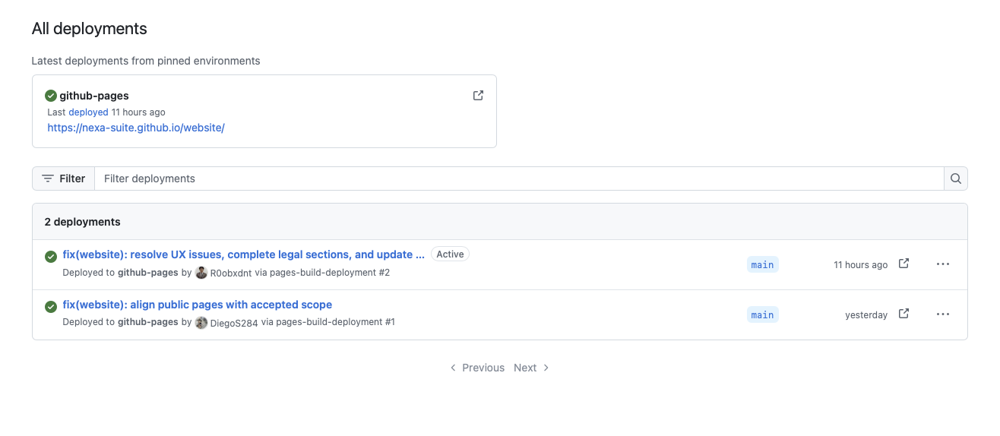

### 4.1.4. Software Deployment Configuration

La configuración de despliegue conserva la separación entre el sitio público,
los servicios de negocio y las aplicaciones móviles. Cada producto se
describe con su fuente, entorno y evidencia observable. La comprobación
técnica del 4 de octubre de 2026 se registra por separado de la aceptación
académica y de la validación con personas usuarias.

*Configuración y evidencia de despliegue observada.*

| Producto | Configuración | Evidencia técnica disponible | Alcance pendiente |
| --- | --- | --- | --- |
| Landing Page | Repositorio `nexa-suite/website`, rama `main`, publicación mediante GitHub Pages. | La URL pública `https://nexa-suite.github.io/website/` respondió HTTP 200 durante la comprobación. La captura de GitHub Pages muestra el entorno activo y dos despliegues recientes desde `main`. | Completar la revisión de presentación, contacto y comportamiento responsive que exige la rúbrica. |
| Web Services | Repositorio `nexa-suite/api`, rama `main`; servicio `nexa-api` en Render y base de datos administrada en Neon. | La release API [v0.21.0](https://github.com/nexa-suite/api/releases/tag/v0.21.0) se publicó el 4 de octubre. La vista de Render muestra el servicio activo; readiness y liveness respondieron HTTP 200 en una reconsulta. La ruta [Swagger UI](https://nexa-api-69bj.onrender.com/swagger-ui/index.html) devolvió HTTP 401 sin autenticación. El registro de catálogo separa 102 elementos internos de 50 visibles en Buyer. | Una petición previa de readiness agotó el tiempo de espera. Las respuestas confirman sólo esos instantes; la documentación no quedó accesible públicamente. |
| Operations Mobile | Repositorio `nexa-suite/mobile`, rama `main`, aplicación Android nativa y origen HTTPS de Render. | La release de evaluación [v0.6.0](https://github.com/nexa-suite/mobile/releases/tag/v0.6.0) se publicó el 4 de octubre con APK de depuración para el entorno cloud y requisito Android 10 o posterior. Un APK candidato se instaló en Samsung S22 e inició sesión contra el servicio. | El APK no es una distribución de Play Store. La aceptación de los recorridos por rol, cámara y escaneo físico, y la preparación para producción, siguen pendientes. |
| Buyer Mobile | Aplicación móvil independiente prevista para la proyección comercial. | No hay en este corte un build ni una validación que permitan declarar su publicación. | Implementación, distribución y validación con compradores. |

*Publicación del Website mediante GitHub Pages.*

*La captura muestra dos publicaciones satisfactorias desde `main`, el entorno
activo y la dirección pública del Website. Los tiempos relativos pertenecen al
momento de la captura; la comprobación de contenido y adaptación a distintos
tamaños de pantalla se documenta en las evidencias de ejecución.*

Las capturas de configuración del Website y del API se presentan por separado
como evidencia de Sprint 2 en [Software Deployment Evidence](../4.2-landing-page-and-mobile-application-implementation/4.2.2-sprint-2/4.2.2.8-software-deployment-evidence-for-sprint-review.md).
No se incluyen vistas de variables de entorno, roles de Neon o usuarios de
correo porque muestran nombres internos o cuentas identificables.

## Comprobación del catálogo para la aplicación de operaciones

La lectura autenticada del 4 de octubre distingue 102 elementos en el catálogo
interno y 50 en la proyección Buyer. `PROD-0051` aparece en el catálogo interno,
pero no en Buyer; no se afirma que tenga GTIN ni stock. No se modificaron
productos ni existencias. El acceso protegido sigue sujeto a la sesión,
permisos y contexto autorizados por el servicio.

## Límites de la evidencia

Readiness y liveness del API respondieron HTTP 200 durante una reconsulta del
4 de octubre, aunque una petición previa agotó el tiempo de espera. Esta
observación no demuestra disponibilidad continua ni aceptación del sistema
completo. El catálogo interno se leyó sin cambiar productos ni existencias.
La release de evaluación Mobile v0.6.0 está publicada; la comprobación física
disponible cubre instalación e inicio de sesión en un Samsung S22. La cámara,
el escaneo físico y los recorridos autenticados completos por rol permanecen
pendientes.

El Deployment Diagram del Capítulo II explica la topología lógica. Una URL
accesible, una configuración guardada, una captura o un APK de evaluación no
equivalen por sí solos a aceptación académica ni a disponibilidad de
producción.
