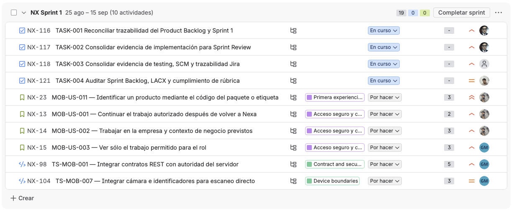
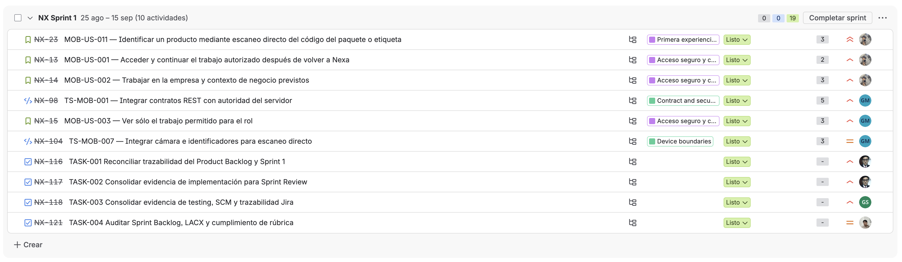
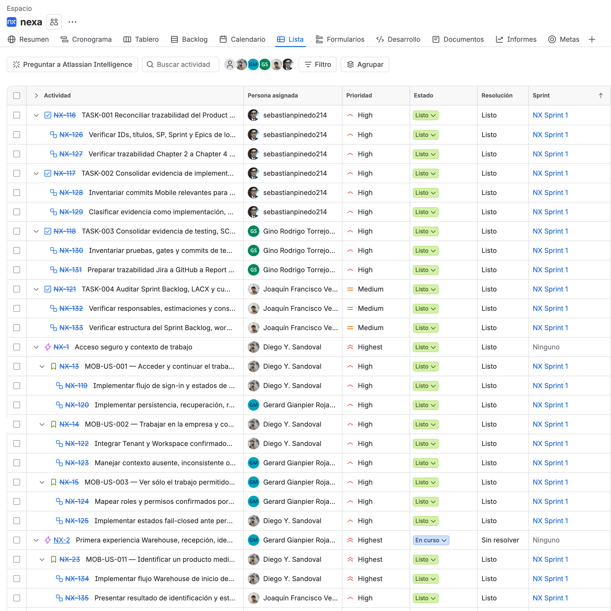
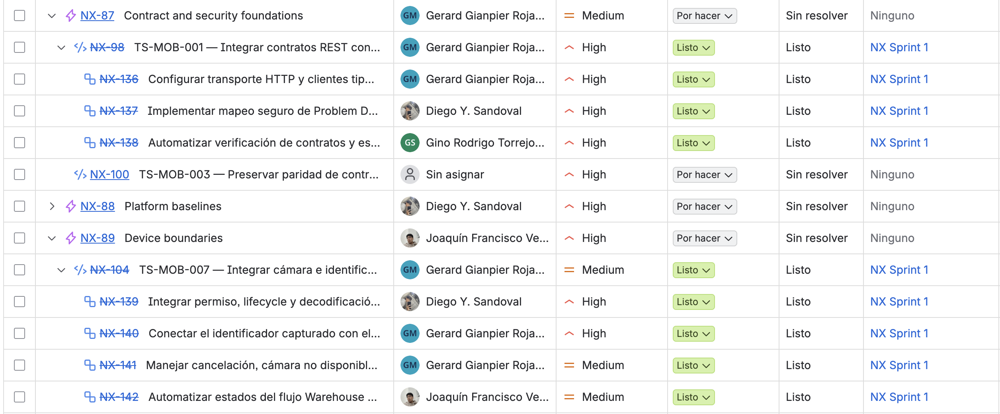
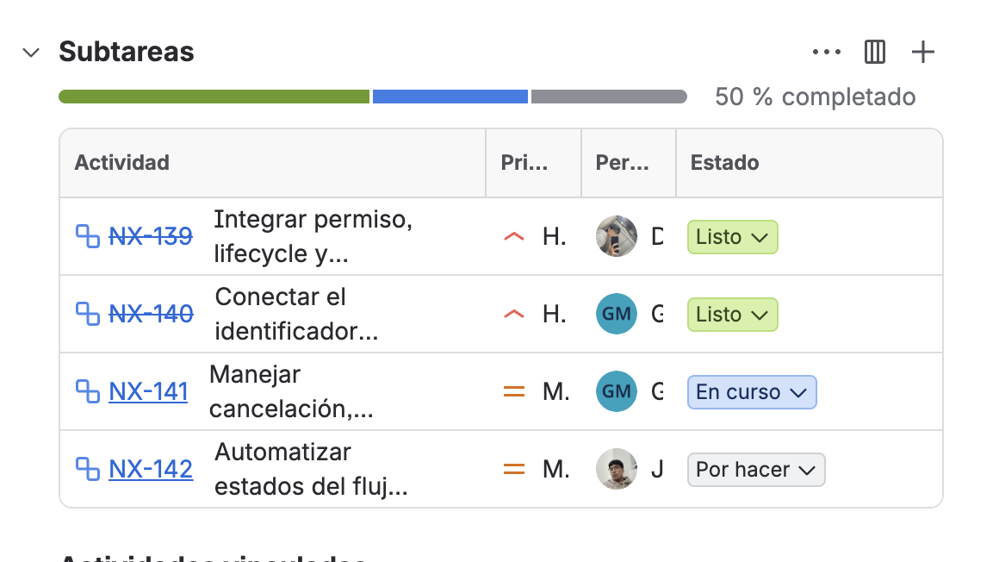

#### 4.2.1.3. Sprint Backlog 1

Este Sprint Backlog materializa en Jira los seis PBIs comprometidos y el trabajo
de soporte del Sprint. Los títulos canónicos de los PBIs conservan la definición
de Chapter 2; las claves, responsables, prioridades, estimaciones y estados se
presentan como lectura de Jira.

*Estado inicial del Sprint Backlog 1*

La captura conserva el estado temprano del Board antes del cierre y muestra
trabajo `Por hacer` y `En curso` como parte de la evolución del flujo.

*Estado final del Sprint Backlog 1*

La evidencia final del Board muestra los diez ítems del Sprint en `Listo`.

**Jira Sprint Backlog:** https://nexa-suite.atlassian.net/jira/software/projects/NX/boards/2/backlog

*Jerarquía de PBIs y work-items del Sprint 1*

*Evolución de subtareas de ingeniería durante Sprint 1*

*Sprint Backlog 1 jerárquico*

| Jira | Item | Type | Parent / Scope | Description | Estimate | Assigned To | Priority | Status |
| --- | --- | --- | --- | --- | --- | --- | --- | --- |
| **NX-13 / MOB-US-001** | PBI | Functional | NX Sprint 1 | Acceder y continuar el trabajo autorizado en Nexa | 2 SP | Diego Y. Sandoval | High | Done (Listo) |
| ↳ `NX-119` | Engineering work-item | Task | NX-13 / MOB-US-001 | Implementar flujo de sign-in y estados de autenticación | 5h | Diego Y. Sandoval | High | Done (Listo) |
| ↳ `NX-120` | Engineering work-item | Task | NX-13 / MOB-US-001 | Implementar persistencia, recuperación, refresh y cierre de sesión | 6h | Gerard Gianpier Rojas Mancilla | High | Done (Listo) |
| **NX-14 / MOB-US-002** | PBI | Functional | NX Sprint 1 | Trabajar en la empresa y contexto de negocio previstos | 3 SP | Diego Y. Sandoval | High | Done (Listo) |
| ↳ `NX-122` | Engineering work-item | Task | NX-14 / MOB-US-002 | Integrar Tenant y Workspace confirmados por el servidor | 4h | Diego Y. Sandoval | High | Done (Listo) |
| ↳ `NX-123` | Engineering work-item | Task | NX-14 / MOB-US-002 | Manejar contexto ausente, inconsistente o no autorizado | 4h | Gerard Gianpier Rojas Mancilla | High | Done (Listo) |
| **NX-15 / MOB-US-003** | PBI | Functional | NX Sprint 1 | Ver sólo el trabajo permitido para el rol | 3 SP | Gerard Gianpier Rojas Mancilla | High | Done (Listo) |
| ↳ `NX-124` | Engineering work-item | Task | NX-15 / MOB-US-003 | Mapear roles y permisos confirmados por el servidor | 4h | Gerard Gianpier Rojas Mancilla | High | Done (Listo) |
| ↳ `NX-125` | Engineering work-item | Task | NX-15 / MOB-US-003 | Implementar estados fail-closed ante permisos insuficientes | 4h | Diego Y. Sandoval | High | Done (Listo) |
| **NX-98 / TS-MOB-001** | PBI | Technical | NX Sprint 1 | Integrar contratos REST con autoridad del servidor | 5 SP | Gerard Gianpier Rojas Mancilla | High | Done (Listo) |
| ↳ `NX-136` | Engineering work-item | Task | NX-98 / TS-MOB-001 | Configurar transporte HTTP y clientes tipados | 7h | Gerard Gianpier Rojas Mancilla | High | Done (Listo) |
| ↳ `NX-137` | Engineering work-item | Task | NX-98 / TS-MOB-001 | Implementar mapeo seguro de Problem Details | 5h | Diego Y. Sandoval | High | Done (Listo) |
| ↳ `NX-138` | Engineering work-item | Task | NX-98 / TS-MOB-001 | Automatizar verificación de contratos y estados del flujo | 5h | Gino Rodrigo Torrejón de los Santos | High | Done (Listo) |
| **NX-23 / MOB-US-011** | PBI | Functional | NX Sprint 1 | Identificar un producto mediante escaneo directo del código del paquete o etiqueta | 3 SP | Diego Y. Sandoval | Highest | Done (Listo) |
| ↳ `NX-134` | Engineering work-item | Task | NX-23 / MOB-US-011 | Implementar flujo Warehouse de inicio de escaneo directo | 4h | Diego Y. Sandoval | Highest | Done (Listo) |
| ↳ `NX-135` | Engineering work-item | Task | NX-23 / MOB-US-011 | Presentar resultado de identificación y estados del flujo | 4h | Joaquín Francisco Verde Bueno | High | Done (Listo) |
| **NX-104 / TS-MOB-007** | PBI | Technical | NX Sprint 1 | Integrar cámara e identificadores para escaneo directo | 3 SP | Gerard Gianpier Rojas Mancilla | Medium | Done (Listo) |
| ↳ `NX-139` | Engineering work-item | Task | NX-104 / TS-MOB-007 | Integrar permiso, lifecycle y decodificación de cámara | 5h | Diego Y. Sandoval | High | Done (Listo) |
| ↳ `NX-140` | Engineering work-item | Task | NX-104 / TS-MOB-007 | Conectar el identificador capturado con el resolver SKU | 4h | Gerard Gianpier Rojas Mancilla | High | Done (Listo) |
| ↳ `NX-141` | Engineering work-item | Task | NX-104 / TS-MOB-007 | Manejar cancelación, cámara no disponible y captura inválida | 4h | Gerard Gianpier Rojas Mancilla | Medium | Done (Listo) |
| ↳ `NX-142` | Engineering work-item | Task | NX-104 / TS-MOB-007 | Automatizar estados del flujo Warehouse y resolución SKU | 5h | Joaquín Francisco Verde Bueno | Medium | Done (Listo) |
| **NX-116 / TASK-001** | Support parent | Task | NX Sprint 1 | Reconciliar trazabilidad del Product Backlog y Sprint 1 | 5h | sebastianpinedo214 | High | Done (Listo) |
| ↳ `NX-126` | Support-detail subtask | Subtask | NX-116 / TASK-001 | Verificar IDs, títulos, SP, Sprint y Epics de los PBIs | Included in parent | sebastianpinedo214 | High | Done (Listo) |
| ↳ `NX-127` | Support-detail subtask | Subtask | NX-116 / TASK-001 | Verificar trazabilidad Chapter 2 a Chapter 4 | Included in parent | sebastianpinedo214 | High | Done (Listo) |
| **NX-117 / TASK-002** | Support parent | Task | NX Sprint 1 | Consolidar evidencia de implementación para Sprint Review | 5h | sebastianpinedo214 | High | Done (Listo) |
| ↳ `NX-128` | Support-detail subtask | Subtask | NX-117 / TASK-002 | Inventariar commits Mobile relevantes para Sprint 1 | Included in parent | sebastianpinedo214 | High | Done (Listo) |
| ↳ `NX-129` | Support-detail subtask | Subtask | NX-117 / TASK-002 | Clasificar evidencia como implementación, pruebas o documentación | Included in parent | sebastianpinedo214 | High | Done (Listo) |
| **NX-118 / TASK-003** | Support parent | Task | NX Sprint 1 | Consolidar evidencia de testing, SCM y trazabilidad Jira | 4h | Gino Rodrigo Torrejón de los Santos | High | Done (Listo) |
| ↳ `NX-130` | Support-detail subtask | Subtask | NX-118 / TASK-003 | Inventariar pruebas, gates y commits de testing | Included in parent | Gino Rodrigo Torrejón de los Santos | High | Done (Listo) |
| ↳ `NX-131` | Support-detail subtask | Subtask | NX-118 / TASK-003 | Preparar trazabilidad Jira a GitHub a Report | Included in parent | Gino Rodrigo Torrejón de los Santos | High | Done (Listo) |
| **NX-121 / TASK-004** | Support parent | Task | NX Sprint 1 | Auditar Sprint Backlog, LACX y cumplimiento de rúbrica | 4h | Joaquín Francisco Verde Bueno | Medium | Done (Listo) |
| ↳ `NX-132` | Support-detail subtask | Subtask | NX-121 / TASK-004 | Verificar responsables, estimaciones y consistencia | Included in parent | Joaquín Francisco Verde Bueno | Medium | Done (Listo) |
| ↳ `NX-133` | Support-detail subtask | Subtask | NX-121 / TASK-004 | Verificar estructura del Sprint Backlog y workflow | Included in parent | Joaquín Francisco Verde Bueno | Medium | Done (Listo) |

El alcance conserva **6 PBIs / 19 SP**. La ejecución estimada comprende **15
Engineering work-items / 70h**, **4 Sprint-wide Support Tasks / 18h** y **8
Support-detail subtasks** con esfuerzo incluido en su parent. El total estimado
de trabajo de ejecución es **88h**; no constituye velocidad.
