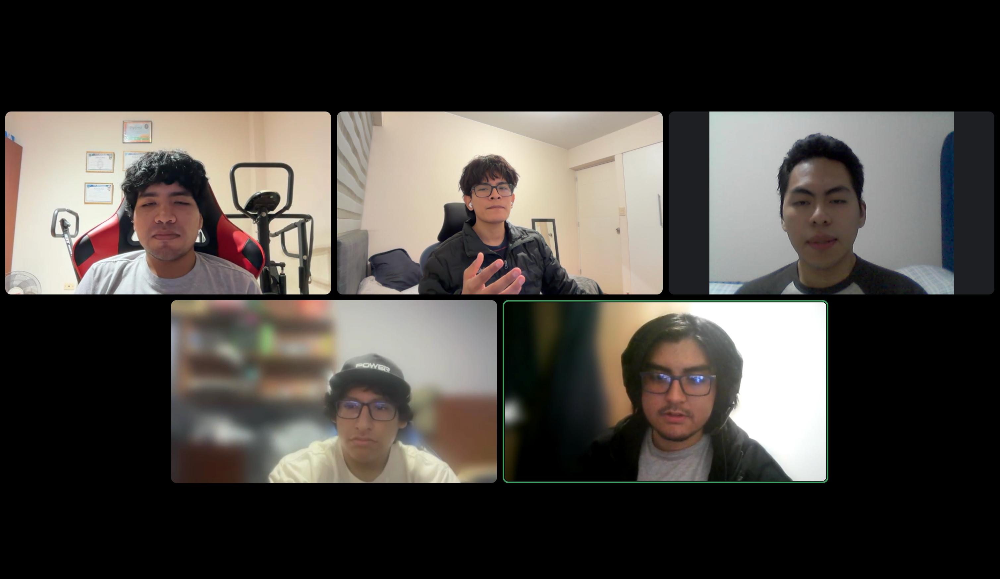

# 4.2.1.9. Team Collaboration Insights during Sprint

El historial consultado muestra contribuciones técnicas distribuidas entre el
2026-09-01 y el 2026-09-02. Sirve para describir áreas de trabajo observadas;
no prueba asistencia al Sprint Planning, trabajo dentro del Sprint histórico,
revisión ni aceptación.

| Contributor | Área técnica observada | Límite de interpretación |
| --- | --- | --- |
| DiegoS284 | Base Android, recuperación de sesión, acceso confirmado y contexto Warehouse. | Fuente técnica; no demuestra coordinación ni aceptación. |
| GerardRojasMancilla | Transporte, cliente SKU, refresh y cancelación. | Fuente técnica; no demuestra participación total. |
| JoaquinBV511 | Estados de acceso y preview de identificación Warehouse. | Parte del trabajo observado; no demuestra aceptación del flujo. |
| R0obxdnt | Gates reproducibles y pruebas unitarias nativas. | Evidencia técnica; no demuestra revisión de equipo. |
| spinedo214 | Documentación de acceso, Warehouse, emulador y resolver. | Fuente documental; no demuestra contribución completa. |

*Figura. Sesión de coordinación del equipo durante Sprint 1, existente en los
activos del informe.*

La captura de Analytics requerida por la rúbrica no fue suministrada y
permanece pendiente. La evidencia técnica se conserva en las tablas formales
de desarrollo y pruebas, sin repetir identificadores de fuente en esta sección.
