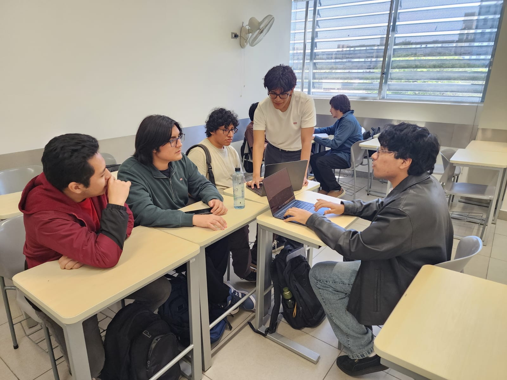

### 4.2.2. Sprint 2

#### 4.2.2.1. Sprint Planning 2

La reunión de planificación de Sprint 2 se realizó de manera presencial en la
UPC, campus San Isidro, el 18 de septiembre de 2026 a las 13:38 (hora de Perú).
Fue organizada por Yucra Sandoval, Diego Sebastián. La planificación conserva
el alcance histórico de cuatro Sprints: Landing Page, overview operativo,
continuidad comercial, búsqueda manual y trabajo de almacén desde la recepción
hasta el despacho. Comprende 36 elementos y 144 Story Points. La rúbrica vigente
ubica AV2 en Sprint 2; esa correspondencia académica no altera
retroactivamente la asignación de los otros Sprints.

La secuencia del plan —seleccionar historias comprometidas, desglosarlas en
tareas relacionadas con sus criterios de aceptación y mantener estimaciones
separadas de resultados— sigue los procesos de planificación y actualización
del Sprint Backlog descritos por SCRUMstudy (2025, secciones 9.3–9.6).

*Planificación de Sprint 2.*

| Campo | Planificación |
| --- | --- |
| Sprint | Sprint 2 |
| Date | 18 de septiembre de 2026 |
| Time | 13:38 (hora de Perú) |
| Location | UPC, campus San Isidro |
| Organized By | Yucra Sandoval, Diego Sebastián |
| Attendees | Pinedo Sanchez, Sebastián Martín; Rojas Mancilla, Gerard Gianpier; Torrejón De Los Santos, Gino Rodrigo; Verde Bueno, Joaquín Francisco; Yucra Sandoval, Diego Sebastián. |
| Prepared By | El registro disponible no identifica por separado a quien preparó el acta. |
| Previous Sprint Review Summary | No se cuenta con un registro fuente que permita resumir una Sprint 1 Review. |
| Previous Sprint Retrospective Summary | No se cuenta con un registro fuente que permita resumir una Sprint 1 Retrospective. |
| Sprint Goal | **Nuestro foco está en** facilitar que las empresas comprendan la propuesta de Nexa y que los equipos comerciales y de almacén continúen sus tareas desde la consulta de productos hasta la preparación y el despacho de mercadería.  **Creemos que esto entrega** información más clara para decidir y mayor continuidad entre las tareas, al permitir que cada participante consulte lo necesario y reconozca el resultado de cada acción según sus permisos.  **Esto será confirmado cuando** los visitantes puedan identificar la utilidad de Nexa y acceder a la información de contacto; los responsables comerciales puedan consultar productos y dar seguimiento a sus solicitudes; y los responsables de almacén puedan recorrer la recepción, preparación y despacho previstos para el Sprint, reconocer el resultado de cada acción y continuar la tarea siguiente con la información disponible. Estos resultados se comprobarán durante la revisión; los recorridos que no los alcancen permanecerán pendientes de corrección. |
| Sprint Velocity | No se dispone de una velocidad histórica medida. Los 144 Story Points son la estimación del alcance planificado, no una métrica de trabajo completado. |
| Sum of Story Points | 144 |

*Alcance de Sprint 2.*

| Grupo | Elementos | Story Points | Fundamento |
| --- | --- | ---: | --- |
| Landing Page | `LAND-US-001`, `LAND-US-002`, `LAND-US-003`, `LAND-US-004`, `LAND-US-005`, `LAND-US-006` | 15 | Comunica propuesta, ajuste, límites, información comercial, onboarding y contacto sin crear hechos autoritativos de Tenant o Workspace. |
| Overview, trabajo comercial y relación con el cliente | `MOB-US-004`, `MOB-US-005`, `MOB-US-006`, `MOB-US-007`, `MOB-US-008`, `MOB-US-009`, `MOB-US-010` | 36 | Cubre overview operativo, excepciones, relación, catálogo, solicitud, Direct Order asistido y seguimiento comercial. |
| Búsqueda manual, recepción, preparación y despacho | `MOB-US-012`, `MOB-US-013`, `MOB-US-014`, `MOB-US-015`, `MOB-US-016`, `MOB-US-017`, `MOB-US-018`, `MOB-US-019`, `MOB-US-020`, `MOB-US-021`, `MOB-US-022`, `MOB-US-023`, `MOB-US-024`, `MOB-US-025` | 52 | Cubre búsqueda manual posterior, recepción, lote, condición, preparación, movimiento, temperatura, readiness, asignación, contraste y transferencia de despacho. |
| Habilitación técnica | `TS-MOB-002`, `TS-MOB-004`, `TS-MOB-005`, `TS-MOB-006`, `TS-MOB-010` | 23 | Delimita compatibilidad Android, capacidades de dispositivo, estado de trabajo, reintentos, i18n y accesibilidad. |
| Investigación delimitada | `SPIKE-001`, `SPIKE-002`, `SPIKE-003`, `SPIKE-004` | 18 | Incluye investigación, evaluación e integración técnica acotada de una funcionalidad de aprendizaje autónomo, además de tracks, identificadores y recuperación de estado. |
| **Total** | **36 elementos** | **144** | Alcance planificado, no evidencia de entrega. |

`MOB-US-001`, `MOB-US-002`, `MOB-US-003`, `MOB-US-011`, `TS-MOB-001` y
`TS-MOB-007` pertenecen a Sprint 1. `MOB-US-004`, `MOB-US-005`, `MOB-US-006`,
`MOB-US-007`, `MOB-US-008`, `MOB-US-009`, `MOB-US-010`, `MOB-US-012`,
`MOB-US-013`, `MOB-US-014`, `MOB-US-015`, `MOB-US-016`, `MOB-US-017`,
`MOB-US-018`, `MOB-US-019`, `MOB-US-020`, `MOB-US-021`, `MOB-US-022`,
`MOB-US-023`, `MOB-US-024` y `MOB-US-025` se asignan a Sprint 2. `SPIKE-001`
incluye investigación, evaluación e integración técnica acotada, sin afirmar
integración productiva.

*Reunión presencial de planificación de Sprint 2 en UPC, campus San Isidro.*

No se ha verificado un tablero. Los paquetes de trabajo siguientes permanecen
en estado inicial `To Do`; no equivalen a tickets creados ni a trabajo iniciado.

##### Tareas y subtareas planificadas

| Elementos | ID del paquete de trabajo | Tarea | Trabajo desglosado (síntesis) | Estimación (horas) | Assigned To | Level | Status |
| --- | --- | --- | --- | ---: | --- | --- | --- |
| `LAND-US-001`, `LAND-US-002`, `LAND-US-003` | SB2-T01 | Preparar descubrimiento público | Mensaje B2B, ajuste operativo y límites comunicables. | 6 | Yucra Sandoval, Diego Sebastián | Lead | To Do |
| `LAND-US-004`, `LAND-US-005`, `LAND-US-006` | SB2-T02 | Preparar información comercial y contacto | Precios, FAQ, legal, onboarding y ruta de contacto. | 6 | Rojas Mancilla, Gerard Gianpier | Lead | To Do |
| `MOB-US-004`, `MOB-US-005`, `MOB-US-006`, `MOB-US-007` | SB2-T03 | Delimitar overview, contexto comercial y catálogo | Overview operativo, excepciones, relación cliente-comprador, productos, precios y disponibilidad. | 8 | Pinedo Sanchez, Sebastián Martín | Lead | To Do |
| `MOB-US-008`, `MOB-US-009`, `MOB-US-010` | SB2-T04 | Preparar solicitud, Direct Order y seguimiento | Solicitud, compromiso, crédito y estado pendiente sin confirmación del cliente. | 8 | Torrejón De Los Santos, Gino Rodrigo | Lead | To Do |
| `MOB-US-012` | SB2-T05 | Preparar búsqueda manual posterior | Entrada manual, coincidencia ambigua y resultado confirmado por servidor. | 6 | Verde Bueno, Joaquín Francisco | Lead | To Do |
| `MOB-US-013`, `MOB-US-014` | SB2-T06 | Delimitar recepción y lote | Stock recibido, lote, vencimiento, cantidad y resultado pendiente del servidor. | 8 | Pinedo Sanchez, Sebastián Martín | Lead | To Do |
| `MOB-US-015`, `MOB-US-016` | SB2-T07 | Preparar condición y trabajo físico | Elegibilidad, condición, lote y cantidad correctos antes del trabajo físico. | 8 | Rojas Mancilla, Gerard Gianpier | Lead | To Do |
| `MOB-US-017`, `MOB-US-019` | SB2-T08 | Preparar discrepancia y temperatura | Registrar discrepancia y evidencia de temperatura sin borrar hechos previos. | 8 | Verde Bueno, Joaquín Francisco | Lead | To Do |
| `MOB-US-018`, `MOB-US-020`, `MOB-US-021`, `MOB-US-022`, `MOB-US-023`, `MOB-US-024`, `MOB-US-025` | SB2-T09 | Preparar movimiento, despacho y transferencia inicial | Movimiento autorizado, lista de entrega, asignación, contraste, transferencia y salida de bienes. | 8 | Pinedo Sanchez, Sebastián Martín | Lead | To Do |
| `TS-MOB-002`, `TS-MOB-004` | SB2-T10 | Delimitar compatibilidad y dispositivo | Compatibilidad autorizada, cámara, navegación y almacenamiento sin crear autoridad del cliente. | 8 | Torrejón De Los Santos, Gino Rodrigo | Lead | To Do |
| `TS-MOB-005`, `TS-MOB-006` | SB2-T11 | Preparar continuidad y reintentos | Estado de trabajo seguro, reintentos, idempotencia y conflictos sin autoridad del cliente. | 8 | Rojas Mancilla, Gerard Gianpier | Lead | To Do |
| `TS-MOB-010` | SB2-T12 | Preparar i18n y accesibilidad | Estados, foco, etiquetas, idioma y reflujo para las superficies Mobile. | 4 | Verde Bueno, Joaquín Francisco | Lead | To Do |
| `SPIKE-001` | SB2-T13 | Investigar, evaluar e integrar funcionalidad de aprendizaje autónomo | Pregunta, alternativas, selección justificada, PoC reproducible e integración técnica acotada con fallo, reversión o aislamiento. | 8 | Rojas Mancilla, Gerard Gianpier | Lead | To Do |
| `SPIKE-002` | SB2-T14 | Delimitar tracks y límites de contratos | Comparar opciones permitidas y documentar decisión de adoptar, diferir o rechazar. | 8 | Torrejón De Los Santos, Gino Rodrigo | Lead | To Do |
| `SPIKE-003` | SB2-T15 | Delimitar identificadores de producto | Comparar formatos, ambigüedad, permisos y alternativa manual. | 6 | Verde Bueno, Joaquín Francisco | Lead | To Do |
| `SPIKE-004` | SB2-T16 | Delimitar persistencia y recuperación de estado | Documentar protección, expiración, recuperación, limpieza y casos diferidos. | 8 | Torrejón De Los Santos, Gino Rodrigo | Lead | To Do |

**Total de horas planificadas: 116.** Las horas son capacidad propuesta, no
velocidad ni evidencia de ejecución.

##### Correspondencia con la rúbrica vigente

La guía del curso identifica AV2 con Sprint 2. Por ello, esta sección presenta
el alcance de Sprint 2 como la proyección para AV2 y conserva los
identificadores, estimaciones y distribución documentados. La entrega
académica no convierte tareas planificadas en completadas ni reemplaza los
registros primarios que faltan para planning, review y retrospectiva.

`MOB-US-029`, `MOB-US-059`, `MOB-US-060`, `MOB-US-061`, `MOB-US-062`,
`MOB-US-063`, `MOB-US-064`, `MOB-US-065`, `MOB-US-066`, `MOB-US-067`,
`MOB-US-068`, `MOB-US-069`, `MOB-US-070`, `MOB-US-071`, `MOB-US-072` y
`MOB-US-073` pertenecen a trabajo posterior o a una asignación futura. No se
agregan al total de Sprint 2 ni a sus 144 Story Points; su estado se mantiene
sin atribuir hasta contar con el registro primario de la Sprint propietaria.
