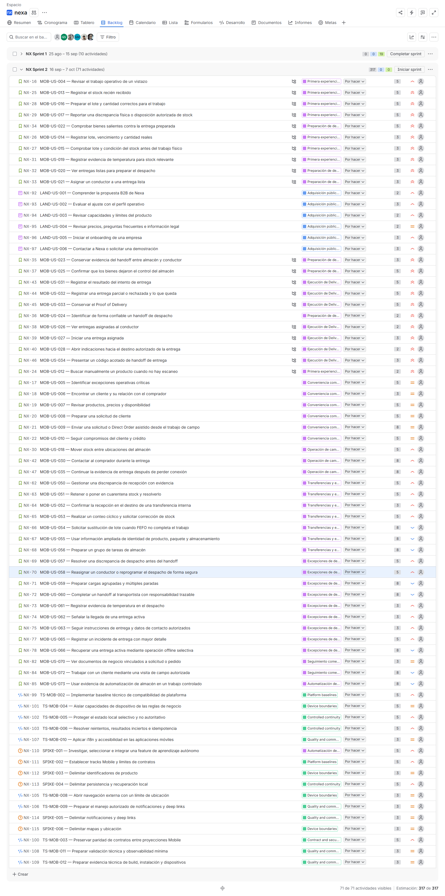
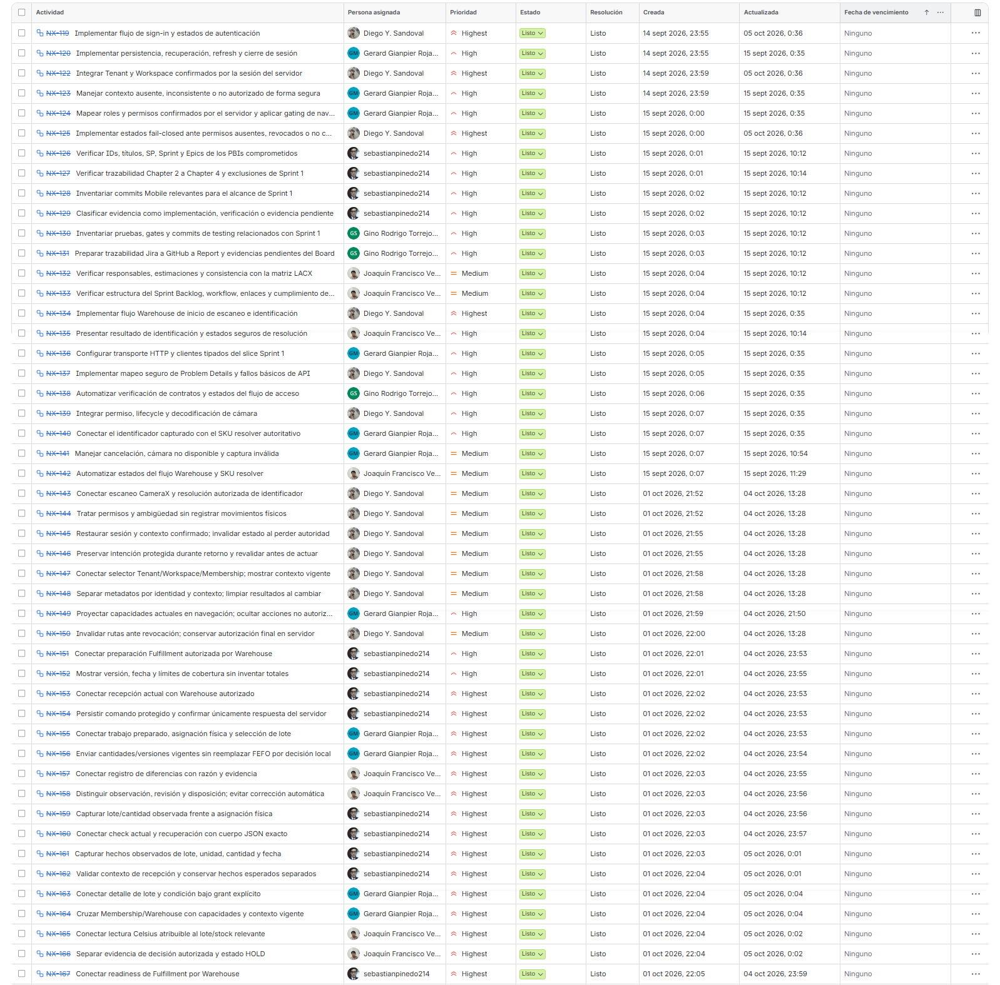
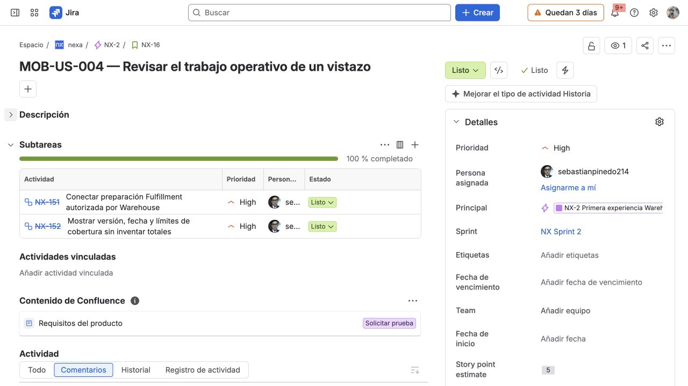

#### 4.2.2.3. Sprint Backlog 2

Sprint 2 conserva el orden de negocio del Product Backlog y recibe Landing, el
overview operativo, la búsqueda manual posterior y el trabajo
comercial/almacén posterior al slice de acceso y escaneo directo de Sprint 1.
La planificación documentada contiene 36 elementos y 144 Story Points: 27 Functional User Stories, 5
Technical Stories y 4 Spikes.

El tablero de Jira observado el 3 de octubre muestra el Sprint 2 con 71
actividades y 317 puntos, para el periodo del 16 de septiembre al 7 de octubre.
La captura muestra las actividades en «Por hacer» y la opción «Iniciar sprint».
Este estado difiere de los 36 elementos y 144 puntos de la planificación
documentada: su conciliación debe identificar los cambios de alcance y su
aprobación antes de presentar un compromiso actualizado. La imagen no
muestra tareas y subtareas desplegadas ni acredita ejecución o aceptación.

*Reconciliación del alcance.*

La comparación de ambos registros permite separar el compromiso académico de
la composición observada en Jira. La siguiente tabla conserva los totales por
familia y hace explícita la variación sin cambiar retrospectivamente la
planificación aprobada.

| Familia | Planificación Sprint 2 | Jira observado | Variación observada |
| --- | ---: | ---: | ---: |
| Historias funcionales Mobile | 21 PBIs / 88 SP | 49 PBIs / 238 SP | +28 PBIs / +150 SP |
| Historias funcionales Landing | 6 PBIs / 15 SP | 6 PBIs / 15 SP | 0 PBIs / 0 SP |
| Technical Stories | 5 PBIs / 23 SP | 10 PBIs / 40 SP | +5 PBIs / +17 SP |
| Spikes | 4 PBIs / 18 SP | 6 PBIs / 24 SP | +2 PBIs / +6 SP |
| **Total** | **36 PBIs / 144 SP** | **71 PBIs / 317 SP** | **+35 PBIs / +173 SP** |

La consulta a Jira, proyecto NX y tablero 2, realizada el 4 de
octubre de 2026, registra `NX Sprint 2` como activo, con 71 issues principales
y 317 Story Points. En ese corte, los 71 issues principales figuran «Listo».
El Sprint continúa activo; por ello, esos estados no acreditan cierre ni
aceptación. Jira no registra estimaciones de horas para los issues principales.
La consulta no documenta la aprobación del cambio de alcance; por ello, los 36
elementos y 144 Story Points permanecen como compromiso documentado de Sprint
2, mientras que los 71 elementos y 317 Story Points se presentan como
composición de Jira pendiente de decisión del equipo.

*Figura. Backlog del proyecto NX en Jira, observado el 3 de octubre de 2026.
La herramienta presenta 71 actividades y una estimación de 317 puntos; la
reconciliación anterior conserva por separado el compromiso de 36 PBIs y 144
SP.*

*Vista Lista de Jira con claves y títulos de actividades, persona asignada, prioridad, estado y fechas de creación y actualización. Las filas visibles aparecen como «Listo»; la imagen incluye tareas de los dos Sprints.*

La revisión del tablero autenticado del 5 de octubre, con filtro `NX Sprint 2`, mostró 71 elementos en «Listo», ninguno en «Por hacer» ni «En curso». El filtro corresponde a un Sprint activo; no se modificaron actividades ni se ejecutó su cierre.

*Captura del 5 de octubre de 2026: NX-16, correspondiente a MOB-US-004, muestra las subtareas NX-151 y NX-152 en «Listo». El panel identifica Sprint 2, responsable sebastianpinedo214 y estimación de cinco Story Points para la historia. Los estados documentan seguimiento en Jira; no sustituyen la demostración funcional de la aplicación.*

*Incidencias principales asignadas a Sprint 2 en Jira.*

Cada issue principal de Jira corresponde a una User Story o elemento del
backlog; la clave `NX-*` identifica el issue asociado. Las descripciones
reflejan el propósito registrado en Jira; la terminología de transferencia de
custodia se presenta en español, sin alterar el alcance. La estimación de los
issues principales se conserva en Story Points; el campo de horas no registra
valores.

| Sprint # | User Story / element ID | User Story / element title | Work-Item / Task ID | Task Title | Description | Estimation (Hours) | Story Points | Assigned To | Status |
|---:|---|---|---|---|---|---:|---:|---|---|
| 2 | `LAND-US-001` | Comprender la propuesta B2B de Nexa | `NX-92` | Comprender la propuesta B2B de Nexa | Como Prospective Company Representative, deseo comprender la propuesta B2B de Nexa para importadores, distribuidores y mayoristas, incluida la especialización de cadena de frío cuando aplique, para decidir si corresponde continuar la evaluación. | No registrado | 2 | Diego Y. Sandoval | Listo |
| 2 | `LAND-US-002` | Evaluar el ajuste con el perfil operativo | `NX-93` | Evaluar el ajuste con el perfil operativo | Como prospecto empresarial, deseo contrastar mi perfil operativo con las soluciones de Nexa, para decidir si debo iniciar una conversación o evaluación. | No registrado | 3 | Diego Y. Sandoval | Listo |
| 2 | `LAND-US-003` | Revisar capacidades y límites del producto | `NX-94` | Revisar capacidades y límites del producto | Como prospecto empresarial, deseo revisar las capacidades y límites públicos del producto, para entender qué problema operativo aborda Nexa antes de continuar. | No registrado | 2 | Diego Y. Sandoval | Listo |
| 2 | `LAND-US-004` | Revisar precios, preguntas frecuentes e información legal | `NX-95` | Revisar precios, preguntas frecuentes e información legal | Como prospecto empresarial, deseo consultar precios, preguntas frecuentes y condiciones legales, para evaluar el siguiente paso con información pública suficiente. | No registrado | 2 | Gerard Gianpier Rojas Mancilla | Listo |
| 2 | `LAND-US-005` | Iniciar el onboarding de una empresa | `NX-96` | Iniciar el onboarding de una empresa | Como Prospective Company Representative, deseo iniciar el onboarding de mi empresa desde la Landing, para solicitar un siguiente paso comercial sin que se cree ni active automáticamente un Tenant o Workspace. | No registrado | 3 | Gerard Gianpier Rojas Mancilla | Listo |
| 2 | `LAND-US-006` | Contactar a Nexa o solicitar una demostración | `NX-97` | Contactar a Nexa o solicitar una demostración | Como prospecto empresarial, deseo contactar a Nexa o solicitar una demostración, para obtener un siguiente paso comercial explícito cuando la información pública no sea suficiente. | No registrado | 3 | Gerard Gianpier Rojas Mancilla | Listo |
| 2 | `MOB-US-004` | Revisar el trabajo operativo de un vistazo | `NX-16` | Revisar el trabajo operativo de un vistazo | Como Business Operations Manager, deseo revisar el trabajo operativo de un vistazo, para priorizarlo usando hechos actuales y confiables. | No registrado | 5 | sebastianpinedo214 | Listo |
| 2 | `MOB-US-005` | Identificar excepciones operativas críticas | `NX-17` | Identificar excepciones operativas críticas | Como Business Operations Manager, deseo identificar excepciones operativas críticas, para atender trabajo bloqueado antes de que retrase a un cliente o una entrega. | No registrado | 5 | sebastianpinedo214 | Listo |
| 2 | `MOB-US-006` | Encontrar un cliente y su relación con el comprador | `NX-18` | Encontrar un cliente y su relación con el comprador | Como Sales Representative, deseo encontrar una relación entre cliente y comprador, para trabajar con el cliente correcto en un flujo móvil autorizado. | No registrado | 3 | sebastianpinedo214 | Listo |
| 2 | `MOB-US-007` | Revisar productos, precios y disponibilidad | `NX-19` | Revisar productos, precios y disponibilidad | Como Sales Representative, deseo revisar productos, precios y disponibilidad, para preparar la demanda de un cliente con información confiable. | No registrado | 5 | sebastianpinedo214 | Listo |
| 2 | `MOB-US-008` | Preparar una solicitud de cliente | `NX-20` | Preparar una solicitud de cliente | Como Sales Representative, deseo preparar una solicitud de cliente, para organizar una intención antes de un envío autorizado. | No registrado | 5 | Gino Rodrigo Torrejon de Los Santos | Listo |
| 2 | `MOB-US-009` | Enviar una solicitud o Direct Order asistido desde el trabajo de campo | `NX-21` | Enviar una solicitud o Direct Order asistido desde el trabajo de campo | Como Sales Representative autorizado, deseo enviar la intención comercial del cliente conforme a la política del Tenant, para convertir el trabajo de campo en una solicitud o compromiso válido sin suplantar al comprador. | No registrado | 8 | Gino Rodrigo Torrejon de Los Santos | Listo |
| 2 | `MOB-US-010` | Seguir compromisos del cliente y crédito | `NX-22` | Seguir compromisos del cliente y crédito | Como Sales Representative, deseo seguir los compromisos y el crédito del cliente, para comprender el progreso autorizado sin tomar localmente una decisión de crédito. | No registrado | 5 | Gino Rodrigo Torrejon de Los Santos | Listo |
| 2 | `MOB-US-012` | Buscar manualmente un producto cuando no hay escaneo | `NX-24` | Buscar manualmente un producto cuando no hay escaneo | Como Warehouse Operator, deseo buscar manualmente un producto cuando el escaneo no está disponible, para continuar el trabajo seguro sin adivinar el producto. | No registrado | 2 | Joaquín Francisco Verde Bueno | Listo |
| 2 | `MOB-US-013` | Registrar el stock recién recibido | `NX-25` | Registrar el stock recién recibido | Como Warehouse Operator, deseo registrar el stock que acaba de llegar, para que el almacén tenga un registro confiable del stock recibido. | No registrado | 5 | sebastianpinedo214 | Listo |
| 2 | `MOB-US-014` | Registrar lote, vencimiento y cantidad reales | `NX-26` | Registrar lote, vencimiento y cantidad reales | Como Warehouse Operator, deseo registrar el lote, vencimiento y cantidad reales, para que el picking posterior use lo que llegó físicamente. | No registrado | 3 | sebastianpinedo214 | Listo |
| 2 | `MOB-US-015` | Comprobar lote y condición del stock antes del trabajo físico | `NX-27` | Comprobar lote y condición del stock antes del trabajo físico | Como Warehouse Operator, deseo comprobar el lote actual y la condición del stock antes del trabajo físico, para elegir stock seguro y disponible para la tarea. | No registrado | 3 | Gerard Gianpier Rojas Mancilla | Listo |
| 2 | `MOB-US-016` | Preparar el lote y cantidad correctos para el trabajo | `NX-28` | Preparar el lote y cantidad correctos para el trabajo | Como Warehouse Operator, deseo hacer picking del lote y cantidad correctos para el trabajo preparado, para que la entrega reciba el stock realmente preparado. | No registrado | 5 | Gerard Gianpier Rojas Mancilla | Listo |
| 2 | `MOB-US-017` | Reportar una discrepancia física o disposición autorizada de stock | `NX-29` | Reportar una discrepancia física o disposición autorizada de stock | Como Warehouse Operator, deseo reportar una discrepancia física o disposición autorizada del stock, para mantener visible la excepción sin borrar lo ocurrido. | No registrado | 5 | Joaquín Francisco Verde Bueno | Listo |
| 2 | `MOB-US-018` | Mover stock entre ubicaciones del almacén | `NX-30` | Mover stock entre ubicaciones del almacén | Como Warehouse Operator, deseo mover stock entre ubicaciones del almacén, para que el movimiento físico sea atribuible desde el origen hasta el destino. | No registrado | 5 | sebastianpinedo214 | Listo |
| 2 | `MOB-US-019` | Registrar evidencia de temperatura para stock relevante | `NX-31` | Registrar evidencia de temperatura para stock relevante | Como Warehouse Operator, deseo registrar evidencia de temperatura para el stock relevante, para que las decisiones de cadena de frío usen una lectura física atribuible. | No registrado | 3 | Joaquín Francisco Verde Bueno | Listo |
| 2 | `MOB-US-020` | Ver entregas listas para preparar el despacho | `NX-32` | Ver entregas listas para preparar el despacho | Como Dispatch Coordinator, deseo ver las entregas listas para preparación del despacho, para preparar únicamente entregas listas para salir del almacén. | No registrado | 3 | sebastianpinedo214 | Listo |
| 2 | `MOB-US-021` | Asignar un conductor a una entrega lista | `NX-33` | Asignar un conductor a una entrega lista | Como Dispatch Coordinator, deseo asignar un conductor a una entrega lista, para que la responsabilidad quede clara antes del traspaso de custodia. | No registrado | 3 | sebastianpinedo214 | Listo |
| 2 | `MOB-US-022` | Comprobar bienes salientes contra la entrega preparada | `NX-34` | Comprobar bienes salientes contra la entrega preparada | Como Dispatch Coordinator, deseo comprobar los bienes salientes contra la entrega preparada, para que el conductor reciba lo que la entrega realmente requiere. | No registrado | 5 | sebastianpinedo214 | Listo |
| 2 | `MOB-US-023` | Conservar evidencia del traspaso entre almacén y conductor | `NX-35` | Conservar evidencia del traspaso entre almacén y conductor | Como Dispatch Coordinator, deseo conservar la evidencia del traspaso entre almacén y conductor, para que el movimiento de bienes preparados pueda revisarse. | No registrado | 3 | sebastianpinedo214 | Listo |
| 2 | `MOB-US-024` | Identificar de forma confiable el traspaso de la carga en el despacho | `NX-36` | Identificar de forma confiable el traspaso de la carga en el despacho | Como Dispatch Coordinator, deseo identificar de forma confiable el traspaso de la carga durante el despacho, para mantener vinculados la entrega correcta y el conductor durante todo el traspaso. | No registrado | 2 | sebastianpinedo214 | Listo |
| 2 | `MOB-US-025` | Confirmar que los bienes dejaron el control del almacén | `NX-37` | Confirmar que los bienes dejaron el control del almacén | Como Dispatch Coordinator, deseo confirmar que los bienes dejaron el control del almacén, para que todos puedan confiar en el estado del despacho de la entrega. | No registrado | 5 | sebastianpinedo214 | Listo |
| 2 | `MOB-US-026` | Ver entregas asignadas al conductor | `NX-38` | Ver entregas asignadas al conductor | Como Driver / Delivery Operator, deseo ver las entregas asignadas a mí, para conocer las entregas de las que soy responsable hoy. | No registrado | 2 | sebastianpinedo214 | Listo |
| 2 | `MOB-US-027` | Iniciar una entrega asignada | `NX-39` | Iniciar una entrega asignada | Como Driver / Delivery Operator, deseo iniciar una entrega asignada, para que el Delivery Attempt tenga un inicio claro y autorizado. | No registrado | 3 | sebastianpinedo214 | Listo |
| 2 | `MOB-US-028` | Abrir indicaciones hacia el destino autorizado de la entrega | `NX-40` | Abrir indicaciones hacia el destino autorizado de la entrega | Como Driver / Delivery Operator, deseo abrir indicaciones hacia el destino autorizado de la entrega, para viajar al destino correcto sin cambiar el registro de entrega. | No registrado | 2 | Gino Rodrigo Torrejon de Los Santos | Listo |
| 2 | `MOB-US-030` | Contactar al comprador durante la entrega | `NX-42` | Contactar al comprador durante la entrega | Como Driver / Delivery Operator, deseo contactar al comprador durante la entrega, para resolver una duda de llegada mediante un canal autorizado. | No registrado | 8 | Diego Y. Sandoval | Listo |
| 2 | `MOB-US-031` | Registrar el resultado del intento de entrega | `NX-43` | Registrar el resultado del intento de entrega | Como Driver / Delivery Operator, deseo registrar el resultado del intento de entrega, para que el proveedor conozca lo ocurrido físicamente en el destino. | No registrado | 5 | Gerard Gianpier Rojas Mancilla | Listo |
| 2 | `MOB-US-032` | Registrar una entrega parcial o rechazada y lo que queda | `NX-44` | Registrar una entrega parcial o rechazada y lo que queda | Como Driver / Delivery Operator, deseo registrar una entrega parcial o rechazada y lo que queda, para no perder ningún resultado físico ni obligación restante. | No registrado | 5 | Gerard Gianpier Rojas Mancilla | Listo |
| 2 | `MOB-US-033` | Conservar el Proof of Delivery | `NX-45` | Conservar el Proof of Delivery | Como Driver / Delivery Operator, deseo conservar el Proof of Delivery, para que el resultado de entrega pueda revisarse sin perder su historial. | No registrado | 5 | sebastianpinedo214 | Listo |
| 2 | `MOB-US-034` | Presentar un código acotado para el traspaso de la entrega | `NX-46` | Presentar un código acotado para el traspaso de la entrega | Como Driver / Delivery Operator, deseo presentar un código acotado para el traspaso de la entrega, para que el comprador identifique correctamente la entrega de forma segura. | No registrado | 3 | Diego Y. Sandoval | Listo |
| 2 | `MOB-US-035` | Continuar la evidencia de entrega después de perder conexión | `NX-47` | Continuar la evidencia de entrega después de perder conexión | Como Driver / Delivery Operator, deseo continuar la evidencia de entrega después de perder conexión, para que un flujo de recuperación definido proteja la evidencia sin afirmar éxito falso. | No registrado | 8 | sebastianpinedo214 | Listo |
| 2 | `MOB-US-050` | Gestionar una discrepancia de recepción con evidencia | `NX-62` | Gestionar una discrepancia de recepción con evidencia | Como Warehouse Operator, deseo registrar una discrepancia de recepción de entrada con evidencia, para que la decisión de recepción refleje lo encontrado físicamente. | No registrado | 5 | Gerard Gianpier Rojas Mancilla | Listo |
| 2 | `MOB-US-051` | Retener o poner en cuarentena stock y resolverlo | `NX-63` | Retener o poner en cuarentena stock y resolverlo | Como Warehouse Operator, deseo colocar stock cuestionable en retención o cuarentena y registrar su resolución, para impedir su uso antes de una decisión autorizada. | No registrado | 5 | Gino Rodrigo Torrejon de Los Santos | Listo |
| 2 | `MOB-US-052` | Confirmar la recepción en el destino de una transferencia interna | `NX-64` | Confirmar la recepción en el destino de una transferencia interna | Como Warehouse Operator, deseo confirmar lo que llegó al destino de una transferencia interna, para que el registro de stock refleje el movimiento físico y cualquier diferencia. | No registrado | 3 | Joaquín Francisco Verde Bueno | Listo |
| 2 | `MOB-US-053` | Realizar un conteo cíclico y solicitar corrección de stock | `NX-65` | Realizar un conteo cíclico y solicitar corrección de stock | Como Warehouse Operator, deseo contar una ubicación de almacenamiento y solicitar una corrección de stock, para resolver una diferencia física sin reescribir el historial. | No registrado | 5 | Diego Y. Sandoval | Listo |
| 2 | `MOB-US-054` | Solicitar sustitución de lote cuando FEFO no completa el trabajo | `NX-66` | Solicitar sustitución de lote cuando FEFO no completa el trabajo | Como Warehouse Operator, deseo solicitar una sustitución permitida de lote cuando el lote esperado no puede completar el trabajo, para revisar el pedido sin omitir la política de disponibilidad. | No registrado | 8 | sebastianpinedo214 | Listo |
| 2 | `MOB-US-055` | Usar información ampliada de identidad de producto, paquete y almacenamiento | `NX-67` | Usar información ampliada de identidad de producto, paquete y almacenamiento | Como Warehouse Operator, deseo usar información más rica de identidad de producto, paquete y almacenamiento, para manipular el stock previsto con menos errores de identificación. | No registrado | 8 | Gerard Gianpier Rojas Mancilla | Listo |
| 2 | `MOB-US-056` | Preparar un grupo de tareas de almacén | `NX-68` | Preparar un grupo de tareas de almacén | Como Warehouse Operator, deseo preparar un grupo de tareas de almacén, para trabajar eficientemente sin perder el resultado de cada elemento. | No registrado | 8 | Gino Rodrigo Torrejon de Los Santos | Listo |
| 2 | `MOB-US-057` | Resolver una discrepancia de despacho antes del traspaso de la carga | `NX-69` | Resolver una discrepancia de despacho antes del traspaso de la carga | Como Dispatch Coordinator, deseo resolver una discrepancia de despacho antes del traspaso de la carga, para que solo una entrega revisada abandone el control del almacén. | No registrado | 5 | Joaquín Francisco Verde Bueno | Listo |
| 2 | `MOB-US-058` | Reasignar un conductor o reprogramar el despacho de forma segura | `NX-70` | Reasignar un conductor o reprogramar el despacho de forma segura | Como Dispatch Coordinator, deseo reasignar un conductor o reprogramar un despacho de forma segura, para que la entrega siga siendo responsabilidad de una persona elegible en un momento acordado. | No registrado | 5 | Diego Y. Sandoval | Listo |
| 2 | `MOB-US-059` | Preparar cargas agrupadas y múltiples paradas | `NX-71` | Preparar cargas agrupadas y múltiples paradas | Como Dispatch Coordinator, deseo preparar una carga de entrega agrupada con sus paradas, para despachar entregas compatibles manteniendo visibles sus restricciones. | No registrado | 8 | sebastianpinedo214 | Listo |
| 2 | `MOB-US-060` | Completar el traspaso de la carga al transportista con responsabilidad trazable | `NX-72` | Completar el traspaso de la carga al transportista con responsabilidad trazable | Como Dispatch Coordinator, deseo completar el traspaso de la carga al transportista con responsabilidad clara, para que todos sepan quién controla la carga después de que abandona el almacén. | No registrado | 8 | Gerard Gianpier Rojas Mancilla | Listo |
| 2 | `MOB-US-061` | Registrar evidencia de temperatura en el despacho | `NX-73` | Registrar evidencia de temperatura en el despacho | Como Dispatch Coordinator, deseo registrar evidencia de temperatura en el despacho, para que la decisión de entrega refleje la condición observada antes del traspaso de custodia. | No registrado | 3 | Gino Rodrigo Torrejon de Los Santos | Listo |
| 2 | `MOB-US-062` | Señalar la llegada de una entrega activa | `NX-74` | Señalar la llegada de una entrega activa | Como Driver / Delivery Operator, deseo señalar la llegada de una entrega activa, para que el comprador y el equipo de entrega sepan que puede comenzar el traspaso de la carga. | No registrado | 3 | Joaquín Francisco Verde Bueno | Listo |
| 2 | `MOB-US-063` | Seguir instrucciones de entrega y datos de contacto autorizados | `NX-75` | Seguir instrucciones de entrega y datos de contacto autorizados | Como Driver / Delivery Operator, deseo seguir las instrucciones y datos de contacto permitidos de la entrega, para coordinar la entrega con la persona prevista. | No registrado | 3 | Diego Y. Sandoval | Listo |
| 2 | `MOB-US-065` | Registrar un incidente de entrega con mayor detalle | `NX-77` | Registrar un incidente de entrega con mayor detalle | Como Driver / Delivery Operator, deseo registrar un incidente de entrega con sus detalles relevantes, para que el equipo tome una decisión de seguimiento informada. | No registrado | 5 | Gerard Gianpier Rojas Mancilla | Listo |
| 2 | `MOB-US-066` | Recuperar una entrega activa mediante operación offline selectiva | `NX-78` | Recuperar una entrega activa mediante operación offline selectiva | Como Driver / Delivery Operator, deseo conservar evidencia seleccionada de entrega durante una pérdida de conexión, para recuperar el trabajo sin afirmar un resultado de entrega no confirmado. | No registrado | 8 | Gino Rodrigo Torrejon de Los Santos | Listo |
| 2 | `MOB-US-070` | Ver documentos de negocio vinculados a solicitud o pedido | `NX-82` | Ver documentos de negocio vinculados a solicitud o pedido | Como Customer Buyer, deseo ver un documento de negocio vinculado a una solicitud o un pedido, para usar la evidencia autorizada del trabajo comercial. | No registrado | 3 | Gerard Gianpier Rojas Mancilla | Listo |
| 2 | `MOB-US-072` | Trabajar con un cliente mediante una visita de campo autorizada | `NX-84` | Trabajar con un cliente mediante una visita de campo autorizada | Como Sales Representative, deseo trabajar con un cliente mediante una visita de campo autorizada, para iniciar con el contexto correcto de relación y terminar con un seguimiento claro. | No registrado | 8 | Joaquín Francisco Verde Bueno | Listo |
| 2 | `MOB-US-073` | Usar evidencia de automatización de almacén en un trabajo controlado | `NX-85` | Usar evidencia de automatización de almacén en un trabajo controlado | Como Warehouse Operator, deseo consultar evidencia de automatización asociada al trabajo autorizado, para apoyar una decisión operativa sin convertir el mecanismo técnico ni el dispositivo en autoridad de stock. | No registrado | 8 | Diego Y. Sandoval | Listo |
| 2 | `TS-MOB-002` | Implementar baseline técnico de compatibilidad de plataforma | `NX-99` | Implementar baseline técnico de compatibilidad de plataforma | Como Developer, deseo implementar el baseline técnico de compatibilidad de Android nativo con Kotlin, para reproducir su build y validación técnica sin convertir la tarea en una selección de producto o framework. | No registrado | 5 | Gino Rodrigo Torrejon de Los Santos | Listo |
| 2 | `TS-MOB-003` | Preservar paridad de contratos entre proyecciones Mobile | `NX-100` | Preservar paridad de contratos entre proyecciones Mobile | Como Developer, deseo preservar el significado de contratos, errores, autorización e idempotencia entre las dos proyecciones, para que una diferencia de plataforma no cambie reglas compartidas. | No registrado | 5 | Gino Rodrigo Torrejon de Los Santos | Listo |
| 2 | `TS-MOB-004` | Aislar capacidades de dispositivo de las reglas de negocio | `NX-101` | Aislar capacidades de dispositivo de las reglas de negocio | Como Developer, deseo encapsular cámara, navegación, almacenamiento y notificaciones detrás de límites técnicos, para que su disponibilidad no redefina autoridad, estado ni reglas del dominio. | No registrado | 5 | Gino Rodrigo Torrejon de Los Santos | Listo |
| 2 | `TS-MOB-005` | Proteger el estado local selectivo y no autoritativo | `NX-102` | Proteger el estado local selectivo y no autoritativo | Como Developer, deseo proteger caché segura, borradores, evidencia temporal y metadatos de reintento, para conservar continuidad sin presentar el estado local como verdad de negocio. | No registrado | 5 | Gerard Gianpier Rojas Mancilla | Listo |
| 2 | `TS-MOB-006` | Resolver reintentos, resultados inciertos e idempotencia | `NX-103` | Resolver reintentos, resultados inciertos e idempotencia | Como Developer, deseo gestionar reintentos, conflictos y resultados inciertos con identificadores durables, para que una interrupción no duplique ni sobrescriba un hecho de negocio. | No registrado | 5 | Gerard Gianpier Rojas Mancilla | Listo |
| 2 | `TS-MOB-008` | Abrir navegación externa con un límite de ubicación | `NX-105` | Abrir navegación externa con un límite de ubicación | Como Developer, deseo entregar un destino autorizado a navegación externa, para apoyar una entrega sin crear seguimiento continuo ni autoridad de ubicación. | No registrado | 3 | Gino Rodrigo Torrejon de Los Santos | Listo |
| 2 | `TS-MOB-009` | Preparar el manejo autorizado de notificaciones y deep links | `NX-106` | Preparar el manejo autorizado de notificaciones y deep links | Como Developer, deseo preparar el manejo técnico autorizado de notificaciones y deep links conforme a los límites aceptados, para revalidar el contexto antes de mostrar trabajo protegido sin asumir proveedor o integración productiva. | No registrado | 3 | Joaquín Francisco Verde Bueno | Listo |
| 2 | `TS-MOB-010` | Aplicar i18n y accesibilidad en las aplicaciones móviles | `NX-107` | Aplicar i18n y accesibilidad en las aplicaciones móviles | Como Developer, deseo incorporar internacionalización y accesibilidad en ambas aplicaciones, para que contenido, estados y acciones puedan comprenderse y operarse con configuraciones y necesidades diferentes. | No registrado | 3 | Gerard Gianpier Rojas Mancilla | Listo |
| 2 | `TS-MOB-011` | Preparar validación técnica y observabilidad mínima | `NX-108` | Preparar validación técnica y observabilidad mínima | Como Developer, deseo validar contratos, autorización, reintentos, estado local y errores con observabilidad mínima, para diagnosticar fallos sin registrar secretos, Tenant IDs innecesarios ni PII. | No registrado | 3 | Joaquín Francisco Verde Bueno | Listo |
| 2 | `TS-MOB-012` | Preparar evidencia técnica de build, instalación y dispositivos | `NX-109` | Preparar evidencia técnica de build, instalación y dispositivos | Como Developer, deseo preparar evidencia repetible de build, instalación y prueba en dispositivos para los tracks definidos, para distinguir factibilidad técnica de validación de producto. | No registrado | 3 | Diego Y. Sandoval | Listo |
| 2 | `SPIKE-001` | Investigar, seleccionar e integrar una feature de aprendizaje autónomo | `NX-110` | Investigar, seleccionar e integrar una feature de aprendizaje autónomo | Como Developer, deseo investigar, seleccionar e integrar una feature de aprendizaje autónomo que aporte un resultado Mobile real de Nexa, para incorporar una capacidad mediante una decisión técnica reproducible sin crear una autoridad de negocio local. La feature debe usar una tecnología, biblioteca o servicio no utilizado previamente por el equipo y debe evaluarse con datos no sensibles, contratos explícitos y límites de seguridad. | No registrado | 5 | Gerard Gianpier Rojas Mancilla | Listo |
| 2 | `SPIKE-002` | Establecer tracks Mobile y límites de contratos | `NX-111` | Establecer tracks Mobile y límites de contratos | Como Developer, deseo establecer el setup y los límites de contrato para Kotlin Android AND (Flutter/Dart OR KMP/Kotlin): Android nativo con Kotlin y una alternativa multiplataforma en Flutter con Dart o Kotlin Multiplatform (KMP), para evaluar opciones sin duplicar reglas de negocio ni seleccionar un framework para Operations Mobile o Buyer Mobile. La decisión de framework permanece OPEN / NOT STARTED. | No registrado | 5 | Gino Rodrigo Torrejon de Los Santos | Listo |
| 2 | `SPIKE-003` | Delimitar identificadores de producto | `NX-112` | Delimitar identificadores de producto | Como Developer, deseo delimitar formatos Barcode, QR y GS1, ambigüedades y alternativa manual, para decidir qué identificación puede apoyar un flujo sin crear una decisión de inventario desde el dispositivo. | No registrado | 3 | Joaquín Francisco Verde Bueno | Listo |
| 2 | `SPIKE-004` | Delimitar persistencia y recuperación local | `NX-113` | Delimitar persistencia y recuperación local | Como Developer, deseo delimitar caché segura, borrador, evidencia temporal y metadatos de reintento, para decidir qué puede persistir, expirar y recuperarse sin declarar éxito de negocio ante una red interrumpida. | No registrado | 5 | Gino Rodrigo Torrejon de Los Santos | Listo |
| 2 | `SPIKE-005` | Delimitar notificaciones y deep links | `NX-114` | Delimitar notificaciones y deep links | Como Developer, deseo delimitar eventos, permisos, expiración y revalidación de deep links, para decidir qué comunicación contextual puede abrir trabajo protegido sin exponer datos ni mutar hechos de negocio. | No registrado | 3 | Gerard Gianpier Rojas Mancilla | Listo |
| 2 | `SPIKE-006` | Delimitar mapas y ubicación | `NX-115` | Delimitar mapas y ubicación | Como Developer, deseo delimitar destino autorizado, permiso, retención y alternativa ante falla para navegación externa, para decidir si aporta valor sin introducir tracking continuo, ETA ni autoridad de ubicación. | No registrado | 3 | Joaquín Francisco Verde Bueno | Listo |
