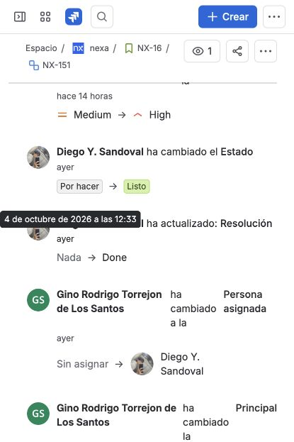

#### 4.2.2.3. Sprint Backlog 2

Sprint 2 conserva el orden de negocio del Product Backlog y recibe Landing, el
overview operativo, la búsqueda manual posterior y el trabajo
comercial/almacén posterior al slice de acceso y escaneo directo de Sprint 1.
La planificación documentada contiene 36 elementos y 144 Story Points: 27 Functional User Stories, 5
Technical Stories y 4 Spikes.

El tablero de Jira observado el 3 de octubre muestra el Sprint 2 con 71
actividades y 317 puntos, para el periodo del 16 de septiembre al 7 de octubre.
La captura muestra las actividades en «Por hacer» y la opción «Iniciar sprint».
Este estado corresponde al corte histórico de la imagen. La conciliación del 5 de octubre conserva los 36 elementos y 144 puntos originales y establece el corte documental ampliado de 71 elementos y 317 puntos. La imagen no
muestra tareas y subtareas desplegadas ni acredita ejecución o aceptación.

*Reconciliación del alcance.*

La comparación de ambos registros permite separar el compromiso académico de
la composición observada en Jira. La siguiente tabla conserva los totales por
familia y hace explícita la variación sin cambiar retrospectivamente la
planificación original.

| Familia | Planificación Sprint 2 | Jira observado | Variación observada |
| --- | ---: | ---: | ---: |
| Historias funcionales Mobile | 21 PBIs / 88 SP | 49 PBIs / 238 SP | +28 PBIs / +150 SP |
| Historias funcionales Landing | 6 PBIs / 15 SP | 6 PBIs / 15 SP | 0 PBIs / 0 SP |
| Technical Stories | 5 PBIs / 23 SP | 10 PBIs / 40 SP | +5 PBIs / +17 SP |
| Spikes | 4 PBIs / 18 SP | 6 PBIs / 24 SP | +2 PBIs / +6 SP |
| **Total** | **36 PBIs / 144 SP** | **71 PBIs / 317 SP** | **+35 PBIs / +173 SP** |

La consulta a Jira, proyecto NX y tablero 2, realizada el 5 de
octubre de 2026, registra `NX Sprint 2` como activo, con 71 issues principales
y 317 Story Points. El corte inicial del 5 de octubre registró los 71 issues principales en «Listo»; la revisión posterior de NX-82 deja el corte actual en 70 «Listo» y uno «Por hacer».
El Sprint continúa activo; por ello, esos estados no acreditan cierre ni
aceptación. Los Story Points se registran en los issues principales; las 142 subtareas tienen Original Estimate entre 4 y 8 horas en el corte actual.
El 5 de octubre se registró la variación en [NX-296](https://nexa-suite.atlassian.net/browse/NX-296): el alcance documental TB1 queda en 71 elementos y 317 Story Points, con una diferencia de +35 elementos y +173 puntos respecto de la planificación original. El registro se conserva fuera del Sprint para no añadir un elemento funcional ni alterar sus totales. Esta conciliación no cambia las fechas ni acredita un acuerdo anterior, aceptación funcional o cierre del Sprint.

*Figura. Backlog del proyecto NX en Jira, observado el 3 de octubre de 2026.
La herramienta presenta 71 actividades y una estimación de 317 puntos; la
reconciliación anterior conserva por separado el compromiso de 36 PBIs y 144
SP.*

*Vista Lista de Jira con claves y títulos de actividades, persona asignada, prioridad, estado y fechas de creación y actualización. Las filas visibles aparecen como «Listo»; la imagen incluye tareas de los dos Sprints.*

La revisión del tablero autenticado del 5 de octubre, anterior al ajuste de NX-82 y con filtro `NX Sprint 2`, mostró 71 elementos en «Listo», ninguno en «Por hacer» ni «En curso». Esta observación conserva su fecha; la consulta final del mismo día registra 70 elementos «Listo» y NX-82 «Por hacer». El Sprint continúa activo.

*Captura del 5 de octubre de 2026: NX-16, correspondiente a MOB-US-004, muestra las subtareas NX-151 y NX-152 en «Listo». El panel identifica Sprint 2, responsable sebastianpinedo214 y estimación de cinco Story Points para la historia. Los estados documentan seguimiento en Jira; no sustituyen la demostración funcional de la aplicación.*

El historial de Jira registra el cambio de NX-151 y NX-152 de «Por hacer» a «Listo» el 4 de octubre de 2026. El corte del 5 de octubre muestra NX-16 y ambas subtareas en «Listo».

*Captura del historial de NX-151 consultada el 5 de octubre de 2026. La vista muestra el cambio de «Por hacer» a «Listo», registrado el 4 de octubre.*

*Incidencias principales asignadas a Sprint 2 en Jira.*

Cada fila relaciona un elemento del backlog con sus dos subtareas existentes
en Jira. El corte final del 5 de octubre registra 70 issues principales «Listo» y uno «Por hacer»,
142 subtareas y 801 h de Original Estimate: 16 subtareas de 4 h, 57 de 5 h,
37 de 6 h, 26 de 7 h y 6 de 8 h. Son estimaciones actuales reconstruidas, no
tiempo trabajado: ninguno de los 142 campos Time Spent contiene un registro.
Los historiales consultados muestran entradas de Original Estimate el 5 de
octubre, posteriores a la planificación inicial; no se presentan como horas
registradas durante Sprint Planning.

La actualización de NX-168 y NX-169 del 5 de octubre relaciona sus estados con
pruebas de preparación actual y asignación versionada. Después de releer Jira,
el corte conserva 34 subtareas «Listo» y 108 «Por hacer». El estado del issue principal y el de sus subtareas se conservan como
registros de niveles distintos del trabajo. Doce subtareas de seis padres fueron
creadas después de la resolución de esos padres. Las fechas y los movimientos
individuales permanecen en el historial de cada incidencia.

NX-42 conserva la aclaración de que MOB-US-030 no dispone de un canal
Driver–Buyer autorizado en este alcance. Sus subtareas corresponden a retirar
exposición y separar capacidades; sus 8 SP y su historial se conservan en el
registro de seguimiento, sin acreditar implementación de ese contacto.

NX-82 y sus subtareas NX-245 y NX-246 se reabrieron el 5 de octubre: sus escenarios corresponden a Customer Buyer, mientras el cliente integrado contiene Operations Android. El soporte de documentos en el servidor y en Operations conserva su evidencia; la lista y visualización de documentos desde Buyer Mobile constituyen un alcance distinto. La actualización mantiene responsables, Story Points, estimaciones e historial.

El Sprint permanece activo. Los estados, las estimaciones y las comprobaciones
técnicas documentan aspectos distintos y no establecen cierre del Sprint ni
aceptación de producto. La revisión de código se consulta en las referencias de
Pull Requests de 4.1.2; el flujo de Jira utiliza «Por hacer», «En curso» y «Listo».

| PBI / issue | Historia (Story Points; responsable; estado) | Subtareas (ID — título — Original Estimate (h) — responsable — estado) |
| --- | --- | --- |
| `LAND-US-001` / `NX-92` | Comprender la propuesta B2B de Nexa (`LAND-US-001`) — 2 SP; Diego Y. Sandoval; Listo | `NX-282` — Redactar introducción y valor B2B — 4 h — Diego Y. Sandoval — Por hacer `NX-283` — Revisar escenarios de propuesta y especialización — 5 h — Diego Y. Sandoval — Por hacer |
| `LAND-US-002` / `NX-93` | Evaluar el ajuste con el perfil operativo (`LAND-US-002`) — 3 SP; Diego Y. Sandoval; Listo | `NX-286` — Mapear perfiles a soluciones comunicables — 4 h — Diego Y. Sandoval — Por hacer `NX-287` — Verificar continuidad del siguiente paso — 5 h — sebastianpinedo214 — Por hacer |
| `LAND-US-003` / `NX-94` | Revisar capacidades y límites del producto (`LAND-US-003`) — 2 SP; Diego Y. Sandoval; Listo | `NX-284` — Trazar capacidades públicas a evidencia — 5 h — Gino Rodrigo Torrejon de Los Santos — Por hacer `NX-285` — Verificar límites de las promesas — 5 h — Diego Y. Sandoval — Por hacer |
| `LAND-US-004` / `NX-95` | Revisar precios, preguntas frecuentes e información legal (`LAND-US-004`) — 2 SP; Gerard Gianpier Rojas Mancilla; Listo | `NX-288` — Consolidar contenido aprobado y registrar vacíos — 5 h — Gerard Gianpier Rojas Mancilla — Por hacer `NX-289` — Verificar FAQ y ruta para preguntas abiertas — 5 h — sebastianpinedo214 — Por hacer |
| `LAND-US-005` / `NX-96` | Iniciar el onboarding de una empresa (`LAND-US-005`) — 3 SP; Gerard Gianpier Rojas Mancilla; Listo | `NX-290` — Definir datos requeridos y estados de solicitud — 4 h — Gerard Gianpier Rojas Mancilla — Por hacer `NX-291` — Verificar solicitud válida, incompleta y servicio no disponible — 6 h — Diego Y. Sandoval — Por hacer |
| `LAND-US-006` / `NX-97` | Contactar a Nexa o solicitar una demostración (`LAND-US-006`) — 3 SP; Gerard Gianpier Rojas Mancilla; Listo | `NX-292` — Definir canal y contexto mínimo de contacto — 4 h — Gerard Gianpier Rojas Mancilla — Por hacer `NX-293` — Verificar validación y respuesta del canal — 6 h — Joaquín Francisco Verde Bueno — Por hacer |
| `MOB-US-004` / `NX-16` | Revisar el trabajo operativo de un vistazo (`MOB-US-004`) — 5 SP; sebastianpinedo214; Listo | `NX-151` — Conectar preparación Fulfillment autorizada por Warehouse — 6 h — sebastianpinedo214 — Listo `NX-152` — Mostrar versión, fecha y límites de cobertura sin inventar totales — 4 h — sebastianpinedo214 — Listo |
| `MOB-US-005` / `NX-17` | Identificar excepciones operativas críticas (`MOB-US-005`) — 5 SP; sebastianpinedo214; Listo | `NX-193` — Integrar tipos y severidad del servidor; listar casos y responsables actuales — 6 h — sebastianpinedo214 — Por hacer `NX-194` — Conectar claim, reasignación, seguimiento y cierre sin conceder autoridad de disposición — 5 h — sebastianpinedo214 — Por hacer |
| `MOB-US-006` / `NX-18` | Encontrar un cliente y su relación con el comprador (`MOB-US-006`) — 3 SP; sebastianpinedo214; Listo | `NX-195` — Conectar búsqueda y detalle de relaciones autorizadas — 6 h — sebastianpinedo214 — Por hacer `NX-196` — Mostrar vínculo comercial vigente sin ampliar acceso a otros contextos — 5 h — sebastianpinedo214 — Por hacer |
| `MOB-US-007` / `NX-19` | Revisar productos, precios y disponibilidad (`MOB-US-007`) — 5 SP; sebastianpinedo214; Listo | `NX-197` — Conectar catálogo y detalle con hechos del servidor — 5 h — sebastianpinedo214 — Por hacer `NX-198` — Separar disponibilidad proyectada de reserva/asignación física — 4 h — Gino Rodrigo Torrejon de Los Santos — Por hacer |
| `MOB-US-008` / `NX-20` | Preparar una solicitud de cliente (`MOB-US-008`) — 5 SP; Gino Rodrigo Torrejon de Los Santos; Listo | `NX-199` — Implementar borrador de cliente, productos y cantidades — 5 h — Gino Rodrigo Torrejon de Los Santos — Listo `NX-200` — Proteger intención local por contexto antes de envío — 6 h — Gino Rodrigo Torrejon de Los Santos — Por hacer |
| `MOB-US-009` / `NX-21` | Enviar una solicitud o Direct Order asistido desde el trabajo de campo (`MOB-US-009`) — 8 SP; Gino Rodrigo Torrejon de Los Santos; Listo | `NX-201` — Conectar envío comercial con clave y cuerpo exactos — 6 h — Gino Rodrigo Torrejon de Los Santos — Por hacer `NX-202` — Mostrar rechazo, conflicto y resultado incierto; recuperación manual — 6 h — Gino Rodrigo Torrejon de Los Santos — Listo |
| `MOB-US-010` / `NX-22` | Seguir compromisos del cliente y crédito (`MOB-US-010`) — 5 SP; Gino Rodrigo Torrejon de Los Santos; Listo | `NX-203` — Conectar consulta de compromiso, crédito y estado actual — 6 h — Gino Rodrigo Torrejon de Los Santos — Listo `NX-204` — Mostrar hechos y límites sin confirmar pagos o recepción localmente — 4 h — Gino Rodrigo Torrejon de Los Santos — Listo |
| `MOB-US-012` / `NX-24` | Buscar manualmente un producto cuando no hay escaneo (`MOB-US-012`) — 2 SP; Joaquín Francisco Verde Bueno; Listo | `NX-191` — Implementar búsqueda manual alternativa al escaneo — 5 h — Joaquín Francisco Verde Bueno — Listo `NX-192` — Conectar selección de SKU confirmado para consulta autorizada — 6 h — Joaquín Francisco Verde Bueno — Listo |
| `MOB-US-013` / `NX-25` | Registrar el stock recién recibido (`MOB-US-013`) — 5 SP; sebastianpinedo214; Listo | `NX-153` — Conectar recepción actual con Warehouse autorizado — 7 h — sebastianpinedo214 — Listo `NX-154` — Persistir comando protegido y confirmar únicamente respuesta del servidor — 5 h — sebastianpinedo214 — Listo |
| `MOB-US-014` / `NX-26` | Registrar lote, vencimiento y cantidad reales (`MOB-US-014`) — 3 SP; sebastianpinedo214; Listo | `NX-161` — Capturar hechos observados de lote, unidad, cantidad y fecha — 5 h — sebastianpinedo214 — Listo `NX-162` — Validar contexto de recepción y conservar hechos esperados separados — 5 h — sebastianpinedo214 — Listo |
| `MOB-US-015` / `NX-27` | Comprobar lote y condición del stock antes del trabajo físico (`MOB-US-015`) — 3 SP; Gerard Gianpier Rojas Mancilla; Listo | `NX-163` — Conectar detalle de lote y condición bajo grant explícito — 5 h — Gerard Gianpier Rojas Mancilla — Listo `NX-164` — Cruzar Membership/Warehouse con capacidades y contexto vigente — 5 h — Gerard Gianpier Rojas Mancilla — Listo |
| `MOB-US-016` / `NX-28` | Preparar el lote y cantidad correctos para el trabajo (`MOB-US-016`) — 5 SP; Gerard Gianpier Rojas Mancilla; Listo | `NX-155` — Conectar trabajo preparado, asignación física y selección de lote — 5 h — Gerard Gianpier Rojas Mancilla — Listo `NX-156` — Enviar cantidades/versiones vigentes sin reemplazar FEFO por decisión local — 6 h — Gerard Gianpier Rojas Mancilla — Listo |
| `MOB-US-017` / `NX-29` | Reportar una discrepancia física o disposición autorizada de stock (`MOB-US-017`) — 5 SP; Joaquín Francisco Verde Bueno; Listo | `NX-157` — Conectar registro de diferencias con razón y evidencia — 6 h — Joaquín Francisco Verde Bueno — Listo `NX-158` — Distinguir observación, revisión y disposición; evitar corrección automática — 4 h — Joaquín Francisco Verde Bueno — Listo |
| `MOB-US-018` / `NX-30` | Mover stock entre ubicaciones del almacén (`MOB-US-018`) — 5 SP; sebastianpinedo214; Listo | `NX-205` — Conectar origen/destino autorizados y movimiento versionado — 8 h — sebastianpinedo214 — Por hacer `NX-206` — Conservar intención idempotente y conflicto sin duplicar movimiento — 7 h — sebastianpinedo214 — Por hacer |
| `MOB-US-019` / `NX-31` | Registrar evidencia de temperatura para stock relevante (`MOB-US-019`) — 3 SP; Joaquín Francisco Verde Bueno; Listo | `NX-165` — Conectar lectura Celsius atribuible al lote/stock relevante — 7 h — Joaquín Francisco Verde Bueno — Listo `NX-166` — Separar evidencia de decisión autorizada y estado HOLD — 6 h — Joaquín Francisco Verde Bueno — Listo |
| `MOB-US-020` / `NX-32` | Ver entregas listas para preparar el despacho (`MOB-US-020`) — 3 SP; sebastianpinedo214; Listo | `NX-167` — Conectar readiness de Fulfillment por Warehouse — 6 h — sebastianpinedo214 — Listo `NX-168` — Mostrar bloqueos actuales y no asumir READY por caché — 5 h — sebastianpinedo214 — Listo |
| `MOB-US-021` / `NX-33` | Asignar un conductor a una entrega lista (`MOB-US-021`) — 3 SP; sebastianpinedo214; Listo | `NX-169` — Conectar candidatos autorizados y asignación versionada — 8 h — sebastianpinedo214 — Listo `NX-170` — Invalidar responsabilidad anterior y preservar historia — 6 h — sebastianpinedo214 — Por hacer |
| `MOB-US-022` / `NX-34` | Comprobar bienes salientes contra la entrega preparada (`MOB-US-022`) — 5 SP; sebastianpinedo214; Listo | `NX-159` — Capturar lote/cantidad observada frente a asignación física — 5 h — sebastianpinedo214 — Listo `NX-160` — Conectar check actual y recuperación con cuerpo JSON exacto — 6 h — sebastianpinedo214 — Listo |
| `MOB-US-023` / `NX-35` | Conservar evidencia del handoff entre almacén y conductor (`MOB-US-023`) — 3 SP; sebastianpinedo214; Listo | `NX-171` — Conectar hechos de preparación y traslado de responsabilidad — 5 h — sebastianpinedo214 — Por hacer `NX-172` — Conservar evidencia sin convertirla en POD o Buyer Receipt — 7 h — sebastianpinedo214 — Por hacer |
| `MOB-US-024` / `NX-36` | Identificar de forma confiable un handoff de despacho (`MOB-US-024`) — 2 SP; sebastianpinedo214; Listo | `NX-181` — Integrar DISPATCH_HANDOFF ligado a assignment/Driver/Delivery/version — 8 h — sebastianpinedo214 — Por hacer `NX-182` — Emitir y validar identidad sin devolver secreto ni aceptar recepción — 6 h — sebastianpinedo214 — Por hacer |
| `MOB-US-025` / `NX-37` | Confirmar que los bienes dejaron el control del almacén (`MOB-US-025`) — 5 SP; sebastianpinedo214; Listo | `NX-173` — Conectar despacho físico con validaciones/versiones actuales — 7 h — sebastianpinedo214 — Por hacer `NX-174` — Preservar hecho autoritativo de salida sin resultado de entrega implícito — 4 h — sebastianpinedo214 — Por hacer |
| `MOB-US-026` / `NX-38` | Ver entregas asignadas al conductor (`MOB-US-026`) — 2 SP; sebastianpinedo214; Listo | `NX-183` — Conectar lista/detalle del Driver actualmente asignado — 6 h — sebastianpinedo214 — Por hacer `NX-184` — Excluir entregas ajenas y descartar respuesta de contexto obsoleto — 5 h — sebastianpinedo214 — Por hacer |
| `MOB-US-027` / `NX-39` | Iniciar una entrega asignada (`MOB-US-027`) — 3 SP; sebastianpinedo214; Listo | `NX-185` — Conectar inicio y Delivery Attempt con precondiciones actuales — 7 h — sebastianpinedo214 — Por hacer `NX-186` — Exigir ACK crítico vigente y preservar intención idempotente — 7 h — sebastianpinedo214 — Por hacer |
| `MOB-US-028` / `NX-40` | Abrir indicaciones hacia el destino autorizado de la entrega (`MOB-US-028`) — 2 SP; Gino Rodrigo Torrejon de Los Santos; Listo | `NX-187` — Abrir geo intent solo con destino autorizado — 5 h — Gino Rodrigo Torrejon de Los Santos — Listo `NX-188` — Resolver proveedor externo y tratar aplicación/permiso ausente — 5 h — Gino Rodrigo Torrejon de Los Santos — Listo |
| `MOB-US-030` / `NX-42` | Contactar al comprador durante la entrega (`MOB-US-030`) — 8 SP; Diego Y. Sandoval; Listo | `NX-209` — Retirar exposición de chat Driver–Buyer según decisión Owner — 5 h — Joaquín Francisco Verde Bueno — Por hacer `NX-210` — Mantener Sales↔Buyer como capacidad separada; no crear chat Driver — 5 h — Diego Y. Sandoval — Por hacer |
| `MOB-US-031` / `NX-43` | Registrar el resultado del intento de entrega (`MOB-US-031`) — 5 SP; Gerard Gianpier Rojas Mancilla; Listo | `NX-175` — Conectar resultado actual de Delivery Attempt — 7 h — Gerard Gianpier Rojas Mancilla — Por hacer `NX-176` — Registrar resultado explícito sin asumir recepción Buyer — 6 h — Gerard Gianpier Rojas Mancilla — Por hacer |
| `MOB-US-032` / `NX-44` | Registrar una entrega parcial o rechazada y lo que queda (`MOB-US-032`) — 5 SP; Gerard Gianpier Rojas Mancilla; Listo | `NX-177` — Capturar resultado y cantidades remanentes por línea — 5 h — Gerard Gianpier Rojas Mancilla — Por hacer `NX-178` — Conservar intento y restricciones antes de iniciar nuevo intento — 5 h — Gerard Gianpier Rojas Mancilla — Por hacer |
| `MOB-US-033` / `NX-45` | Conservar el Proof of Delivery (`MOB-US-033`) — 5 SP; sebastianpinedo214; Listo | `NX-179` — Crear proof y conectar carga/scan/adjunto AVAILABLE de sujeto exacto — 8 h — sebastianpinedo214 — Por hacer `NX-180` — Preservar evidencia privada y diferenciar POD de Buyer Receipt — 6 h — sebastianpinedo214 — Por hacer |
| `MOB-US-034` / `NX-46` | Presentar un código acotado de handoff de entrega (`MOB-US-034`) — 3 SP; Diego Y. Sandoval; Listo | `NX-189` — Conectar emisión/display sobre intento activo y autoridad actual — 6 h — Diego Y. Sandoval — Por hacer `NX-190` — Mantener secreto solo en memoria; replay sin secreto explícito — 7 h — Diego Y. Sandoval — Por hacer |
| `MOB-US-035` / `NX-47` | Continuar la evidencia de entrega después de perder conexión (`MOB-US-035`) — 8 SP; sebastianpinedo214; Listo | `NX-211` — Retener selección privada de archivo bajo identidad exacta — 7 h — sebastianpinedo214 — Por hacer `NX-212` — Recuperar intención cifrada y revisión manual sin cola genérica — 8 h — sebastianpinedo214 — Por hacer |
| `MOB-US-050` / `NX-62` | Gestionar una discrepancia de recepción con evidencia (`MOB-US-050`) — 5 SP; Gerard Gianpier Rojas Mancilla; Listo | `NX-213` — Registrar observación inmutable de hechos recibidos — 5 h — Gerard Gianpier Rojas Mancilla — Listo `NX-214` — Conectar evidencia AVAILABLE y readiness para revisión sin aprobar stock — 7 h — Gerard Gianpier Rojas Mancilla — Listo |
| `MOB-US-051` / `NX-63` | Retener o poner en cuarentena stock y resolverlo (`MOB-US-051`) — 5 SP; Gino Rodrigo Torrejon de Los Santos; Listo | `NX-215` — Conectar condición bloqueada y acciones con capacidades vigentes — 5 h — Gino Rodrigo Torrejon de Los Santos — Por hacer `NX-216` — Separar reporte de disposición autorizada y mantener historial — 5 h — Gino Rodrigo Torrejon de Los Santos — Por hacer |
| `MOB-US-052` / `NX-64` | Confirmar la recepción en el destino de una transferencia interna (`MOB-US-052`) — 3 SP; Joaquín Francisco Verde Bueno; Listo | `NX-217` — Conectar transferencia vigente y hechos de llegada — 5 h — Joaquín Francisco Verde Bueno — Por hacer `NX-218` — Registrar diferencias y confirmar receipt solo tras resolución válida — 5 h — Joaquín Francisco Verde Bueno — Por hacer |
| `MOB-US-053` / `NX-65` | Realizar un conteo cíclico y solicitar corrección de stock (`MOB-US-053`) — 5 SP; Diego Y. Sandoval; Listo | `NX-219` — Registrar conteo contra lote/version actual — 7 h — Diego Y. Sandoval — Por hacer `NX-220` — Conectar corrección explícita autorizada y movimiento trazable — 6 h — Diego Y. Sandoval — Por hacer |
| `MOB-US-054` / `NX-66` | Solicitar sustitución de lote cuando FEFO no completa el trabajo (`MOB-US-054`) — 8 SP; sebastianpinedo214; Listo | `NX-221` — Registrar REQUESTED sobre asignación/SKU/unidad/cantidad/version — 7 h — sebastianpinedo214 — Por hacer `NX-222` — Conservar lote original hasta decisión autorizada; no sustituir localmente — 6 h — sebastianpinedo214 — Por hacer |
| `MOB-US-055` / `NX-67` | Usar información ampliada de identidad de producto, paquete y almacenamiento (`MOB-US-055`) — 8 SP; Gerard Gianpier Rojas Mancilla; Listo | `NX-223` — Mostrar identidad de producto, empaque, lote y ubicación — 4 h — Gerard Gianpier Rojas Mancilla — Por hacer `NX-224` — Conectar resolución actual sin inferir stock a partir de etiqueta — 7 h — Gerard Gianpier Rojas Mancilla — Por hacer |
| `MOB-US-056` / `NX-68` | Preparar un grupo de tareas de almacén (`MOB-US-056`) — 8 SP; Gino Rodrigo Torrejon de Los Santos; Listo | `NX-225` — Agrupar hasta25 preparaciones para organización local — 4 h — Gino Rodrigo Torrejon de Los Santos — Por hacer `NX-226` — Mantener confirmación/version/error de cada acción separada — 6 h — Gino Rodrigo Torrejon de Los Santos — Por hacer |
| `MOB-US-057` / `NX-69` | Resolver una discrepancia de despacho antes del handoff (`MOB-US-057`) — 5 SP; Joaquín Francisco Verde Bueno; Listo | `NX-227` — Vincular discrepancy a reinspección coincidente actual con motivo — 6 h — Joaquín Francisco Verde Bueno — Por hacer `NX-228` — Preservar check original y exigir validación actual antes de salida — 5 h — sebastianpinedo214 — Por hacer |
| `MOB-US-058` / `NX-70` | Reasignar un conductor o reprogramar el despacho de forma segura (`MOB-US-058`) — 5 SP; Diego Y. Sandoval; Listo | `NX-229` — Conectar revisiones explícitas antes de despacho — 5 h — Diego Y. Sandoval — Por hacer `NX-230` — Preservar trazabilidad/versiones y revocar autoridad de Driver anterior — 6 h — Diego Y. Sandoval — Por hacer |
| `MOB-US-059` / `NX-71` | Preparar cargas agrupadas y múltiples paradas (`MOB-US-059`) — 8 SP; sebastianpinedo214; Listo | `NX-233` — Conectar carga y orden manual con attestation Dispatch explícita — 7 h — sebastianpinedo214 — Por hacer `NX-234` — Planificar ventana solo ausente y bloquear incompatibilidad Warehouse/estado/temperatura/HOLD — 6 h — Gerard Gianpier Rojas Mancilla — Por hacer |
| `MOB-US-060` / `NX-72` | Completar un handoff al transportista con responsabilidad trazable (`MOB-US-060`) — 8 SP; Gerard Gianpier Rojas Mancilla; Listo | `NX-231` — Conectar confirmación Dispatch y aceptación de Driver asignado de carga completa — 6 h — Gerard Gianpier Rojas Mancilla — Listo `NX-232` — Exigir ambos hechos y readiness actual sin mover stock por aceptación local — 7 h — Gerard Gianpier Rojas Mancilla — Listo |
| `MOB-US-061` / `NX-73` | Registrar evidencia de temperatura en el despacho (`MOB-US-061`) — 3 SP; Gino Rodrigo Torrejon de Los Santos; Listo | `NX-235` — Conectar foto exacta AVAILABLE, Celsius y versión de lote con HOLD preventivo — 7 h — Gino Rodrigo Torrejon de Los Santos — Por hacer `NX-236` — Conectar execution HOLD BC-06 por cantidad/SKU y disposition autorizada sin recrear inventario — 7 h — Gino Rodrigo Torrejon de Los Santos — Por hacer |
| `MOB-US-062` / `NX-74` | Señalar la llegada de una entrega activa (`MOB-US-062`) — 3 SP; Joaquín Francisco Verde Bueno; Listo | `NX-237` — Conectar registro arrival con actor/attempt/version actuales — 8 h — Gerard Gianpier Rojas Mancilla — Por hacer `NX-238` — Preservar intención y resultado incierto sin completar entrega — 6 h — Joaquín Francisco Verde Bueno — Por hacer |
| `MOB-US-063` / `NX-75` | Seguir instrucciones de entrega y datos de contacto autorizados (`MOB-US-063`) — 3 SP; Diego Y. Sandoval; Listo | `NX-239` — Conectar autoría Customer/Buyer, proveniencia Sales y Dispatch — 6 h — Gerard Gianpier Rojas Mancilla — Por hacer `NX-240` — Proyectar instrucciones actuales a Delivery y ACK crítico versionado; sin chat Driver — 7 h — Diego Y. Sandoval — Por hacer |
| `MOB-US-065` / `NX-77` | Registrar un incidente de entrega con mayor detalle (`MOB-US-065`) — 5 SP; Gerard Gianpier Rojas Mancilla; Listo | `NX-241` — Conectar tipo/reason/description/place con severidad derivada servidor — 5 h — Gerard Gianpier Rojas Mancilla — Listo `NX-242` — Adjuntar evidencia AVAILABLE al incidente actual sin modificar Delivery outcome — 7 h — Gerard Gianpier Rojas Mancilla — Listo |
| `MOB-US-066` / `NX-78` | Recuperar una entrega activa mediante operación offline selectiva (`MOB-US-066`) — 8 SP; Gino Rodrigo Torrejon de Los Santos; Listo | `NX-243` — Restaurar borrador POD/incidente protegido por contexto — 7 h — Gino Rodrigo Torrejon de Los Santos — Listo `NX-244` — Revalidar autoridad y recuperar comando exacto manualmente — 5 h — Diego Y. Sandoval — Por hacer |
| `MOB-US-070` / `NX-82` | Ver documentos de negocio vinculados a solicitud o pedido (`MOB-US-070`) — 3 SP; Gerard Gianpier Rojas Mancilla; Por hacer | `NX-245` — Conectar lista y acceso a documento emitido autorizado — 6 h — Gerard Gianpier Rojas Mancilla — Por hacer `NX-246` — Visualizar PDF privado sin convertir copia en autoridad de negocio — 5 h — Gerard Gianpier Rojas Mancilla — Por hacer |
| `MOB-US-072` / `NX-84` | Trabajar con un cliente mediante una visita de campo autorizada (`MOB-US-072`) — 8 SP; Joaquín Francisco Verde Bueno; Listo | `NX-247` — Conectar relación cliente y registro de visita actual — 6 h — Joaquín Francisco Verde Bueno — Por hacer `NX-248` — Preservar actor/contexto e intención comercial protegida — 5 h — Joaquín Francisco Verde Bueno — Por hacer |
| `MOB-US-073` / `NX-85` | Usar evidencia de automatización de almacén en un trabajo controlado (`MOB-US-073`) — 8 SP; Diego Y. Sandoval; Listo | `NX-249` — Conectar lectura manual Celsius y foto exacta en receiving — 7 h — Diego Y. Sandoval — Por hacer `NX-250` — Crear excepción/HOLD preventivo atómico; dejar IoT automático diferido — 7 h — Gino Rodrigo Torrejon de Los Santos — Por hacer |
| `TS-MOB-002` / `NX-99` | Implementar baseline técnico de compatibilidad de plataforma (`TS-MOB-002`) — 5 SP; Gino Rodrigo Torrejon de Los Santos; Listo | `NX-251` — Registrar versiones y restricciones del baseline — 7 h — Gino Rodrigo Torrejon de Los Santos — Por hacer `NX-252` — Ejecutar validación reproducible del baseline — 5 h — Diego Y. Sandoval — Por hacer |
| `TS-MOB-003` / `NX-100` | Preservar paridad de contratos entre proyecciones Mobile (`TS-MOB-003`) — 5 SP; Gino Rodrigo Torrejon de Los Santos; Listo | `NX-276` — Implementar comportamiento — TS-MOB-003 — 6 h — Gino Rodrigo Torrejon de Los Santos — Por hacer `NX-277` — Verificar comportamiento — TS-MOB-003 — 5 h — Diego Y. Sandoval — Por hacer |
| `TS-MOB-004` / `NX-101` | Aislar capacidades de dispositivo de las reglas de negocio (`TS-MOB-004`) — 5 SP; Gino Rodrigo Torrejon de Los Santos; Listo | `NX-253` — Trazar capacidades a adaptadores y límites — 5 h — Gino Rodrigo Torrejon de Los Santos — Por hacer `NX-254` — Verificar estados disponible, denegado y fallido — 5 h — sebastianpinedo214 — Por hacer |
| `TS-MOB-005` / `NX-102` | Proteger el estado local selectivo y no autoritativo (`TS-MOB-005`) — 5 SP; Gerard Gianpier Rojas Mancilla; Listo | `NX-255` — Clasificar datos locales permitidos — 5 h — Gerard Gianpier Rojas Mancilla — Por hacer `NX-256` — Verificar aislamiento tras cierre o cambio de Tenant — 7 h — Diego Y. Sandoval — Por hacer |
| `TS-MOB-006` / `NX-103` | Resolver reintentos, resultados inciertos e idempotencia (`TS-MOB-006`) — 5 SP; Gerard Gianpier Rojas Mancilla; Listo | `NX-257` — Trazar comandos inciertos a contratos e identificadores — 5 h — Gerard Gianpier Rojas Mancilla — Por hacer `NX-258` — Verificar reenvío idempotente y conflicto de versión — 7 h — sebastianpinedo214 — Por hacer |
| `TS-MOB-008` / `NX-105` | Abrir navegación externa con un límite de ubicación (`TS-MOB-008`) — 3 SP; Gino Rodrigo Torrejon de Los Santos; Listo | `NX-270` — Implementar comportamiento — TS-MOB-008 — 6 h — Gino Rodrigo Torrejon de Los Santos — Por hacer `NX-271` — Verificar comportamiento — TS-MOB-008 — 5 h — Diego Y. Sandoval — Por hacer |
| `TS-MOB-009` / `NX-106` | Preparar el manejo autorizado de notificaciones y deep links (`TS-MOB-009`) — 3 SP; Joaquín Francisco Verde Bueno; Listo | `NX-272` — Implementar comportamiento — TS-MOB-009 — 6 h — Joaquín Francisco Verde Bueno — Por hacer `NX-273` — Verificar comportamiento — TS-MOB-009 — 5 h — sebastianpinedo214 — Por hacer |
| `TS-MOB-010` / `NX-107` | Aplicar i18n y accesibilidad en las aplicaciones móviles (`TS-MOB-010`) — 3 SP; Gerard Gianpier Rojas Mancilla; Listo | `NX-260` — Revisar traducción de contenido, estados y errores — 5 h — Joaquín Francisco Verde Bueno — Por hacer `NX-261` — Verificar controles y orden para lectura asistida — 5 h — sebastianpinedo214 — Por hacer |
| `TS-MOB-011` / `NX-108` | Preparar validación técnica y observabilidad mínima (`TS-MOB-011`) — 3 SP; Joaquín Francisco Verde Bueno; Listo | `NX-278` — Implementar comportamiento — TS-MOB-011 — 6 h — Joaquín Francisco Verde Bueno — Por hacer `NX-279` — Verificar comportamiento — TS-MOB-011 — 5 h — sebastianpinedo214 — Por hacer |
| `TS-MOB-012` / `NX-109` | Preparar evidencia técnica de build, instalación y dispositivos (`TS-MOB-012`) — 3 SP; Diego Y. Sandoval; Listo | `NX-280` — Implementar comportamiento — TS-MOB-012 — 6 h — Diego Y. Sandoval — Por hacer `NX-281` — Verificar comportamiento — TS-MOB-012 — 5 h — Diego Y. Sandoval — Por hacer |
| `SPIKE-001` / `NX-110` | Investigar, seleccionar e integrar una feature de aprendizaje autónomo (`SPIKE-001`) — 5 SP; Gerard Gianpier Rojas Mancilla; Listo | `NX-262` — Definir pregunta, alternativas y criterios de comparación — 5 h — Gerard Gianpier Rojas Mancilla — Por hacer `NX-263` — Ejecutar PoC reproducible o justificar no proceder — 5 h — Gerard Gianpier Rojas Mancilla — Por hacer |
| `SPIKE-002` / `NX-111` | Establecer tracks Mobile y límites de contratos (`SPIKE-002`) — 5 SP; Gino Rodrigo Torrejon de Los Santos; Listo | `NX-264` — Preparar matriz de baseline y prueba contractual — 4 h — sebastianpinedo214 — Por hacer `NX-265` — Documentar diferencias, riesgos y decisión técnica — 4 h — Gino Rodrigo Torrejon de Los Santos — Por hacer |
| `SPIKE-003` / `NX-112` | Delimitar identificadores de producto (`SPIKE-003`) — 3 SP; Joaquín Francisco Verde Bueno; Listo | `NX-266` — Comparar formatos con fuentes y casos representativos — 5 h — Joaquín Francisco Verde Bueno — Por hacer `NX-267` — Verificar resolución, ambigüedad y alternativa manual — 5 h — Diego Y. Sandoval — Por hacer |
| `SPIKE-004` / `NX-113` | Delimitar persistencia y recuperación local (`SPIKE-004`) — 5 SP; Gino Rodrigo Torrejon de Los Santos; Listo | `NX-268` — Clasificar datos, propósito, protección y expiración — 4 h — Gino Rodrigo Torrejon de Los Santos — Por hacer `NX-269` — Verificar interrupción, recuperación y resultado incierto — 5 h — sebastianpinedo214 — Por hacer |
| `SPIKE-005` / `NX-114` | Delimitar notificaciones y deep links (`SPIKE-005`) — 3 SP; Gerard Gianpier Rojas Mancilla; Listo | `NX-274` — Implementar comportamiento — SPIKE-005 — 4 h — Joaquín Francisco Verde Bueno — Por hacer `NX-275` — Verificar comportamiento — SPIKE-005 — 5 h — sebastianpinedo214 — Por hacer |
| `SPIKE-006` / `NX-115` | Delimitar mapas y ubicación (`SPIKE-006`) — 3 SP; Joaquín Francisco Verde Bueno; Listo | `NX-294` — Implementar comportamiento — SPIKE-006 — 4 h — Joaquín Francisco Verde Bueno — Por hacer `NX-295` — Verificar comportamiento — SPIKE-006 — 5 h — Gerard Gianpier Rojas Mancilla — Por hacer |
