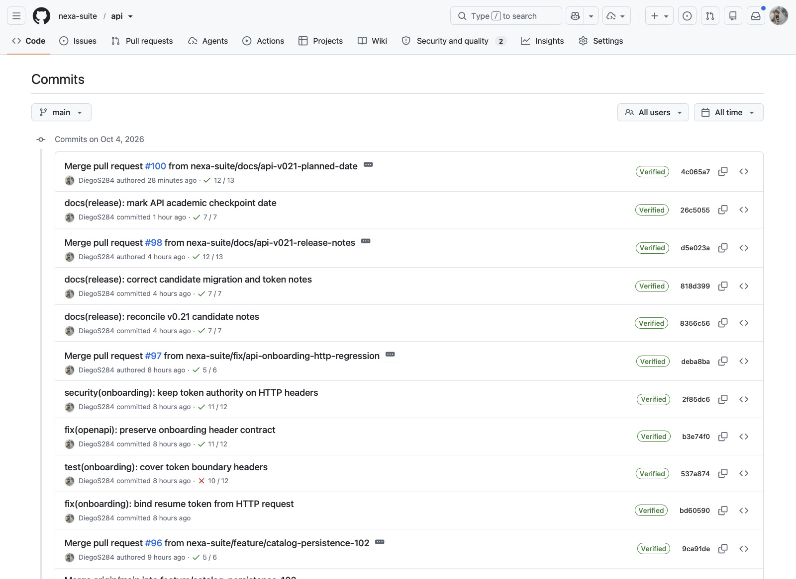
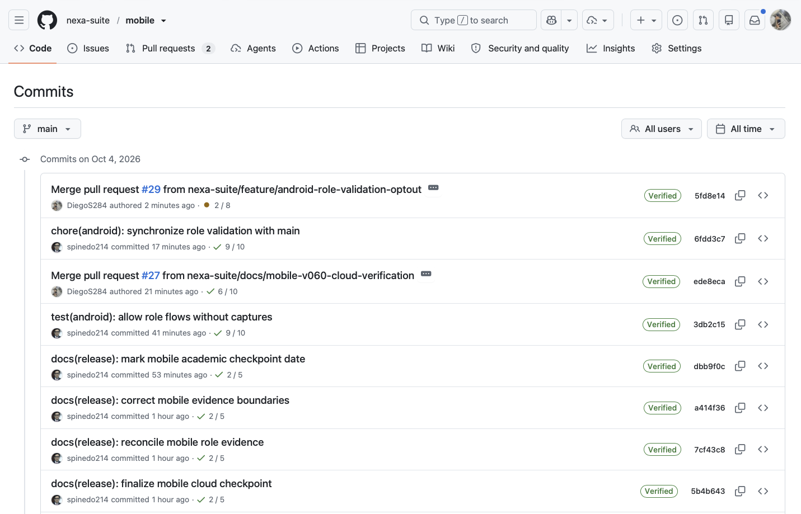

#### 4.2.2.4. Development Evidence for Sprint Review

**Corte de evidencia: 4 de octubre de 2026.** La fecha queda dentro del
periodo de Sprint 2 mostrado por Jira (16 de septiembre–7 de octubre), pero la
actividad del repositorio no se asigna automáticamente a una historia ni
actualiza el compromiso planificado. La planificación documentada conserva 36
elementos y 144 Story Points. 4.2.2.3 Sprint Backlog 2
presenta la comparación por familia con los 71 issues y 317 puntos observados;
Jira no registra aprobación del cambio de alcance.

| Repositorio | Evidencia observada | Lectura del alcance | Estado |
| --- | --- | --- | --- |
| `nexa-suite/api` | El historial de `main` del 4 de octubre muestra cambios de persistencia del catálogo, contrato de onboarding y documentación técnica. | El historial registra cambios publicados en la fuente API; el uso en tareas operativas y la salud del servicio se describen con sus comprobaciones específicas. | Evidencia de fuente |
| `nexa-suite/mobile` | El 4 de octubre, el PR #30 integró en `main` la corrección del adaptador para consultar el catálogo interno. GitHub muestra revisión aprobada y comprobaciones CI satisfactorias. | La integración y CI registran el cambio de fuente; los recorridos móviles, las mutaciones, la prueba con usuarios y la aceptación se presentan en sus registros específicos. | Evidencia de fuente |
| `nexa-suite/mobile-report` | El historial público de `main` registra cambios del informe y la trazabilidad del Sprint 2 hasta el 3 de octubre. La figura registra el historial disponible en esa fecha. | La captura de `main` es anterior a esta actualización y no la muestra. | Evidencia documental |

*Figura 4.2.2.4-1. Historial de `main` del API observado el 4 de octubre de
2026. La captura incluye verificaciones con resultados distintos; en
particular, una ejecución anterior de onboarding muestra 10 de 12 checks, por
lo que la figura no respalda la afirmación de que toda la actividad estuviera
verde.*

*Figura 4.2.2.4-2. Historial de `main` de Operations Mobile observado el 4 de
octubre de 2026. Se distinguen la sincronización de validación de roles y la
actividad del PR #29; el estado de checks visible en esa captura era parcial.*

La validación automatizada registrada en otras secciones conserva su propia
fecha y fuente. Esta sección no reutiliza resultados históricos como si se
hubieran repetido sobre la punta actual. Tampoco atribuye los cambios a una
historia o a un integrante cuando la relación no está demostrada por el
registro disponible. La distribución por dispositivo, los recorridos
autenticados de extremo a extremo, la cámara y la aceptación de producto
siguen abiertos.

*Síntesis del proceso de ingeniería de Sprint 2.*

| Área | Evidencia principal | Corte | Sección | Qué establece |
| --- | --- | --- | --- | --- |
| Development | Revisiones integradas de Operations Mobile y API, vinculadas con tareas y contratos de servicio. | 4–5 de octubre de 2026 | 4.1.2 y 4.2.2.4 | Existencia del código integrado y trazabilidad de sus cambios. |
| Testing | [Verificación Android](https://github.com/nexa-suite/mobile/actions/runs/37224557108) y [API CI](https://github.com/nexa-suite/api/actions/runs/37366453555). | Android: 4 de octubre; API: 5 de octubre de 2026 | 4.2.2.5 | Resultado satisfactorio de esos workflows y de sus comprobaciones ejecutadas; la aceptación de usuario tiene objetivos distintos. |
| Execution | Instalación y estados observados en Samsung S22; consulta protegida desde Swagger sin credenciales. | 4–5 de octubre de 2026 | 4.2.2.6 y 4.2.2.7 | Comportamiento visible de las acciones registradas, incluida la respuesta HTTP 401. |
| Documentation | Contrato OpenAPI, Swagger UI y registro de versiones, tareas y evidencia. | 5 de octubre de 2026 | 4.2.2.3 y 4.2.2.7; Registro de Versiones; Anexos B y C | Descripción de interfaces, seguimiento del trabajo y ubicación de las fuentes. |
| Deployment | Publicación del Website y APK; entorno API en Render, datos en Neon y configuración SMTP de Brevo. | 4–5 de octubre de 2026 | 4.1.4 y 4.2.2.8 | Entornos y artefactos publicados documentados, separados de la evaluación de los recorridos por usuario. |
