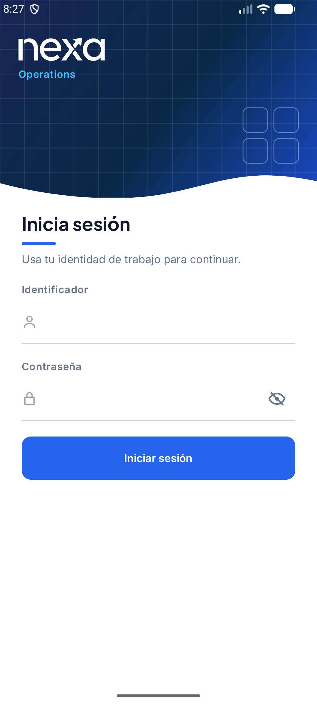
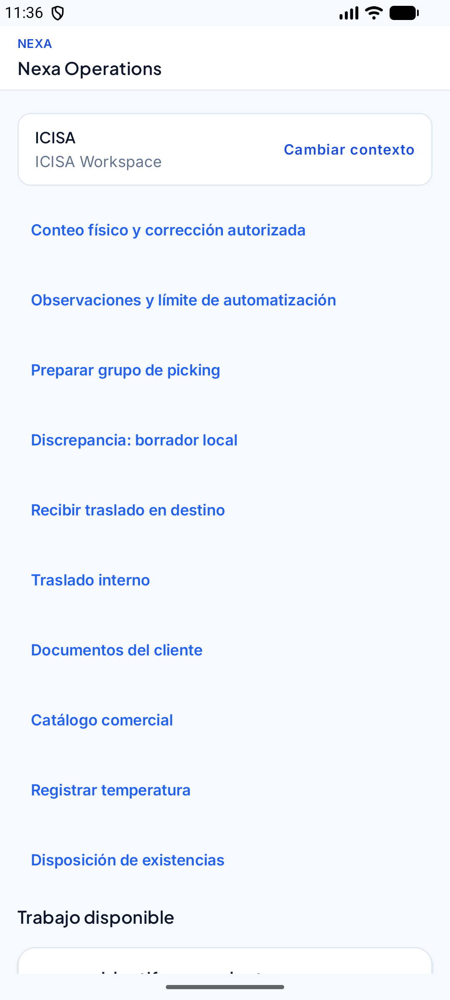
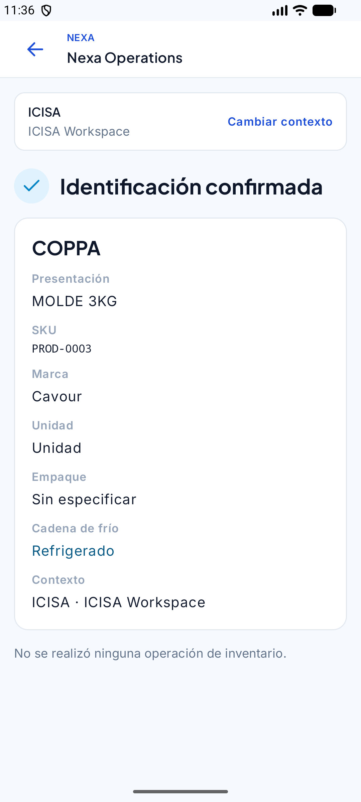
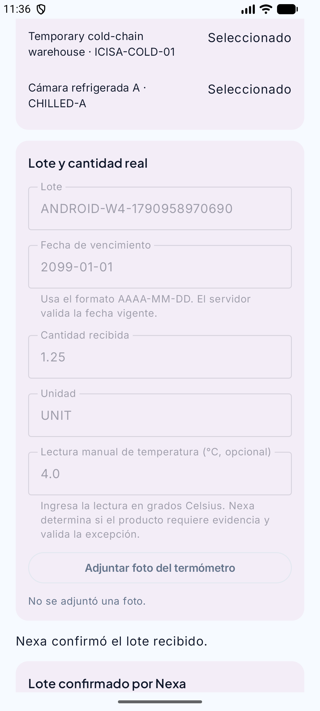
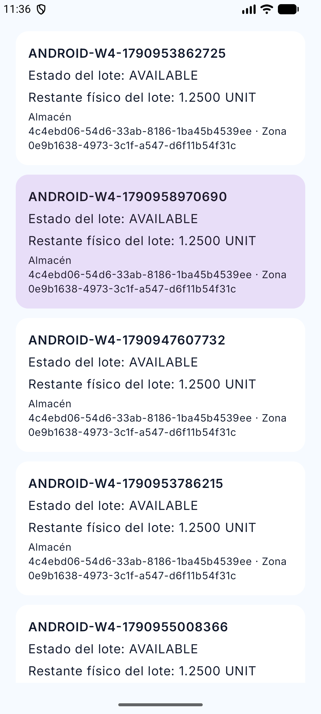
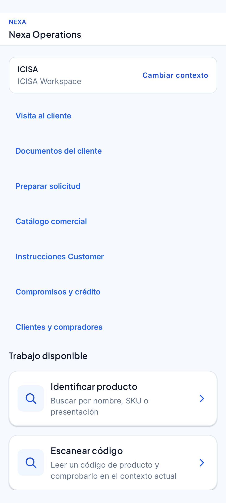
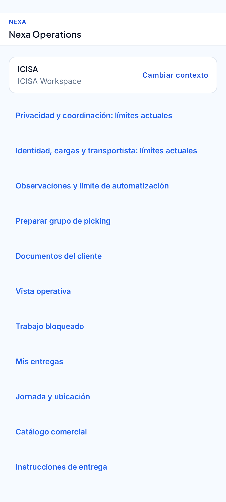
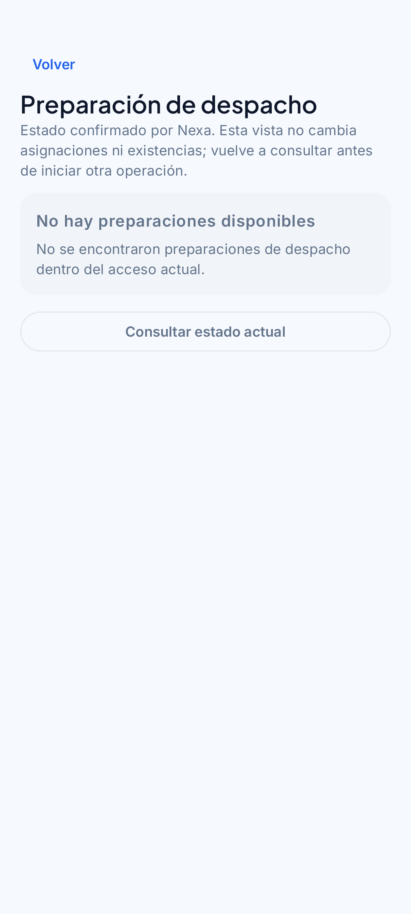
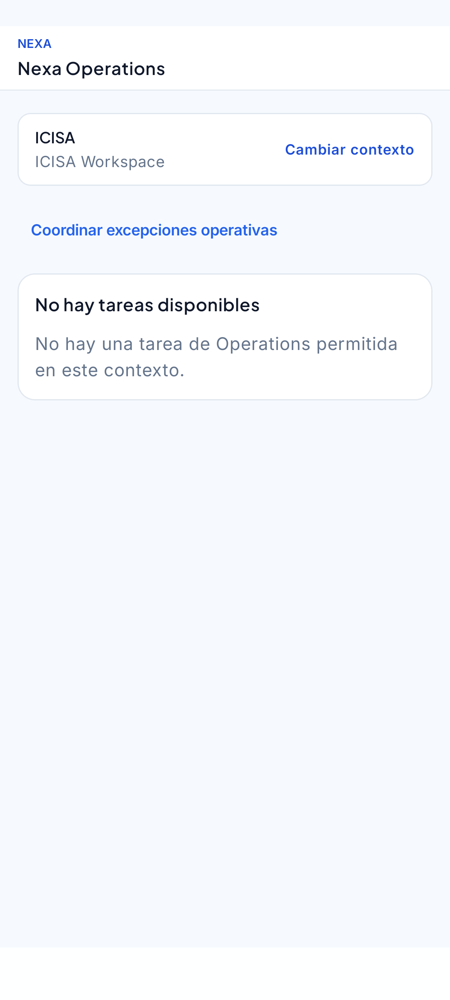
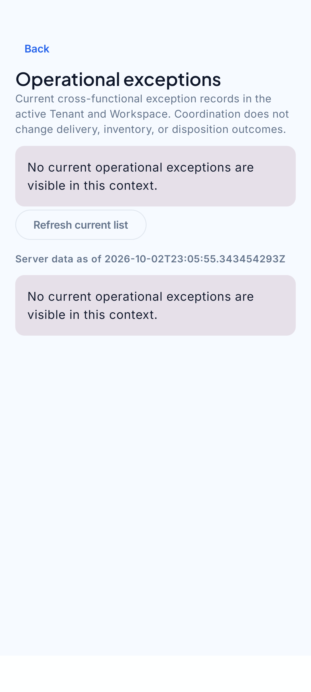

# 4.2.2.6. Execution Evidence for Sprint Review

La ejecución disponible es parcial. En el emulador API 29 se autenticó una
cuenta Warehouse, se abrió el catálogo y la consulta de `PROD-0001` terminó con
fallo de red; el diagnóstico quedó pendiente. El intento integrado anterior
registró 8 de 8 respuestas API y 1 de 1 prueba nativa, pero no recorrió todas
las historias ni todos los roles.

En un Samsung SM-S908E con API 36 se observó instalación, inicio y ausencia de
fallo fatal en el arranque. Esa observación cubre un smoke de instalación y
arranque; no acredita los recorridos de Warehouse, Sales, Logistics, BOM o
Driver ni la aceptación del producto.

Las siguientes figuras ya existían en el repositorio. Se presentan como
evidencia visual parcial, con una leyenda para cada estado observado.

*Figura 1. Pantalla de acceso observada durante la ejecución.*

*Figura 2. Warehouse antes de consultar el catálogo.*

*Figura 3. Resultado de catálogo sin inventario disponible.*

*Figura 4. Estado de recepción confirmado en la evidencia existente.*

*Figura 5. Stock confirmado en la vista Warehouse.*

*Figura 6. Inicio de Sales; no se observa una visita registrada.*

*Figura 7. Estado de Sales sin visita registrada.*

*Figura 8. Catálogo vacío en el estado observado de Sales.*

*Figura 9. Inicio de Logistics.*

*Figura 10. Preparación sin registros en la evidencia existente.*

*Figura 11. Entregas sin registros; no se acredita un recorrido Driver.*

*Figura 12. Acceso autorizado a coordinación BOM.*

*Figura 13. Lista BOM vacía y retorno al trabajo autorizado.*

La instalación y las figuras existentes no prueban aceptación Product/System,
un recorrido comercial completo, una entrega ejecutada ni el cierre del Sprint
Review. Tampoco se generaron capturas nuevas para este informe.
