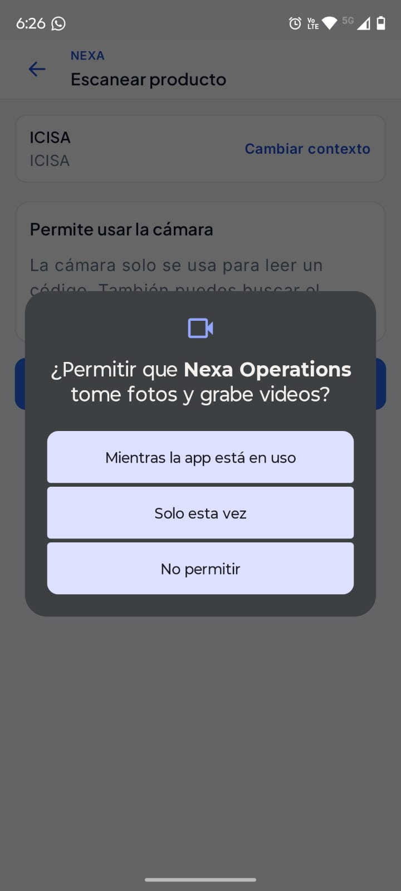
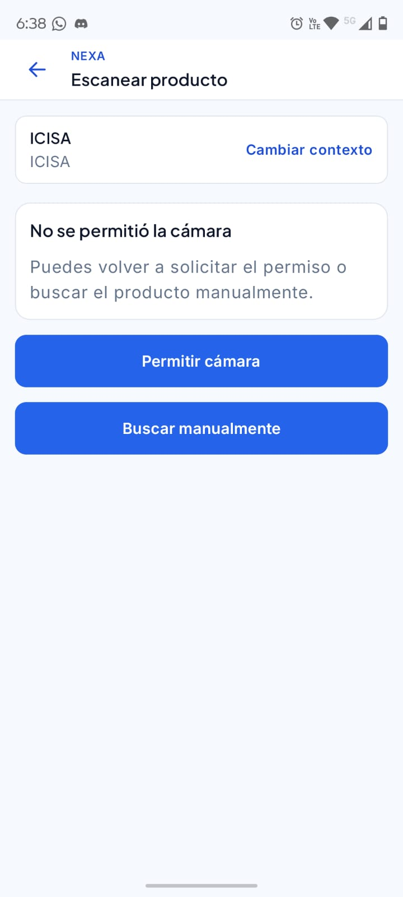
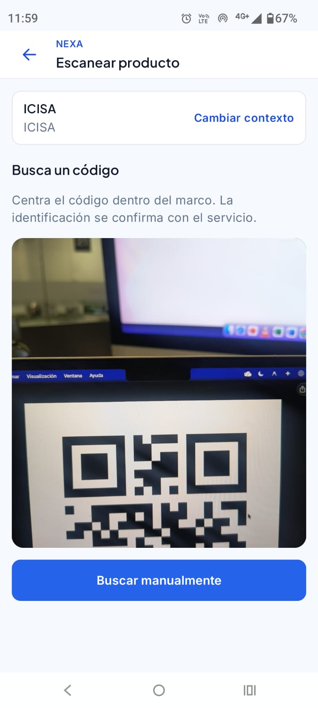
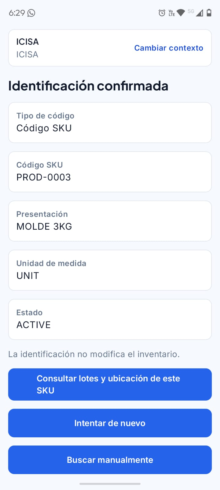
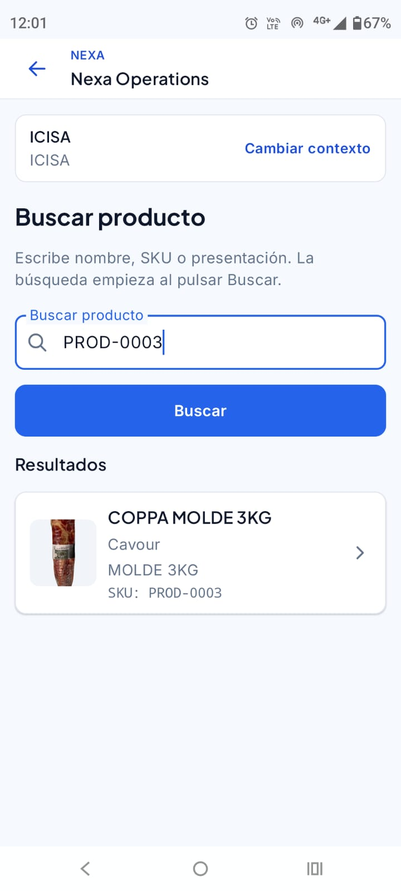
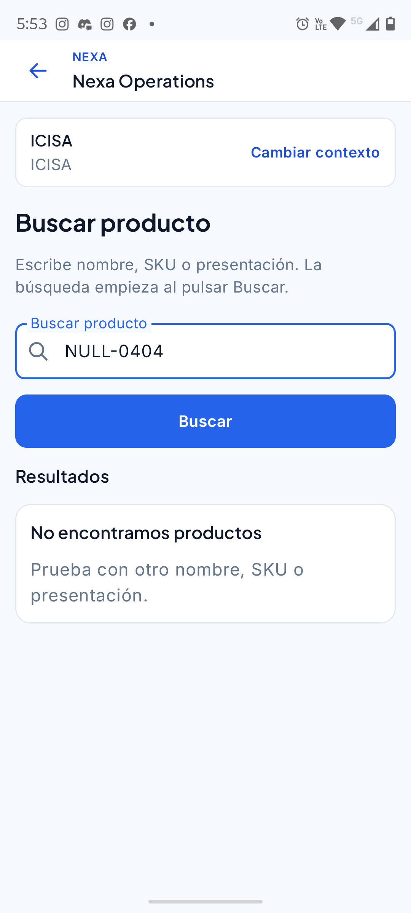
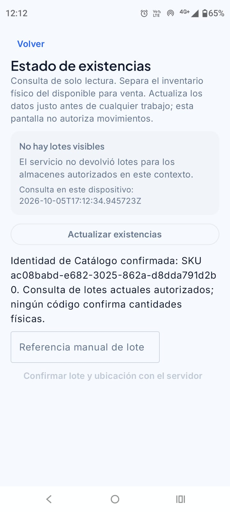

#### 4.2.2.6. Execution Evidence for Sprint Review

*Instalación de Nexa Operations en Android.*

*La pantalla de información de la aplicación muestra Nexa Operations como
instalada y Cámara entre sus permisos. La captura documenta la instalación;
la lectura de códigos y la resolución de un producto se comprueban en sus
recorridos de ejecución. No se observa la versión de la APK en esta vista.*

La comprobación de Samsung S22 registrada el 4 de octubre cubrió instalación e inicio de sesión contra el servicio cloud. La release de evaluación [Mobile v0.6.0](https://github.com/nexa-suite/mobile/releases/tag/v0.6.0) adjunta el APK para ese entorno HTTPS.

Las evidencias complementarias HP-01, HP-02 y HP-03 muestran continuidad de sesión, búsqueda manual e identificación de producto con cámara. UP-07 presenta la alternativa manual ante permiso de cámara denegado; UP-10 muestra consultas por código y nombre. Los recorridos se explican en la sección 3.1.4.4.

Las capturas de Android permiten distinguir la solicitud de acceso, la respuesta ante una denegación y los estados de cámara e identificación.

*Android solicita permiso de cámara para Nexa Operations y ofrece permitir el acceso durante el uso, solo esta vez o denegarlo.*

*La aplicación informa «No se permitió la cámara» y conserva las opciones de solicitar permiso y buscar manualmente en el contexto ICISA.*

*La pantalla «Escanear producto» muestra un código QR frente a la cámara y conserva la alternativa «Buscar manualmente». La figura registra el estado de cámara con el código visible; la identificación se documenta en la captura siguiente.*

*«Identificación confirmada» presenta el SKU PROD-0003, presentación MOLDE 3KG, unidad UNIT y estado ACTIVE en el contexto ICISA. La interfaz indica que la identificación no modifica el inventario y ofrece consultar lotes y ubicación. Estas capturas documentan los estados visibles; la secuencia continua de lectura no se observa en ellas.*

*La consulta manual PROD-0003 muestra COPPA MOLDE 3KG, marca Cavour, presentación MOLDE 3KG y la misma clave SKU en el contexto ICISA. Esta vista documenta entrada y resultado; no determina si la búsqueda se inició después de denegar la cámara.*

*La búsqueda NULL-0404 muestra «No encontramos productos» y propone intentar otro nombre, SKU o presentación, conservando el contexto ICISA. La figura documenta el resultado vacío y una salida de recuperación; el identificador ingresado no representa un código HTTP ni demuestra ausencia de productos en todo el catálogo.*

*«Estado de existencias» informa que el servicio no devolvió lotes para los almacenes autorizados del contexto. La pantalla registra la consulta del 5 de octubre de 2026 y distingue inventario físico de disponibilidad para venta. El estado vacío no acredita ausencia de inventario en todos los almacenes ni autoriza movimientos.*

Las siguientes figuras muestran los estados observados durante los recorridos de operaciones. Cada leyenda identifica la acción y su resultado.

*Pantalla de acceso observada durante la ejecución.*

*Warehouse antes de consultar el catálogo.*

*Resultado de catálogo sin inventario disponible.*

*Estado de recepción confirmado en la evidencia existente.*

*Stock confirmado en la vista Warehouse.*

*Inicio de Sales; no se observa una visita registrada.*

*Estado de Sales sin visita registrada.*

*Catálogo vacío en el estado observado de Sales.*

*Inicio de Logistics.*

*Preparación sin registros en la evidencia existente.*

*Entregas sin registros; no se acredita un recorrido Driver.*

*Acceso autorizado a coordinación BOM.*

*Lista BOM vacía y retorno al trabajo autorizado.*

Las figuras documentan los estados y recorridos presentados; no constituyen mediciones de los resultados de negocio de las hipótesis Lean UX.
