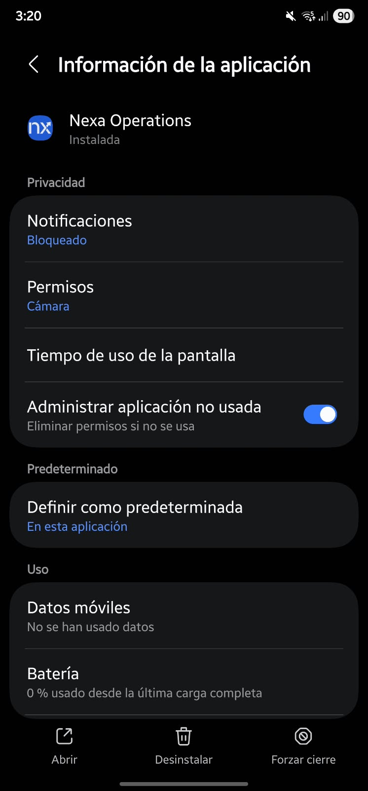
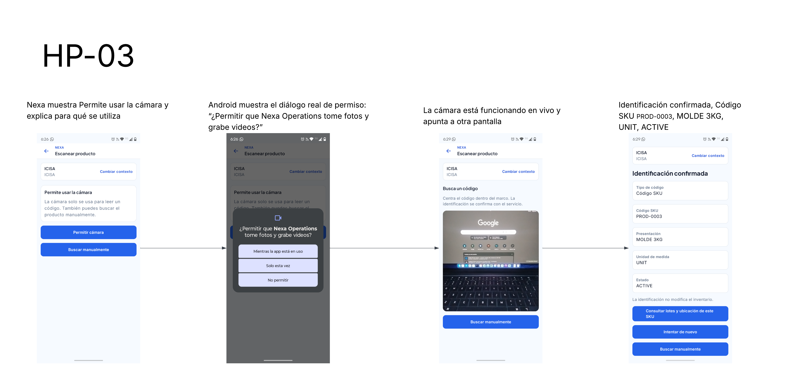

#### 4.2.2.6. Execution Evidence for Sprint Review

*Instalación de Nexa Operations en Android.*

*La pantalla de información de la aplicación muestra Nexa Operations como
instalada y Cámara entre sus permisos. La captura documenta la instalación;
la lectura de códigos y la resolución de un producto se comprueban en sus
recorridos de ejecución. No se observa la versión de la APK en esta vista.*

La comprobación de Samsung S22 registrada el 4 de octubre cubrió instalación e inicio de sesión contra el servicio cloud. La release de evaluación [Mobile v0.6.0](https://github.com/nexa-suite/mobile/releases/tag/v0.6.0) adjunta el APK para ese entorno HTTPS.

Las evidencias complementarias HP-01, HP-02 y HP-03 muestran continuidad de sesión, búsqueda manual e identificación de producto con cámara. UP-07 presenta la alternativa manual ante permiso de cámara denegado; UP-10 muestra consultas por código y nombre. Los recorridos se explican en la sección 3.1.4.4.

*La secuencia HP-03 muestra la solicitud de permiso, el diálogo de Android, la cámara abierta y el resultado «Identificación confirmada» para el SKU PROD-0003, presentación MOLDE 3KG. La identificación no modifica el inventario.*

Las siguientes figuras muestran los estados observados durante los recorridos de operaciones. Cada leyenda identifica la acción y su resultado.

*Figura 1. Pantalla de acceso observada durante la ejecución.*

*Figura 2. Warehouse antes de consultar el catálogo.*

*Figura 3. Resultado de catálogo sin inventario disponible.*

*Figura 4. Estado de recepción confirmado en la evidencia existente.*

*Figura 5. Stock confirmado en la vista Warehouse.*

*Figura 6. Inicio de Sales; no se observa una visita registrada.*

*Figura 7. Estado de Sales sin visita registrada.*

*Figura 8. Catálogo vacío en el estado observado de Sales.*

*Figura 9. Inicio de Logistics.*

*Figura 10. Preparación sin registros en la evidencia existente.*

*Figura 11. Entregas sin registros; no se acredita un recorrido Driver.*

*Figura 12. Acceso autorizado a coordinación BOM.*

*Figura 13. Lista BOM vacía y retorno al trabajo autorizado.*

Las figuras documentan los estados y recorridos presentados; no constituyen mediciones de los resultados de negocio de las hipótesis Lean UX.
