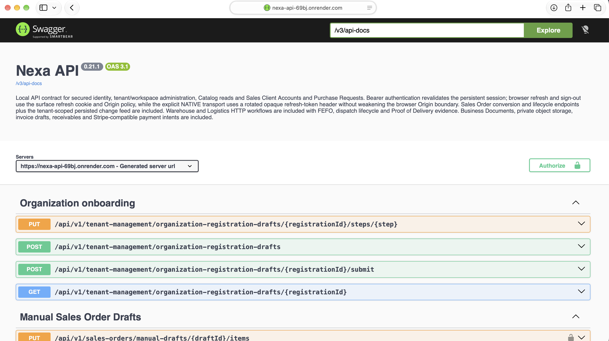
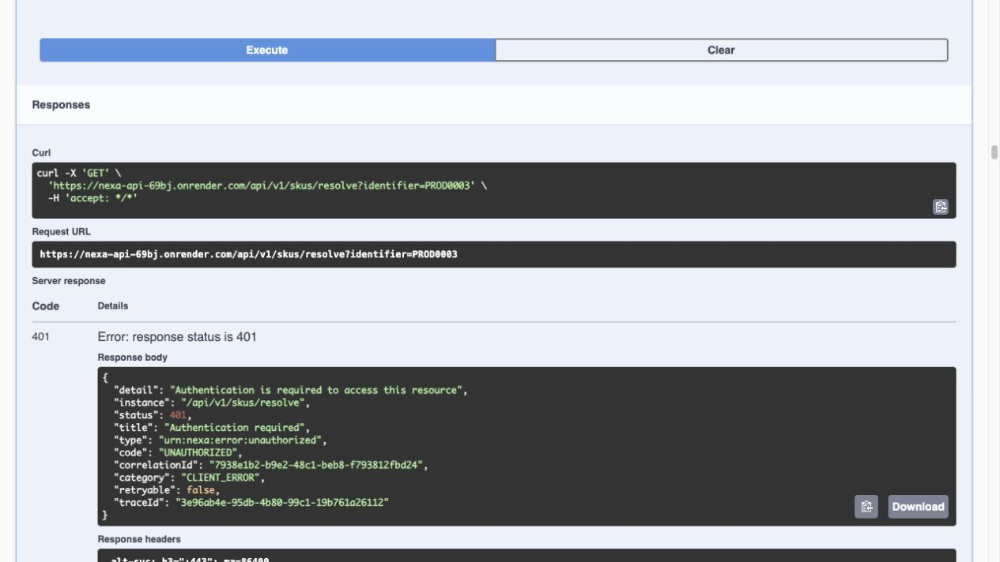

#### 4.2.2.7. Services Documentation Evidence for Sprint Review

Los servicios de Nexa gestionan el acceso, el contexto de trabajo y los
resultados de las operaciones. El API está publicado en
[nexa-api-69bj.onrender.com](https://nexa-api-69bj.onrender.com). Las
comprobaciones del 5 de octubre, a las 18:06 UTC−05:00, obtuvieron HTTP 200
en salud, liveness, readiness y Swagger UI. La consulta sin credenciales a
`/api/v1/me/profile` respondió HTTP 401.

La captura del 5 de octubre de 2026 muestra [Swagger UI publicado en Render](https://nexa-api-69bj.onrender.com/swagger-ui/index.html), Nexa API **0.21.1** y OpenAPI **3.1**. El selector de servidor apunta al dominio del servicio publicado y la vista presenta las operaciones de Organization onboarding. La consulta de `/v3/api-docs` del mismo día, a las 18:09 UTC−05:00, obtuvo HTTP **200**; el contrato publicado identifica OpenAPI 3.1.0 y la versión 0.21.1. Una reconsulta a las 18:14 UTC−05:00 confirmó esa respuesta.

*Operaciones de acceso e identificación presentes en el contrato OpenAPI publicado.*

| Método y ruta | Datos esenciales | Resultado definido por el contrato |
| --- | --- | --- |
| `POST /api/v1/authentication/sign-in` | `identifier`, `password`, `workspaceSlug`, `surface`; `X-Nexa-Client` en cliente nativo. | HTTP 200, sesión y credenciales de acceso. |
| `POST /api/v1/authentication/refresh` | `X-Nexa-Surface`; cookie de renovación o `X-Nexa-Refresh-Token` para transporte nativo. | HTTP 200, renovación de sesión y rotación del token. |
| `POST /api/v1/authentication/sign-out` | Superficie y sesión autenticada. | HTTP 204, revocación de sesión. |
| `GET /api/v1/session` | Token Bearer. | HTTP 200, sesión y contexto actuales. |
| `GET /api/v1/skus/resolve?identifier={value}` | Identificador y contexto Tenant/Workspace autenticado. | HTTP 200, resolución `RESOLVED`, `NOT_FOUND` o `AMBIGUOUS`. |

El contrato agrupa estas operaciones en dos áreas: acceso y sesión, y resolución de identificadores de producto.

*Figura 4.2.2.7-1. Swagger UI de Nexa API 0.21.1 en Render: versión, servidor y operaciones de Organization onboarding visibles en la captura del 5 de octubre de 2026.*

*Figura 4.2.2.7-2. Consulta `GET https://nexa-api-69bj.onrender.com/api/v1/skus/resolve?identifier=PROD0003` desde Swagger UI sin credenciales: el servicio respondió HTTP 401 Unauthorized el 5 de octubre de 2026 e indicó que se requiere autenticación para acceder al recurso.*

| Operación | Método | Historia | Control de acceso y errores | Evidencia disponible |
| --- | --- | --- | --- | --- |
| `/api/v1/operational-exceptions` | `GET` | `MOB-US-005` | `delivery.exception.read`; lectura dentro del tenant y workspace actuales. | `BomOperationalExceptionController` → `BomOperationalExceptionService`; `BomOperationalExceptionIT` verifica consulta de excepciones con HTTP 200. |
| `/api/v1/operational-exceptions/{exceptionId}/assignees` | `GET` | `MOB-US-005` | `delivery.exception.read`; candidatos activos según pertenencia y permisos efectivos. | `BomOperationalExceptionController` → `BomOperationalExceptionService`; `BomOperationalExceptionIT` verifica consulta de candidatos con HTTP 200. |
| `/api/v1/operational-exceptions/{exceptionId}/claims` | `POST` | `MOB-US-005` | `delivery.exception.coordinate`; `If-Match` e `Idempotency-Key`; alcance Tenant/Workspace actual. | `BomOperationalExceptionController` → `BomOperationalExceptionService`; `BomOperationalExceptionIT` cubre claim HTTP 201 y replay HTTP 200. |
| `/api/v1/operational-exceptions/{exceptionId}/resolutions` | `POST` | `MOB-US-005` | La resolución conserva bloqueos y autoridad sobre los hechos de la fuente. | `BomOperationalExceptionIT` cubre rechazo HTTP 409 de una resolución con bloqueos. |
| `/api/v1/operational-exceptions/{exceptionId}/assignments`, `/follow-ups`, `/closures` | `POST` | `MOB-US-005` | `delivery.exception.coordinate`; versión actual y repetición protegida. | Operaciones definidas en el contrato y en `BomOperationalExceptionController` → `BomOperationalExceptionService`; la evidencia funcional anterior corresponde a claim/replay y al rechazo de resolución. |
| `/api/v1/dispatch/loads/{loadId}/handoff-confirmations` | `POST` | `MOB-US-024` | Carga autorizada, `If-Match` e `Idempotency-Key`; contexto y asignación vigentes. | `DeliveryLoadController` → `DeliveryLoadService`; `DeliveryLoadIT` comprueba HTTP 200 y estado `RESPONSIBILITY_TRANSFERRED`, y HTTP 409 ante asignación desactualizada. |
| `/api/v1/driver/loads/{loadId}/acceptances` | `POST` | `MOB-US-024` | Conductor asignado, `If-Match` e `Idempotency-Key`; rechazo si cambia la revisión de asignación. | `DeliveryLoadController` → `DeliveryLoadService`; `DeliveryLoadIT` comprueba aceptación HTTP 200 y conflicto HTTP 409 ante asignación desactualizada. |

Para MOB-US-024, Dispatch registra el traspaso de responsabilidad de la carga al conductor; la aceptación confirma que el conductor toma esa carga. El recibo del comprador corresponde al hito de entrega y mantiene un significado distinto.

El [repositorio de Web Services](https://github.com/nexa-suite/api) conserva los cambios de documentación del Sprint: [6af902a2](https://github.com/nexa-suite/api/commit/6af902a2a3b2de3966264dda64bda8b11309f89d), del 1 de octubre de 2026, regeneró el contrato integrado; [92c96323](https://github.com/nexa-suite/api/commit/92c96323e495fa5dce334ad49aaaebb8bf4e47f7), del mismo día, actualizó el contrato de instrucciones operativas y sus aserciones. Estos cambios registran la evolución del contrato integrado y las aserciones asociadas a las instrucciones operativas.

*Alcance y trazabilidad funcional del API para TB1.*

La matriz de trazabilidad del 4 de octubre, elaborada sobre API v0.21.0, contrasta las 49 historias funcionales Mobile incluidas en el backlog observado. Cada historia cuenta una vez; las seis historias Landing, diez Technical Stories y seis Spikes se registran por separado y no forman parte de este denominador funcional Mobile.

| Correspondencia localizada | Historias | Proporción del conjunto Mobile |
| --- | ---: | ---: |
| Operación documentada, controlador/servicio y prueba fuente relacionada | 39 | 79,6 % |
| Correspondencia parcial o comportamiento de cliente fuera del alcance del API | 9 | 18,4 % |
| Sin operación API directa localizada | 1 | 2,0 % |
| **Total revisado** | **49** | **100 %** |

El 79,6 % expresa correspondencia documental entre historias, operaciones de servicio y pruebas fuente en ese corte; su unidad es una historia, no un endpoint. La proporción conserva valor de trazabilidad y se distingue de la cobertura funcional de operaciones servidor. Las comprobaciones funcionales de esta sección se describen por operación y escenario; los resultados de CI y las respuestas del servicio publicado conservan su fecha y alcance.

La cobertura funcional global de endpoints no se ha medido en este corte:
el conjunto de operaciones servidor del alcance y sus resultados funcionales
por operación aún no están consolidados en una única matriz.

| Historias con correspondencia parcial o sin operación directa | Límite localizado |
| --- | --- |
| `MOB-US-004` — Revisar el trabajo operativo de un vistazo | La prueba del dashboard cubre una consulta amplia de tracking/analytics; la correspondencia con cada indicador de priorización se clasifica como parcial. |
| `MOB-US-008` — Preparar una solicitud de cliente | El contrato presenta modelos de borrador y envío desde campo; esta matriz registra correspondencia parcial con la historia de solicitud de cliente. |
| `MOB-US-028` — Abrir indicaciones hacia el destino autorizado de la entrega | El servidor proyecta destino e instrucciones autorizados, y la prueba cubre el límite del proveedor; abrir navegación externa corresponde a una acción del cliente. |
| `MOB-US-035` — Continuar la evidencia de entrega después de perder conexión | El servidor soporta replay idempotente de comandos; persistencia local y recuperación selectiva tras desconexión corresponden a la evaluación del cliente. |
| `MOB-US-055` — Usar información ampliada de identidad de producto, paquete y almacenamiento | La correspondencia incluye contrato y prueba para identidad SKU/lote; los campos ampliados de paquete y almacenamiento conservan correspondencia parcial. |
| `MOB-US-056` — Preparar un grupo de tareas de almacén | Las pruebas cubren lista de trabajo y asignación; la correspondencia para preparar un grupo que preserve resultado por elemento se clasifica como parcial. |
| `MOB-US-066` — Recuperar una entrega activa mediante operación offline selectiva | El replay del servidor cubre la recuperación de un resultado incierto; la operación offline selectiva local corresponde a la evaluación del cliente. |
| `MOB-US-070` — Ver documentos de negocio vinculados a solicitud o pedido | Las pruebas cubren lectura, descarga y aislamiento; el vínculo visible del documento al Buyer desde una solicitud o pedido corresponde a la experiencia del cliente. |
| `MOB-US-073` — Usar evidencia de automatización de almacén en un trabajo controlado | Las pruebas incluyen evidencia térmica, foto, excepción y HOLD; la matriz clasifica como parcial el enlace entre un evento de automatización y el recorrido origen→hecho→HOLD. |
| `MOB-US-030` — Contactar al comprador durante la entrega | El contacto Driver–Buyer está diferido en este alcance. El chat autorizado corresponde exclusivamente a Sales–Buyer dentro de una relación comercial vigente. |

La experiencia del Website se presenta en 3.1.3 y 4.2.2.8, separada de la documentación de servicios Mobile. Las rutas documentadas en OpenAPI describen contratos; su presencia en el catálogo no equivale a una prueba funcional del recorrido que las utiliza.
