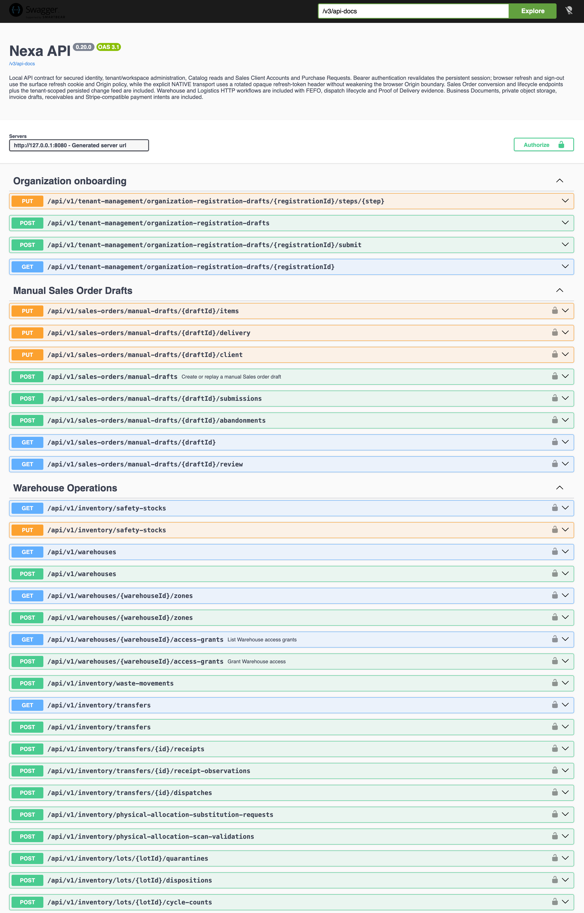

#### 4.2.2.7. Services Documentation Evidence for Sprint Review

La tabla distingue los contratos disponibles en la fuente de su consumo
observado. El API conserva la autoridad sobre acceso, contexto y estado de las
operaciones. Su URL es [nexa-api-69bj.onrender.com](https://nexa-api-69bj.onrender.com)
y la release API [v0.21.0](https://github.com/nexa-suite/api/releases/tag/v0.21.0)
se publicó el 4 de octubre. Una captura de Render mostró el servicio como
`Live`; en una reconsulta del mismo día, readiness y liveness respondieron
HTTP 200. Una petición previa de readiness agotó el tiempo de espera. Estas
respuestas describen instantes concretos, no disponibilidad continua.

Las comprobaciones de frontera devolvieron HTTP 401 para catálogo sin
credenciales y para un token inválido, y HTTP 403 para un origen CORS no
confiable. Una petición sin autenticación a [Swagger UI del servicio](https://nexa-api-69bj.onrender.com/swagger-ui/index.html) y otra a
`/v3/api-docs` respondieron HTTP 401. La fuente del API habilita Springdoc y
Swagger UI sólo con el perfil `local`; no se afirma que la documentación sea
accesible públicamente ni se altera la política de seguridad. Estas respuestas
no demuestran un flujo autenticado completo ni aceptación funcional.

*Figura 4.2.2.7-1. Captura de Swagger UI local: muestra el servidor
`http://127.0.0.1:8080`, la versión visible `0.20.0` y grupos de operaciones.
Es evidencia de una vista de documentación local; no demuestra que cada
endpoint haya sido ejecutado ni que Swagger UI esté disponible en Render.*

| Contract / endpoint | HTTP method | Story | Authorization / error boundary | Consumer evidence / status |
| --- | --- | --- | --- | --- |
| `/api/v1/operational-exceptions` | `GET` | `MOB-US-005` | `delivery.exception.read`; lectura dentro del tenant y workspace actuales. | Contrato disponible; aceptación funcional pendiente. |
| `/api/v1/operational-exceptions/{exceptionId}/assignees` | `GET` | `MOB-US-005` | `delivery.exception.read`; candidatos activos según pertenencia y permisos efectivos. | Fuente y checks focalizados disponibles; aceptación pendiente. |
| `/api/v1/operational-exceptions/{exceptionId}/claims`, `/assignments`, `/follow-ups`, `/resolutions`, `/closures` | `POST` | `MOB-US-005` | `delivery.exception.coordinate`; `If-Match` e `Idempotency-Key`; respuestas de conflicto y fuera de alcance preservan la autoridad del servidor. | Controlador y pruebas focalizadas disponibles; no se demuestra consumo aceptado. |
| Token de transferencia de entrega | `POST` | `MOB-US-024` | Valida asignación, Driver y versión de Delivery en el contexto actual; no expone el secreto de transferencia. | Contrato disponible; transferencia completa no verificada. |
| Validación de transferencia de entrega | `POST` | `MOB-US-024` | Valida identidad contra transferencia, Delivery y asignación vigentes. | No acredita aceptación bilateral ni recepción del comprador. |

*Estado del conjunto de contratos descritos en esta sección.*

| Alcance documentado | Implementación | Verificación técnica | Documentación | Alcance público |
| --- | --- | --- | --- | --- |
| Endpoints enumerados arriba | Contratos y controladores disponibles en la fuente API consultada. | Readiness y liveness respondieron HTTP 200 en la reconsulta; las solicitudes anónimas a la documentación devolvieron HTTP 401. No se presenta un conteo de endpoints funcionales ni de pruebas como cobertura total. | Captura local de Swagger 0.20.0; la configuración de `main` deshabilita Springdoc fuera del perfil `local`. | La URL de Swagger del servicio responde HTTP 401 sin autenticación; no se acredita documentación pública accesible ni aceptación funcional. |

La captura de Swagger corresponde a una vista local rotulada 0.20.0; muestra
la interfaz de documentación y no acredita que cada operación se haya
ejecutado. En la fuente consultada, Swagger UI y OpenAPI están habilitados para
el perfil `local`. El servicio desplegado respondió HTTP 401 en
[Swagger UI](https://nexa-api-69bj.onrender.com/swagger-ui/index.html) y
`/v3/api-docs` sin autenticación; no se afirma acceso público ni se modifica
la política de seguridad.

La rúbrica aún requiere una comparación de fuentes, una decisión técnica y un
resultado reproducible para `SPIKE-001`. Tener contratos y pruebas
automatizadas no demuestra consumo aceptado desde la aplicación.
