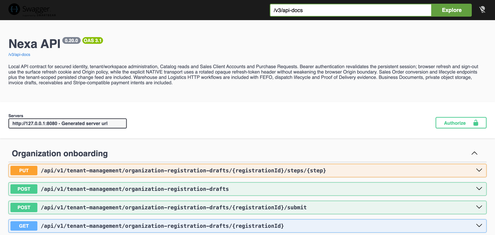

#### 4.2.2.7. Services Documentation Evidence for Sprint Review

Los servicios de Nexa gestionan el acceso, el contexto de trabajo y los
resultados de las operaciones. El API está publicado en
[nexa-api-69bj.onrender.com](https://nexa-api-69bj.onrender.com). Las
comprobaciones del 4 de octubre confirmaron respuesta de los puntos de salud
del servicio y rechazo de consultas sin credenciales válidas o desde un
origen no permitido.

La documentación de operaciones se consultó en el entorno de desarrollo.
Las rutas Swagger UI y OpenAPI del servicio publicado devolvieron HTTP 401
sin autenticación; por ello, su disponibilidad pública no queda acreditada.

El 5 de octubre de 2026, una primera reconsulta agotó el tiempo de espera. Las consultas posteriores a la URL base, Swagger UI y OpenAPI recibieron HTTP 401 con exigencia de autenticación. Estas respuestas acreditan acceso al servicio en esos instantes, pero no acceso público a su documentación ni disponibilidad continua.

*Operaciones de acceso e identificación presentes en el contrato OpenAPI de API v0.21.0.*

| Método y ruta | Datos esenciales | Resultado definido por el contrato |
| --- | --- | --- |
| `POST /api/v1/authentication/sign-in` | `identifier`, `password`, `workspaceSlug`, `surface`; `X-Nexa-Client` en cliente nativo. | HTTP 200, sesión y credenciales de acceso. |
| `POST /api/v1/authentication/refresh` | `X-Nexa-Surface`; cookie de renovación o `X-Nexa-Refresh-Token` para transporte nativo. | HTTP 200, renovación de sesión y rotación del token. |
| `POST /api/v1/authentication/sign-out` | Superficie y sesión autenticada. | HTTP 204, revocación de sesión. |
| `GET /api/v1/session` | Token Bearer. | HTTP 200, sesión y contexto actuales. |
| `GET /api/v1/skus/resolve?identifier={value}` | Identificador y contexto Tenant/Workspace autenticado. | HTTP 200, resolución `RESOLVED`, `NOT_FOUND` o `AMBIGUOUS`. |

Estas operaciones corresponden a los contratos de acceso e identificación vinculados a Sprint 1. Su presencia en la documentación de v0.21.0 no acredita ejecución funcional en esta reconsulta. No se establece un porcentaje de cobertura del alcance TB1 a partir del número de rutas documentadas; se requiere relacionar el conjunto de funcionalidades exigidas con resultados verificables.

*Figura 4.2.2.7-1. Swagger UI del entorno de desarrollo: versión visible 0.20.0, servidor local 127.0.0.1:8080 y operaciones de Organization onboarding. El recorte conserva el encabezado y este grupo completo. La imagen documenta la interfaz de consulta,
sin atribuir ejecución a todas las operaciones mostradas.*

| Operación | Método | Historia | Control de acceso y errores | Evidencia disponible |
| --- | --- | --- | --- | --- |
| `/api/v1/operational-exceptions` | `GET` | `MOB-US-005` | `delivery.exception.read`; lectura dentro del tenant y workspace actuales. | Contrato disponible; aceptación funcional pendiente. |
| `/api/v1/operational-exceptions/{exceptionId}/assignees` | `GET` | `MOB-US-005` | `delivery.exception.read`; candidatos activos según pertenencia y permisos efectivos. | Fuente y checks focalizados disponibles; aceptación pendiente. |
| `/api/v1/operational-exceptions/{exceptionId}/claims`, `/assignments`, `/follow-ups`, `/resolutions`, `/closures` | `POST` | `MOB-US-005` | `delivery.exception.coordinate`; `If-Match` e `Idempotency-Key`; respuestas de conflicto y fuera de alcance preservan la autoridad del servidor. | Controlador y pruebas focalizadas disponibles; no se demuestra consumo aceptado. |
| `/api/v1/dispatch/loads/{loadId}/handoff-confirmations` | `POST` | `MOB-US-024` | Carga autorizada, `If-Match` e `Idempotency-Key`; contexto y asignación vigentes. | `DeliveryLoadIT` comprueba la transición a `RESPONSIBILITY_TRANSFERRED`; la ejecución física completa no se acredita. |
| `/api/v1/driver/loads/{loadId}/acceptances` | `POST` | `MOB-US-024` | Conductor asignado, `If-Match` e `Idempotency-Key`; rechazo si cambia la revisión de asignación. | `DeliveryLoadIT` ejercita aceptación de carga y escenarios de asignación cambiada; no representa recibo del comprador. |

El traspaso de carga de Dispatch al conductor corresponde a MOB-US-024. Los tokens de transferencia de una entrega y el recibo del comprador pertenecen a una etapa distinta; no sustituyen la aceptación y confirmación de la carga. Los contratos enumerados permiten revisar las responsabilidades de los servicios y sus condiciones de acceso. La comprobación de una transferencia
completa, su aceptación por el conductor y la recepción del comprador requiere
recorridos separados; la documentación de una operación no sustituye su
validación funcional.

El [repositorio de Web Services](https://github.com/nexa-suite/api) conserva los cambios de documentación del Sprint: [6af902a2](https://github.com/nexa-suite/api/commit/6af902a2a3b2de3966264dda64bda8b11309f89d), del 1 de octubre de 2026, regeneró el contrato integrado; [92c96323](https://github.com/nexa-suite/api/commit/92c96323e495fa5dce334ad49aaaebb8bf4e47f7), del mismo día, actualizó el contrato de instrucciones operativas y sus aserciones. Estos cambios documentan la evolución del contrato y no acreditan por sí solos acceso público a Swagger.

*Alcance y trazabilidad funcional del API para TB1.*

La revisión de API v0.21.0 contrasta las 49 historias funcionales Mobile incluidas en el backlog actualizado. Cada historia cuenta una vez; las seis historias Landing, diez Technical Stories y seis Spikes se registran por separado y no forman parte de este denominador funcional Mobile.

| Correspondencia localizada | Historias | Proporción del conjunto Mobile |
| --- | ---: | ---: |
| Operación documentada, controlador/servicio y prueba fuente relacionada | 39 | 79,6 % |
| Correspondencia parcial o comportamiento de cliente no acreditado por el API | 9 | 18,4 % |
| Sin operación API directa localizada | 1 | 2,0 % |
| **Total revisado** | **49** | **100 %** |

El 79,6 % expresa trazabilidad estricta entre historias, implementación y pruebas fuente. No representa un porcentaje de funcionalidades ejecutadas en el servicio publicado. La ejecución CI acredita el pipeline de la revisión; las consultas públicas descritas no establecen resultados autenticados por historia.

| Historias con correspondencia parcial o sin operación directa | Límite localizado |
| --- | --- |
| `MOB-US-004` — Revisar el trabajo operativo de un vistazo | La prueba consulta el dashboard, pero el método es una verificación amplia de tracking/analytics; no demuestra cada indicador de priorización. |
| `MOB-US-008` — Preparar una solicitud de cliente | Hay contratos de borrador y envío desde campo; el backlog no establece una correspondencia uno-a-uno entre “solicitud de cliente” y esos dos modelos. |
| `MOB-US-028` — Abrir indicaciones hacia el destino autorizado de la entrega | El servidor proyecta destino/instrucciones autorizados y hay prueba del límite de proveedor; el acto de abrir navegación externa pertenece al cliente y no está verificado aquí. |
| `MOB-US-035` — Continuar la evidencia de entrega después de perder conexión | El servidor soporta replay idempotente de comandos; persistencia local y recuperación selectiva tras desconexión no quedan demostradas por API. |
| `MOB-US-055` — Usar información ampliada de identidad de producto, paquete y almacenamiento | Identidad SKU/lote tiene contrato y prueba; esta revisión no confirma los campos ampliados de paquete y almacenamiento para todos los recorridos. |
| `MOB-US-056` — Preparar un grupo de tareas de almacén | Lista de trabajo/asignación existe; no demuestra preparar un grupo de tareas que preserve resultado por elemento. |
| `MOB-US-066` — Recuperar una entrega activa mediante operación offline selectiva | Replay del servidor apoya recuperación de resultado incierto; la operación offline selectiva local no se demuestra mediante API. |
| `MOB-US-070` — Ver documentos de negocio vinculados a solicitud o pedido | Se prueban lectura/descarga y aislamiento; el vínculo visible al Buyer desde una solicitud/pedido no se verificó directamente en esta matriz. |
| `MOB-US-073` — Usar evidencia de automatización de almacén en un trabajo controlado | Hay evidencia térmica, foto, excepción y HOLD en pruebas; no se verificó aquí un evento proveniente de automatización ni el recorrido completo de origen→hecho→HOLD en un endpoint de automatización. |
| `MOB-US-030` — Contactar al comprador durante la entrega | La comunicación directa entre conductor y comprador queda fuera del alcance operativo actual hasta definir sus condiciones de autorización. |

Las capacidades de Landing con interacción de servicio incluyen onboarding de empresa y contacto. Se documentan separadamente de la medición Mobile para conservar unidades comparables y evitar contar varias rutas como funcionalidades distintas.
