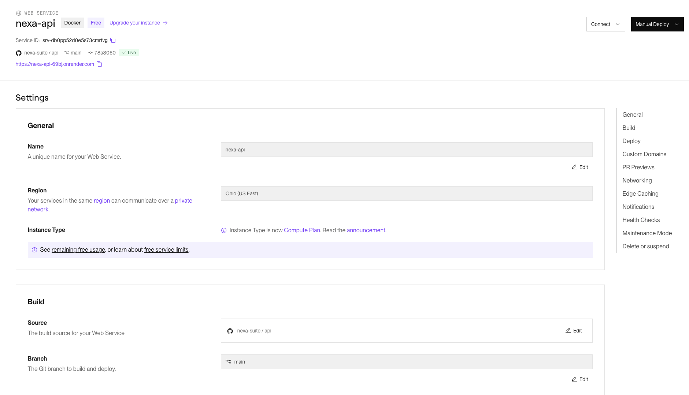
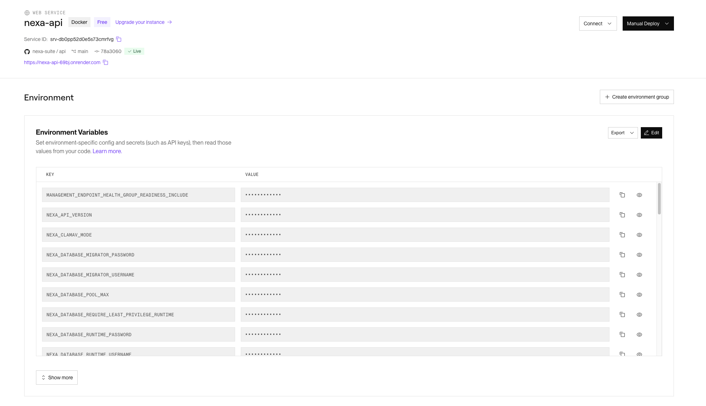

#### 4.2.2.8. Software Deployment Evidence for Sprint Review

**Corte de evidencia: 4–6 de octubre de 2026.** Esta sección relaciona las
publicaciones de fuente con los servicios y vistas públicas observados. Las
capturas de proveedor conservan la fecha de cada registro; las consultas
HTTP anotan el corte en que se ejecutaron.

| Artefacto | Entorno y fuente | Resultado observado | Estado del corte |
| --- | --- | --- | --- |
| Landing Page | `nexa-suite/website`, `main`, GitHub Pages: [nexa-suite.github.io/website](https://nexa-suite.github.io/website/). Fuente publicada como [Website v1.0.0](https://github.com/nexa-suite/website/releases/tag/v1.0.0). | La URL pública respondió HTTP 200 en la comprobación registrada. Las capturas del proveedor son del 4 de octubre; las vistas publicadas en escritorio y móvil se capturaron el 5 de octubre. | La release de fuente v1.0.0 se publicó el 5 de octubre. Las capturas conservan la fecha de cada observación. |
| API Operations | Fuente publicada como [Nexa API v1.0.0](https://github.com/nexa-suite/api/releases/tag/v1.0.0), en `main`. Servicio `nexa-api` en Render y PostgreSQL configurado en Neon. | El dashboard de Render del 6 de octubre presenta el servicio `Live` en `main` con el commit `78a3060`; el último despliegue fue manual. A las 06:09 UTC, salud, liveness, readiness y Swagger UI respondieron HTTP 200; los tres chequeos de salud indicaron `UP`. | La publicación v1.0.0 identifica una versión de fuente. El servicio observado corre el commit de `main` mostrado por Render, no una etiqueta seleccionada como despliegue. El historial de 4 de octubre permanece como evidencia histórica. |
| Persistencia API | Configuración versionada en [`render.yaml`](https://github.com/nexa-suite/api/blob/main/render.yaml): conexión PostgreSQL por JDBC a Neon, con accesos de migración y runtime separados. | La configuración del readiness de Render incluye el chequeo `db`; readiness respondió `UP` a las 06:09 UTC del 6 de octubre. | Observación de preparación del servicio y su conexión a base de datos en el instante registrado. |
| Correo API | Relay SMTP de Brevo; la captura existente conserva `smtp-relay.brevo.com` y puerto `587`. | El manifiesto del servicio mantiene la configuración de correo fuera del código del cliente. | Configuración del relay documentada mediante sus parámetros de servidor y puerto. |
| Operations Mobile | Publicación [Nexa Operations v1.0.1](https://github.com/nexa-suite/mobile/releases/tag/v1.0.1), con [APK firmado](https://github.com/nexa-suite/mobile/releases/download/v1.0.1/nexa-operations-v1.0.1.apk), `versionCode` 9 y checksum. Origen HTTPS de Render. | El [PR #35](https://github.com/nexa-suite/mobile/pull/35) integró `release/v1.0.1` en `main` con dos revisiones aprobadas por [spinedo214](https://github.com/spinedo214) y [R0obxdnt](https://github.com/R0obxdnt). El [PR #36](https://github.com/nexa-suite/mobile/pull/36) sincronizó la fuente publicada a `develop`. El equipo confirmó manualmente la cámara; las pruebas de instalación y lectura en emulador API 37 documentadas antes corresponden a v1.0.0. | La release conserva el certificado oficial, corrige el inicio del escáner en release y añade cierre de sesión y tarjetas operativas. Las capturas Samsung y v0.6.0 siguen siendo históricas. UF-06/07 requiere stock y trabajo preparado. |

*Captura de GitHub Pages del 4 de octubre de 2026: entorno `github-pages` y
publicaciones desde `main`.*

*Vista de proyecto Render del 4 de octubre de 2026: servicio Docker
`nexa-api`, región Ohio y plan Free.*

*Historial del servicio `nexa-api` en Render, capturado el 4 de octubre de
2026. Corresponde al corte previo a la release API v1.0.0 y al despliegue de
`main` que presenta la captura más reciente.*

*Configuración de Render observada el 6 de octubre de 2026:
servicio Docker `nexa-api` en Free y Ohio (US East), conectado a
`nexa-suite/api` y a la rama `main`. El encabezado identifica el commit
`78a3060` como `Live` y muestra el origen HTTPS. La captura conserva la vista
de Settings sin abrir variables o credenciales.*

*Vista de variables del servicio tomada el 6 de octubre de
2026. Los valores están ocultos; la imagen documenta que los datos sensibles
se administran como configuración del entorno Render.*

*Recorte versionado de la configuración SMTP de Brevo:
servidor `smtp-relay.brevo.com` y puerto `587`. Se excluyen la cuenta, los
valores de acceso y las claves visibles en el archivo original.*

La consulta autorizada del 4 de octubre identificó `PROD-0051` en el catálogo
interno. La proyección Buyer conserva su propio alcance de lectura, sujeto
a sesión, contexto y permisos.

Las capturas administrativas muestran la configuración y mantienen ocultos los valores de entorno y las credenciales. La configuración del entorno se presenta en la sección 4.1.4. La instalación de Operations Mobile en Android se muestra en la sección 4.2.2.6.

El 5 de octubre se publicó [Website v1.0.0](https://github.com/nexa-suite/website/releases/tag/v1.0.0)
mediante el [PR #1](https://github.com/nexa-suite/website/pull/1). La publicación
conserva las páginas y recursos del sitio; actualiza el registro de versión y
la carga de reglas de Conventional Commits en CI. Las comprobaciones de Markdown,
JavaScript y commits finalizaron correctamente, al igual que el
[despliegue de GitHub Pages](https://github.com/nexa-suite/website/actions/runs/37390755276).
La URL pública respondió HTTP 200 después de ese despliegue.

Las comprobaciones del 5 de octubre relacionan la documentación pública con el servicio disponible: Swagger UI respondió HTTP 200 en el corte de las 18:06 UTC−05:00 y OpenAPI a las 18:09 y 18:14 UTC−05:00. Las respuestas de salud y de acceso protegido corresponden a las rutas y momentos consultados; la evaluación funcional de los recorridos se documenta por separado.

La consulta autenticada de Warehouse y Dispatch utilizó el mismo Tenant y
Workspace. El servicio devolvió un almacén activo y listas sin registros de
lotes, reservas y Fulfillments; las vistas Dispatch Readiness y órdenes de
despacho reflejaron ese contexto. Los recorridos de recepción, picking y
despacho requieren existencias recibidas y trabajo preparado, por lo que la
consulta del entorno se distingue de la ejecución de esas transacciones.

*Website público observado el 5 de octubre de 2026 en una ventana de 1366 × 900: navegación, presentación de Nexa y acceso al alcance del producto. La URL respondió HTTP 200 en la comprobación de ese día.*

*Website observado con viewport de 390 × 844: menú compacto, contenido y llamada a la acción visibles. En esa vista, el ancho del documento fue de 390 píxeles, sin desbordamiento horizontal. Los dos tamaños documentan la adaptación del contenido y la navegación.*

La navegación del Website se registra en los videos [desktop](https://upcedupe-my.sharepoint.com/:v:/g/personal/u202323040_upc_edu_pe/IQB3V3-kjOLFTKyjwHYRmSHYAbwyQ_QriEIgStDJDEOcvaY?e=sAnogm) y [mobile](https://upcedupe-my.sharepoint.com/:v:/g/personal/u202323040_upc_edu_pe/IQCuv9bkLBMeSLpqQVJMLH9vAXtshWb7EpDHY-Yb4vY9oS4?e=6OlkLx), publicados el 5 de octubre de 2026 según sus capturas. Cada grabación tiene una duración de 2 minutos y 3 segundos. Las grabaciones complementan las vistas del sitio y se distinguen de las comprobaciones HTTP y de la evaluación de resultados con usuarios.
