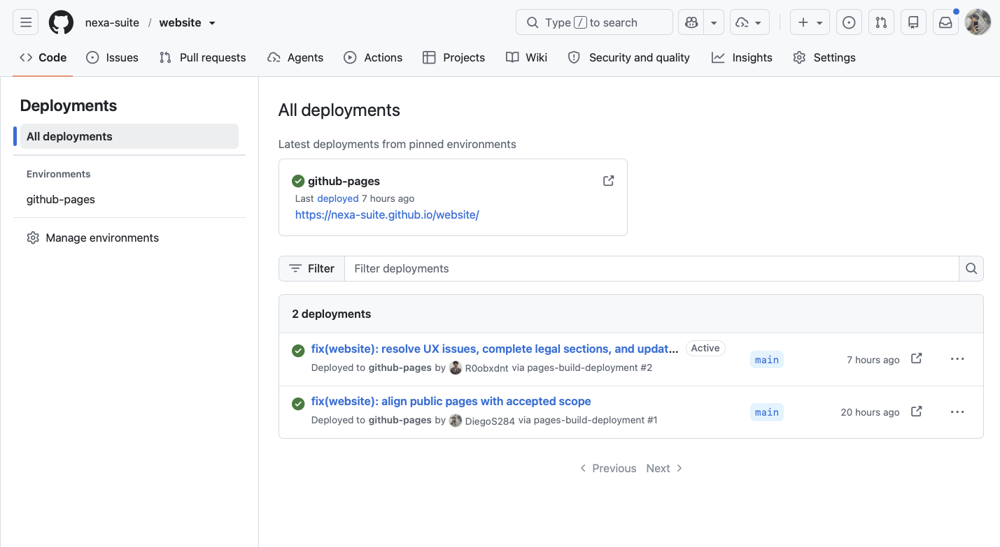
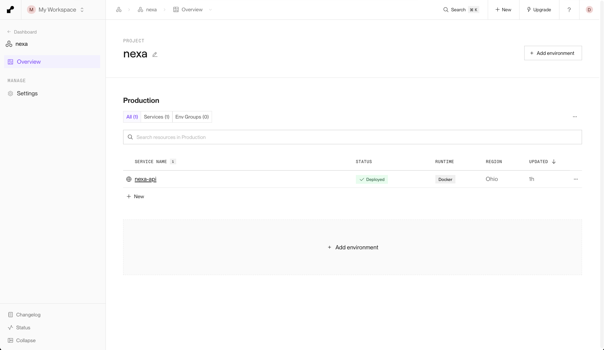
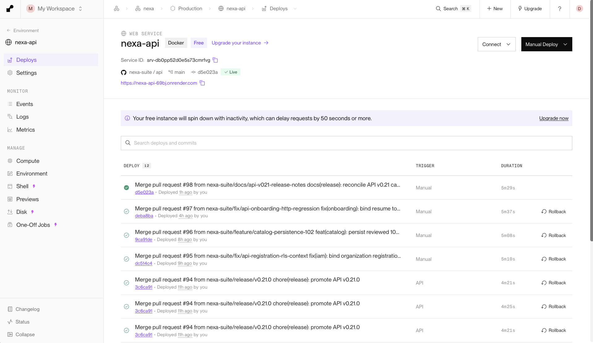
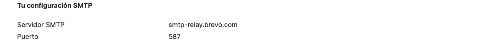
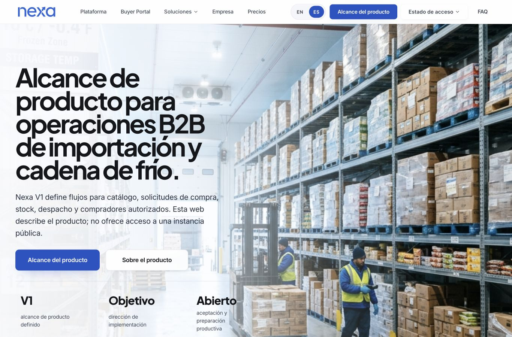
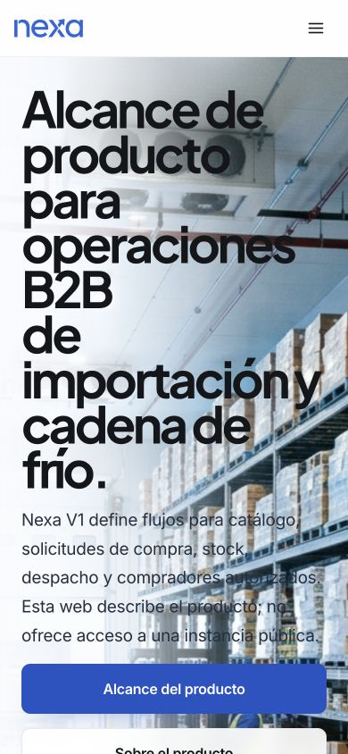

#### 4.2.2.8. Software Deployment Evidence for Sprint Review

**Corte de evidencia: 4 de octubre de 2026.** Esta sección registra
publicación web y configuración de servicio observables por fecha. Distingue
la captura de un entorno, la respuesta de una comprobación técnica y la
aceptación del producto.

| Artefacto | Entorno y fuente | Resultado observado | Estado y límite |
| --- | --- | --- | --- |
| Landing Page | `nexa-suite/website`, `main`, GitHub Pages: [nexa-suite.github.io/website](https://nexa-suite.github.io/website/) | La URL pública respondió HTTP 200 durante la comprobación del 4 de octubre. La captura del proveedor muestra el entorno `github-pages` activo y despliegues desde `main`. | Publicación accesible. Las vistas publicadas en escritorio y móvil se comprueban adicionalmente el 5 de octubre; la observación cubre esos tamaños de pantalla. |
| API Operations | `nexa-suite/api`, rama `main`; servicio `nexa-api` en Render y base administrada en Neon | La release API [v0.21.0](https://github.com/nexa-suite/api/releases/tag/v0.21.0) se publicó el 4 de octubre. La captura de Render muestra el servicio como `Live`; readiness y liveness respondieron HTTP 200 en una reconsulta. La ruta oficial [Swagger UI](https://nexa-api-69bj.onrender.com/swagger-ui/index.html) y `/v3/api-docs` respondieron HTTP 401 sin autenticación. La lectura de catálogo registró 102 elementos internos y 50 en la proyección Buyer. | Una petición previa de readiness agotó el tiempo de espera. Las respuestas acreditan sólo esos instantes; la documentación no quedó accesible públicamente y no se ejecutaron mutaciones de producto o inventario. |
| Operations Mobile | `nexa-suite/mobile`, rama `main`; origen de servicios HTTPS | La release de evaluación [v0.6.0](https://github.com/nexa-suite/mobile/releases/tag/v0.6.0) se publicó el 4 de octubre con APK de depuración para el entorno cloud y requisito Android 10 o posterior. Un APK candidato se instaló en un Samsung S22 e inició sesión contra el servicio cloud. | Es un artefacto de evaluación, no una distribución de Play Store. La comprobación registrada cubre instalación e inicio de sesión. La evidencia complementaria de sesión, búsqueda y cámara se presenta en la sección 4.2.2.6. |

*Figura 4.2.2.8-1. Captura del proveedor GitHub Pages del 4 de octubre de
2026: entorno `github-pages` y publicaciones desde `main`.*

*Figura 4.2.2.8-2. Captura de la vista de proyecto de Render, tomada el 4 de
octubre de 2026; identifica el servicio Docker `nexa-api`, región Ohio y plan
Free.*

*Figura 4.2.2.8-3. Captura del servicio `nexa-api` en Render, tomada el 4 de
octubre de 2026; la vista muestra el despliegue `main` como `Live` y la URL
pública. La captura no acredita la respuesta del servicio después de ese
instante.*

*Figura 4.2.2.8-4. Configuración SMTP de Brevo: servidor `smtp-relay.brevo.com` y puerto `587`. El recorte conserva la configuración y excluye datos de acceso y claves.*

Las consultas del catálogo interno requieren sesión, contexto y permiso de
lectura. El 4 de octubre, `PROD-0051` apareció en el catálogo interno, pero no
en Buyer. No se observó GTIN ni stock. Esta lectura no prueba una transacción,
aceptación de negocio ni visibilidad para compradores.

Las capturas administrativas excluyen variables de entorno, claves y datos de acceso. La configuración del entorno se presenta en la sección 4.1.4. La instalación de Operations Mobile en Android se muestra en la sección 4.2.2.6.

La reconsulta del API del 5 de octubre agotó el tiempo de espera sin respuesta HTTP en las rutas de salud, Swagger UI y OpenAPI. El estado Live de las capturas del proveedor y los resultados del 4 de octubre conservan su fecha; no demuestran disponibilidad continua. En una consulta posterior del 5 de octubre, la URL base, Swagger UI y OpenAPI respondieron HTTP 401 con requisito de autenticación. No se infiere el estado de las rutas de salud a partir de esas respuestas.

*Website público observado el 5 de octubre de 2026 en una ventana de 1366 × 900: navegación, presentación de Nexa y acceso al alcance del producto. La URL respondió HTTP 200 en la comprobación de ese día.*

*Website observado con viewport de 390 × 844: menú compacto, contenido y llamada a la acción visibles. En esa vista, el ancho del documento fue de 390 píxeles, sin desbordamiento horizontal. Se documenta la adaptación en los dos tamaños observados, sin atribuir evaluación de usabilidad con participantes.*

La navegación del Website se registra en los videos [desktop](https://upcedupe-my.sharepoint.com/:v:/g/personal/u202323040_upc_edu_pe/IQB3V3-kjOLFTKyjwHYRmSHYAbwyQ_QriEIgStDJDEOcvaY?e=sAnogm) y [mobile](https://upcedupe-my.sharepoint.com/:v:/g/personal/u202323040_upc_edu_pe/IQCuv9bkLBMeSLpqQVJMLH9vAXtshWb7EpDHY-Yb4vY9oS4?e=6OlkLx), publicados el 5 de octubre de 2026 según sus capturas. Cada grabación tiene una duración de 2 minutos y 3 segundos. Las grabaciones complementan las vistas del sitio y se distinguen de las comprobaciones HTTP y de la evaluación de resultados con usuarios.
