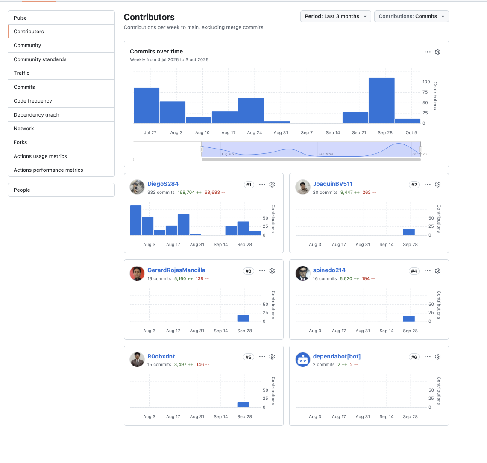
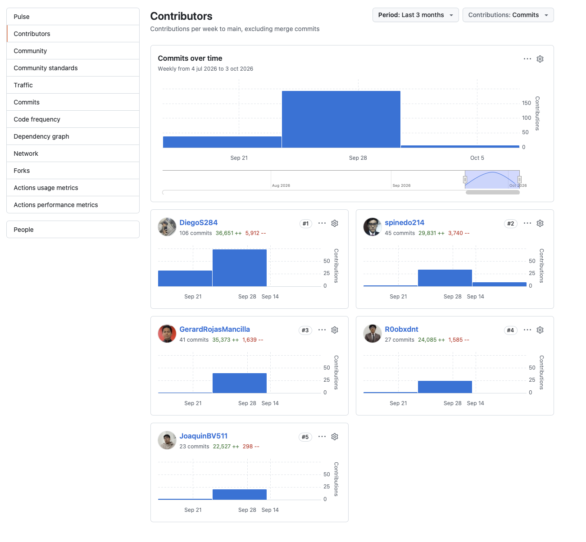
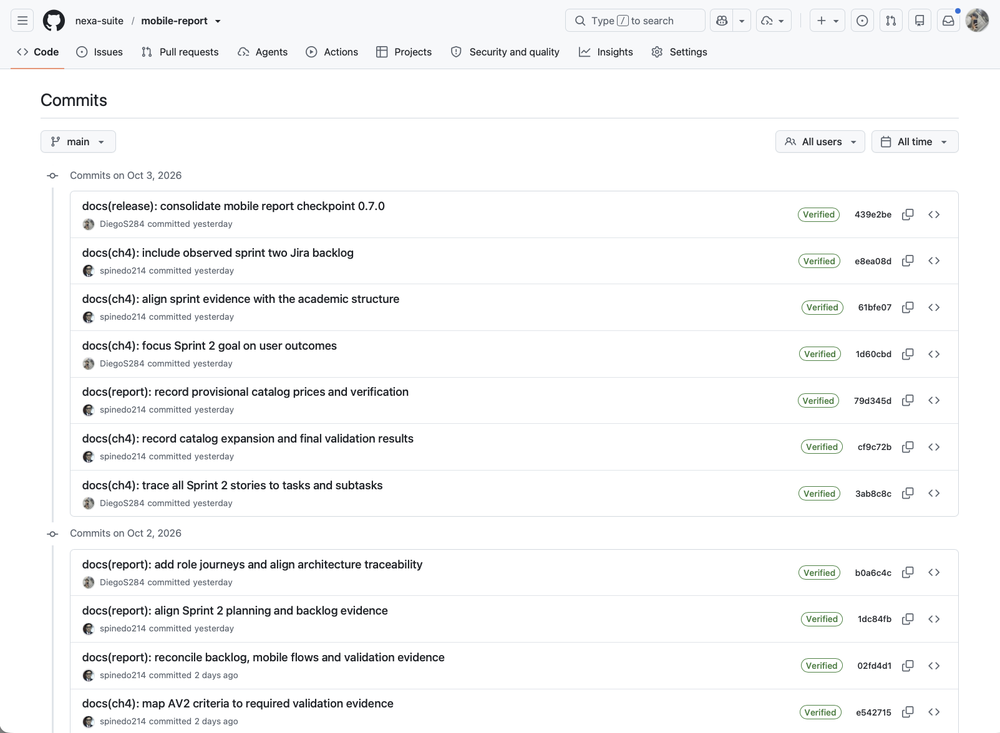
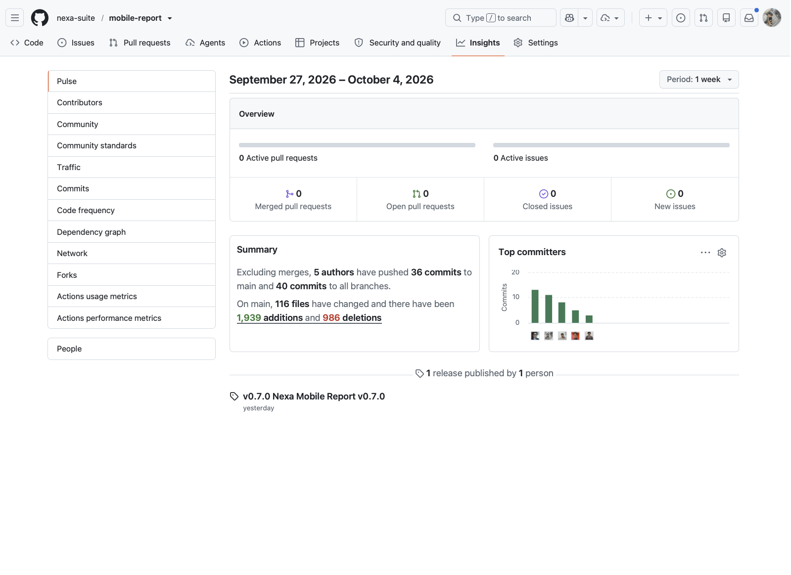
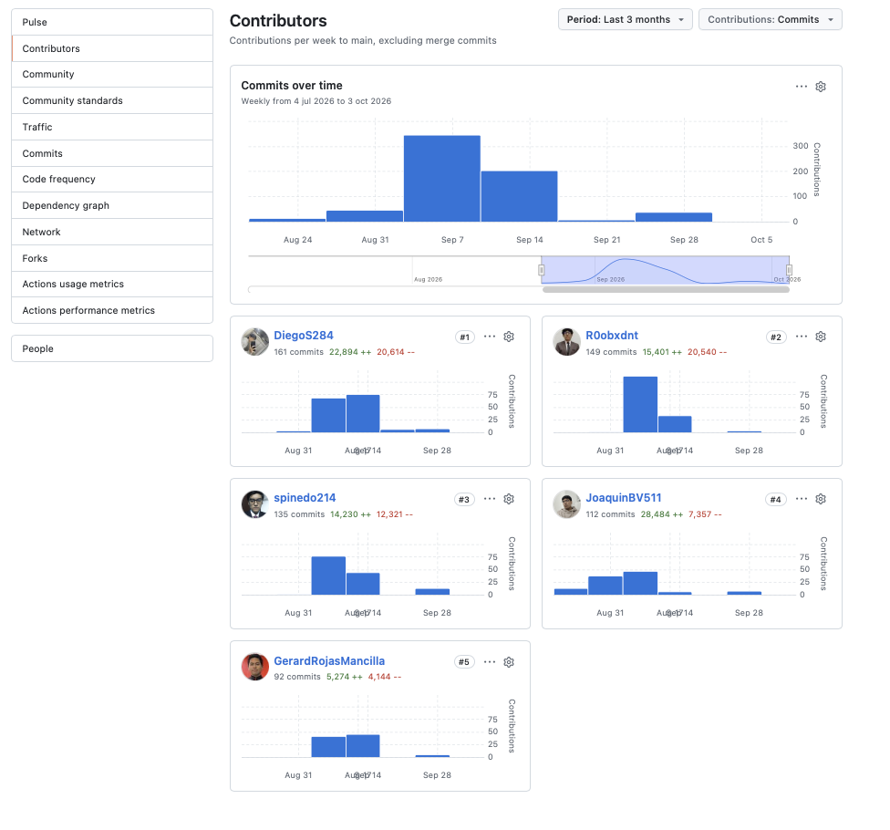
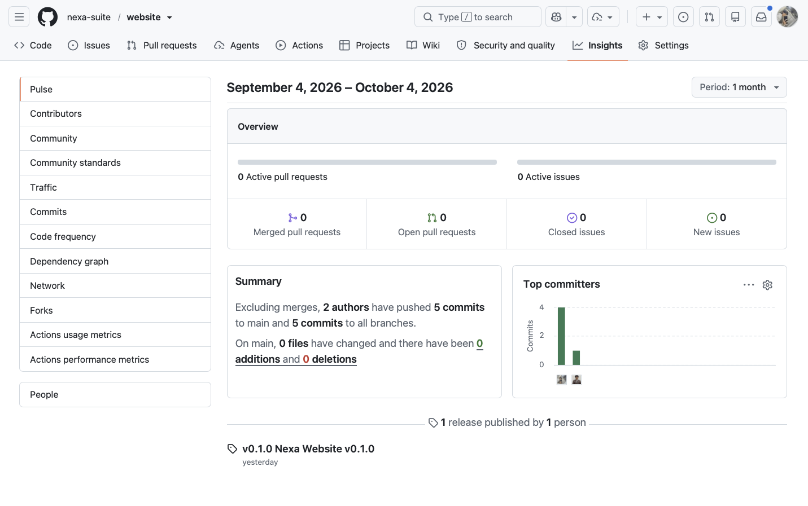

#### 4.2.2.9. Team Collaboration Insights during Sprint

La planificación presencial de Sprint 2 se realizó el 18 de septiembre de
2026 en UPC San Isidro, desde las 13:38, y fue organizada por Diego Yucra
Sandoval. La fotografía y el alcance planificado constan en
4.2.2.1 Sprint Planning 2. No se dispone de un acta
verificable de Sprint Review o retrospectiva para completar esa evidencia.

Las capturas siguientes muestran actividad pública de los repositorios. El
corte de **Pulse** del informe cubre una semana y el del Website, un mes; los
paneles de **Contributors** abarcan del 4 de julio al 3 de octubre. Sus conteos
describen cambios y commits registrados, no horas, dificultad, coordinación,
calidad, aprendizaje o valor individual. La actividad tampoco permite inferir
que una historia de Jira fue aceptada.

| Repositorio | Actividad visible | Lectura acotada |
| --- | --- | --- |
| API | Contributors (4 de julio–3 de octubre): DiegoS284 (332), JoaquinBV511 (20), GerardRojasMancilla (19), spinedo214 (16) y R0obxdnt (15); también aparece `dependabot[bot]` (2). | La actividad del período está concentrada en una cuenta; los conteos no describen coordinación o aceptación. |
| Operations Mobile | Contributors (4 de julio–3 de octubre): DiegoS284 (106), spinedo214 (45), GerardRojasMancilla (41), R0obxdnt (27) y JoaquinBV511 (23). | El panel registra actividad de varias cuentas; no demuestra aceptación de historias. |
| Mobile Report | Pulse del 27 de septiembre–4 de octubre: 36 commits en `main`, 40 entre ramas y 0 PR/issues activos. Contributors: DiegoS284 (161), R0obxdnt (149), spinedo214 (135), JoaquinBV511 (112) y GerardRojasMancilla (92). | La captura de commits tiene corte del 3 de octubre y no incluye los cambios de esta actualización. |
| Website | Pulse del 4 de septiembre–4 de octubre: 5 commits y 2 autores. No hay captura independiente de Contributors para este repositorio. | La actividad de fuente no acredita coordinación, revisión responsive o validación de contacto. |

##### API

*Figura 4.2.2.9-1. GitHub Contributors del API, del 4 de julio al 3 de octubre
de 2026. La gráfica muestra diferencias entre cuentas; `dependabot[bot]` se
separa de los cinco autores humanos indicados en la tabla.*

##### Operations Mobile

*Figura 4.2.2.9-2. GitHub Contributors de Operations Mobile, del 4 de julio al
3 de octubre de 2026. Las cuentas y cantidades corresponden a la actividad de
commits que muestra esta herramienta.*

##### Mobile Report

*Figura 4.2.2.9-3. Historial de `main` de `nexa-suite/mobile-report`, observado
el 3 de octubre de 2026. Los títulos visibles incluyen la reconciliación del
backlog y el mapeo de evidencia; no se atribuyen los cambios locales sin
publicar.*

*Figura 4.2.2.9-4. GitHub Pulse de `nexa-suite/mobile-report`, del 27 de
septiembre al 4 de octubre de 2026: 36 commits en `main`, 40 entre ramas y
ningún PR o issue activo en el periodo mostrado.*

*Figura 4.2.2.9-5. GitHub Contributors del informe, del 4 de julio al 3 de
octubre de 2026. Las cinco cuentas visibles presentan actividad en el periodo;
el gráfico no demuestra asignación formal ni revisión del contenido.*

##### Website

*Figura 4.2.2.9-6. GitHub Pulse de `nexa-suite/website`, del 4 de septiembre al
4 de octubre de 2026: 5 commits en `main` y 2 autores.*

La actividad de Operations Mobile y del informe incluye las cinco cuentas del equipo. En el API, el mayor número de commits corresponde a DiegoS284; en Website, el panel muestra dos autores durante el periodo indicado. Estas diferencias describen la participación registrada en cada repositorio y orientan la distribución del trabajo siguiente. Los conteos no representan horas, dificultad ni aceptación funcional de las historias.
