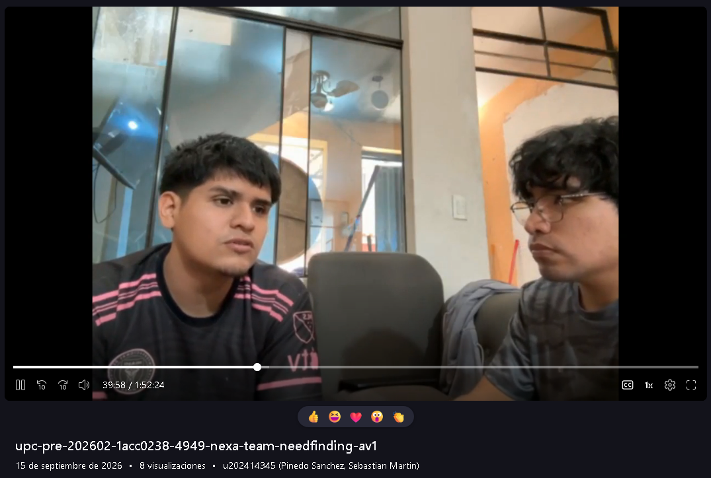

# Anexo A: Registro de evidencia audiovisual

Este anexo registra la evidencia audiovisual propia del proyecto. El análisis
de entrevistas y de producto permanece en los capítulos correspondientes.

*Registro del video consolidado de Needfinding Interviews.*

| Entrega | Tipo | Archivo | Duración total | Fecha de publicación | URL | Captura existente | Estado |
| --- | --- | --- | --- | --- | --- | --- | --- |
| AV1 | Needfinding Interviews | `upc-pre-202620-1acc0238-4949-nexa-team-needfinding-av1.mp4` | `1:52:24` | `2026-09-15` | [Video consolidado](https://upcedupe-my.sharepoint.com/personal/u202323040_upc_edu_pe/_layouts/15/stream.aspx?id=%2Fpersonal%2Fu202323040%5Fupc%5Fedu%5Fpe%2FDocuments%2Fupc%2Dpre%2D202620%2D1acc0238%2D4949%2Dnexa%2Dteam%2Fnexa%2Dinterviews%2Fupc%2Dpre%2D202620%2D1acc0238%2D4949%2Dnexa%2Dteam%2D%20needfinding%2Dav1%2Emp4&referrer=StreamWebApp%2EWeb&referrerScenario=AddressBarCopied%2EWeb&referrerScenario=AddressBarCopied%2Eview%2Ed5b269f7%2D9881%2D4cf3%2D87ae%2D9906871909cd&isDarkMode=true) | [captura del video](../assets/chapter-2/interviews/captura-video-consolidado.png) | Disponible |

*Nota.* El video consolida las nueve entrevistas de Needfinding correspondientes a los tres segmentos objetivo.

*Captura del video consolidado de Needfinding Interviews.*

*Nota.* Captura del reproductor del video consolidado de Needfinding Interviews.

*Cobertura de las entrevistas incluidas en el video consolidado.*

| Código | Entrevistado | Segmento | Fecha de entrevista | Inicio | Fin | Duración | Evidencia |
| --- | --- | --- | --- | --- | --- | --- | --- |
| `INT-S1-01` | Sandro Alonso Alcántara Cerdá | `MOB-SEG-01 — Warehouse & Dispatch Operations` | `2026-09-12` | `00:00:05` | `00:04:47` | `04:42` | Video consolidado; [captura](../assets/chapter-2/interviews/alonso-alcantara.png) |
| `INT-S1-02` | Sebastián Bardales | `MOB-SEG-01 — Warehouse & Dispatch Operations` | `2026-09-12` | `00:04:49` | `00:13:24` | `09:25` | Video consolidado; [captura](../assets/chapter-2/interviews/sebastian-bardales.png) |
| `INT-S1-03` | Rodrigo Mendoza | `MOB-SEG-01 — Warehouse & Dispatch Operations` | `2026-09-14` | `00:13:25` | `00:21:35` | `08:10` | Video consolidado; [captura](../assets/chapter-2/interviews/rodrigo-mendoza.png) |
| `INT-S2-01` | Nicolás Castro | `MOB-SEG-02 — Driver Delivery Execution` | `2026-09-12` | `00:21:40` | `00:29:42` | `08:02` | Video consolidado; [captura](../assets/chapter-2/interviews/entrevista-nicolas-castro.png) |
| `INT-S2-02` | Michelle Rodríguez | `MOB-SEG-02 — Driver Delivery Execution` | `2026-09-12` | `00:29:43` | `00:37:50` | `08:07` | Video consolidado; [captura](../assets/chapter-2/interviews/entrevista-michelle-rodriguez.png) |
| `INT-S2-03` | Renzo Valentino Bueno Montilla | `MOB-SEG-02 — Driver Delivery Execution` | `2026-09-10` | `00:37:51` | `00:44:29` | `07:22` | Video consolidado; [captura](../assets/chapter-2/interviews/entrevista-renzo-bueno.png) |
| `INT-S3-01` | Pedro Puente Arnao | `MOB-SEG-03 — B2B Buyers` | `2026-04-09` | `00:44:43` | `00:56:59` | `12:16` | Video consolidado; [captura](../assets/chapter-2/interviews/pedro-puente.jpeg) |
| `INT-S3-02` | Henrry García | `MOB-SEG-03 — B2B Buyers` | `2026-04-10` | `00:57:00` | `01:37:39` | `40:39` | Video consolidado; [captura](../assets/chapter-2/interviews/henrry-garcia.jpeg) |
| `INT-S3-03` | Gloria Marilú Ángulo Vega | `MOB-SEG-03 — B2B Buyers` | `2026-09-14` | `01:37:40` | `01:52:24` | `14:44` | Video consolidado; [captura](../assets/chapter-2/interviews/gloria-angulo.png) |

*Nota.* Las nueve entrevistas están editadas en un único video consolidado; los tiempos de inicio y fin permiten ubicar cada entrevista dentro del video.

Sólo se incorporan videos, fechas, participantes, URLs y capturas que estén
registrados.
